

![ref1]
<table><tr><th colspan="1"><b>Name</b> </th><th colspan="1">` `Active Crawling with ZAProxy </th></tr>
<tr><td colspan="1" rowspan="2"><b>URL</b> </td><td colspan="1" valign="bottom"><https://attackdefense.com/challengedetails?cid=1890> </td></tr>
<tr><td colspan="1"></td></tr>
<tr><td colspan="1"><b>Type</b> </td><td colspan="1">Webapp Pentesting Basics </td></tr>
</table>

**Important Note:** This document illustrates all the important steps required to complete this lab. This  is  by  no  means  a  comprehensive  step-by-step  solution for this exercise. This is only provided as a reference to various commands needed to complete this exercise and for your further research on this topic. Also, note that the IP addresses and domain names might be different in your lab.  

**Objective:** Perform active crawling on the web application with ZAProxy 

**Step 1:** Identifying IP address of the target machine **Command:** ip addr 

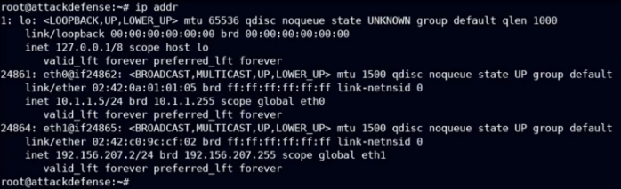

The IP address of the attacker machine is 192.156.207.2. The target machine is located at the IP address 192.156.207.3 ![ref2]

**Step 2:** Identifying open ports. **Command:** nmap 192.156.207.3  

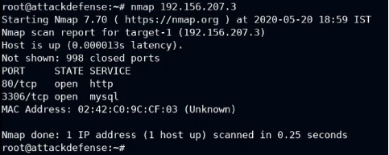

Port 80 and 3306 are open. 

**Step 3:** Starting Burp Suite. Click on the Menu, Navigate to "Web Application Analysis" and click on "owasp-zap". 

ZAP:  ![ref2]

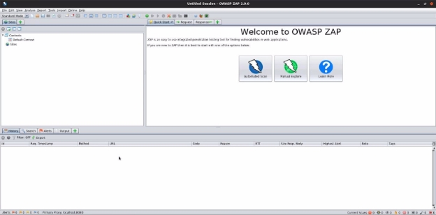

**Step 4:** Click on "Manual Explore", enter the target IP address in the Input field and click on "Launch Browser". 

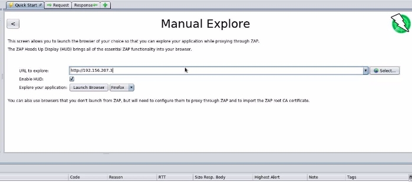

A browser session will be started with ZAP HUD. ![ref2]

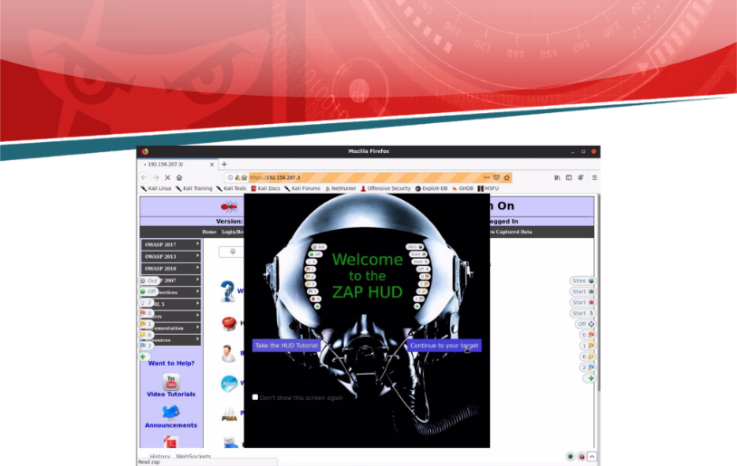

**Step 5:** Click on "Continue to your target".  ![ref2]

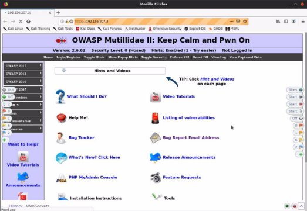

![ref1]

Upon visiting the website, the website will be added to the Site map. 

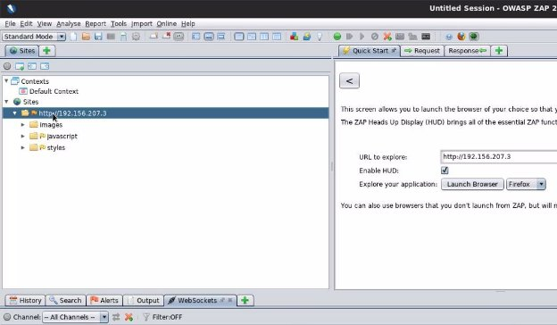

**Step 6:** Right Click on the target site under Sites, navigate to Attack and click on "Spider" .  ![ref2]

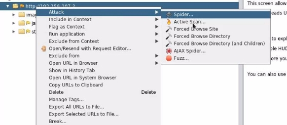

A dialog box will appear 

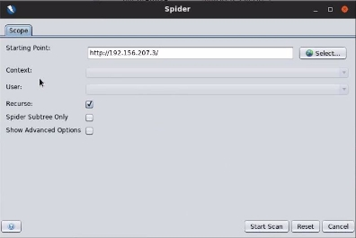

**Step 7:** Click on the "Start Scan" button and ZAP will start crawling the web pages. ![ref2]

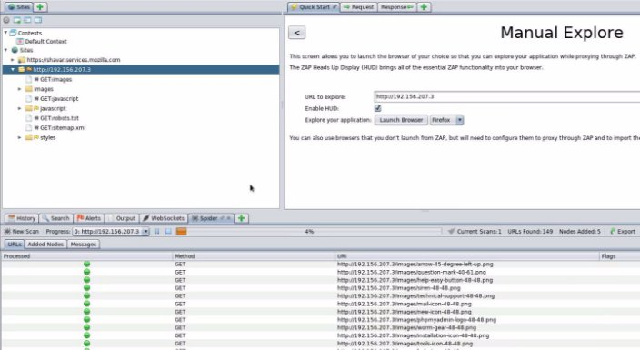

The crawled web pages and files will appear on the sitemap.  

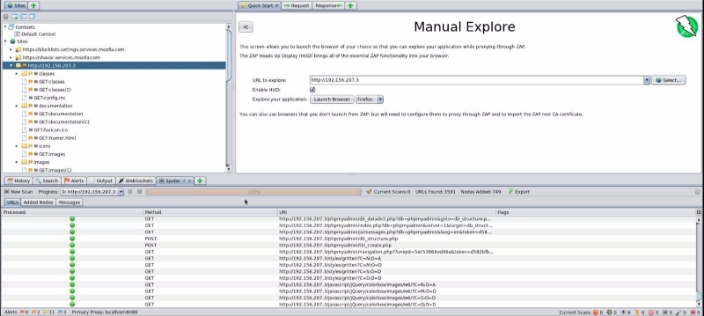

Total: 3591 URLs were found. 

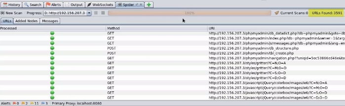

**Step 8:** After all the pages are crawled, Click on the Export Button. ![ref2]

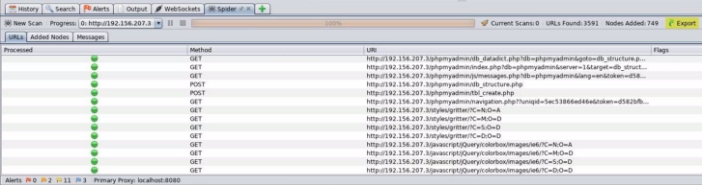

**Step 9:** Enter a filename ("zap-spider.csv") and save the output. 

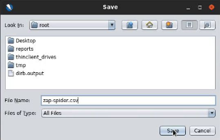

Upon successful export the following message will appear. 

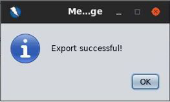

**Step 10:** View the saved file. ![ref2]**Command:** cat zap-spider.csv 

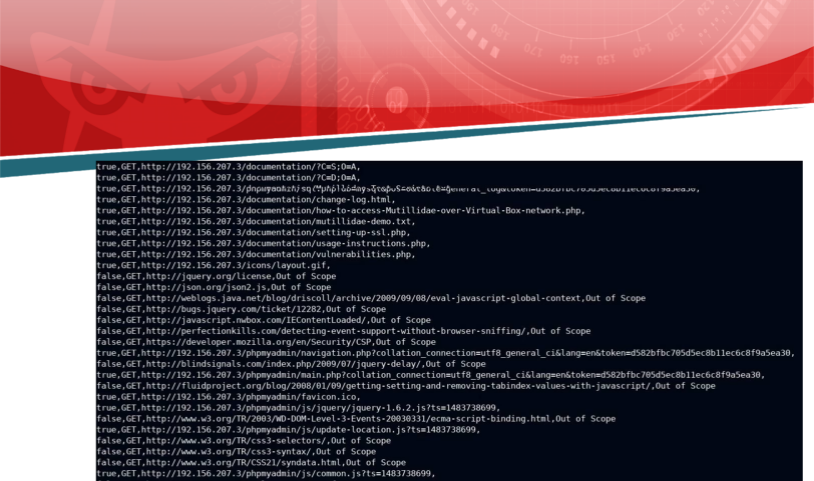

**References:**  

1. OWASP Zed Attack Proxy (<https://www.zaproxy.org/>)  ![ref2]
1. Mutillidae II (<https://sourceforge.net/projects/mutillidae/>) 

[ref1]: Aspose.Words.ea82c07a-05ce-4659-85d6-93f8b3448150.002.png
[ref2]: Aspose.Words.ea82c07a-05ce-4659-85d6-93f8b3448150.004.png
