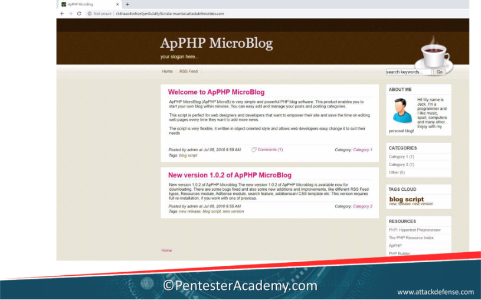
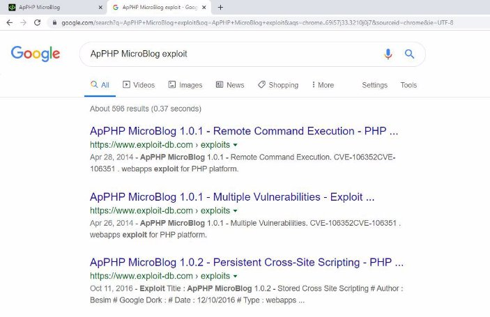
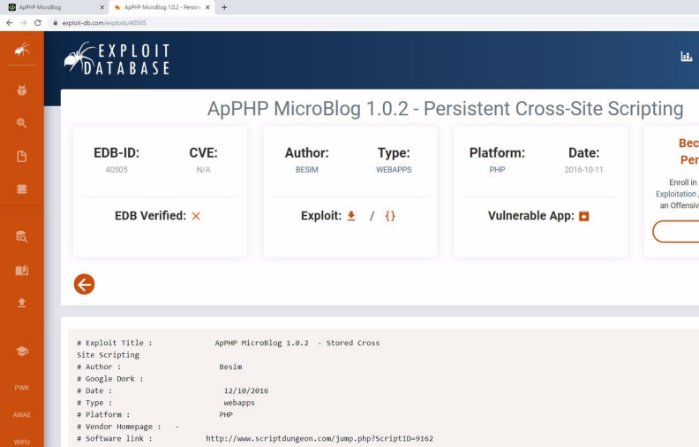
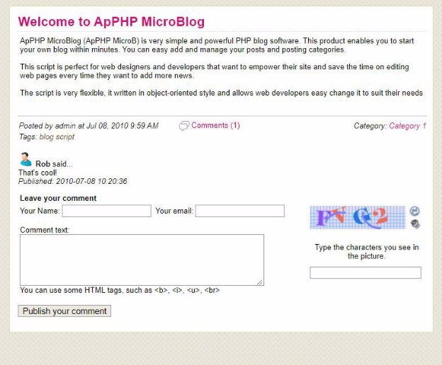
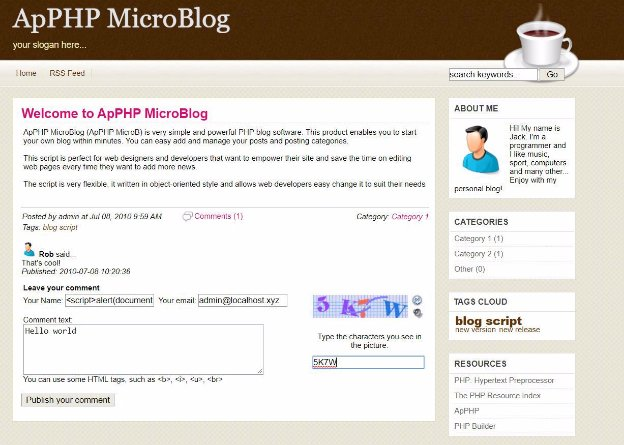
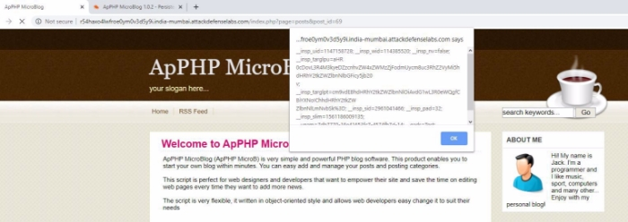



![ref1]
<table><tr><th colspan="1"><b>Name</b> </th><th colspan="1">ApPHP MicroBlog </th></tr>
<tr><td colspan="1" rowspan="2"><b>URL</b> </td><td colspan="1" valign="bottom"><https://www.attackdefense.com/challengedetails?cid=29>  </td></tr>
<tr><td colspan="1"></td></tr>
<tr><td colspan="1"><b>Type</b> </td><td colspan="1">Real World Webapps : Stored XSS </td></tr>
</table>

**Important Note:** This document illustrates all the important steps required to complete this lab. This  is  by  no  means  a  comprehensive  step-by-step  solution for this exercise. This is only provided as a reference to various commands needed to complete this exercise and for your further research on this topic. Also, note that the IP addresses and domain names might be different in your lab.  

**Solution:**  

**Step 1:** Inspect the web application. 

**Step 2:** Search on google “ApPHP MicroBlog exploit”. 

The exploit db link contains the information regarding the vulnerable parameter required to exploit the vulnerability. 

**Exploit DB Link: <https://www.exploit-db.com/exploits/40505>** ![ref2]

**Step 3:** Click on comments.  ![ref2]

![ref1]

**Step 4:** Enter the XSS payload in the “Your Name” field and fill other text fields. ![ref2]**Payload:**  

**Step 5:** Publish the comment and the XSS payload will be executed.  ![ref2]

**References:**  

1. ApPHP MicroBlog (<https://www.apphp.com/php-microblog>)  ![ref2]
1. ApPHP MicroBlog 1.0.2 - Persistent Cross-Site Scripting (<https://www.exploit-db.com/exploits/40505>)  

[ref1]: Aspose.Words.03515e18-c70d-452f-8174-baf75e721773.002.png
[ref2]: Aspose.Words.03515e18-c70d-452f-8174-baf75e721773.005.png
