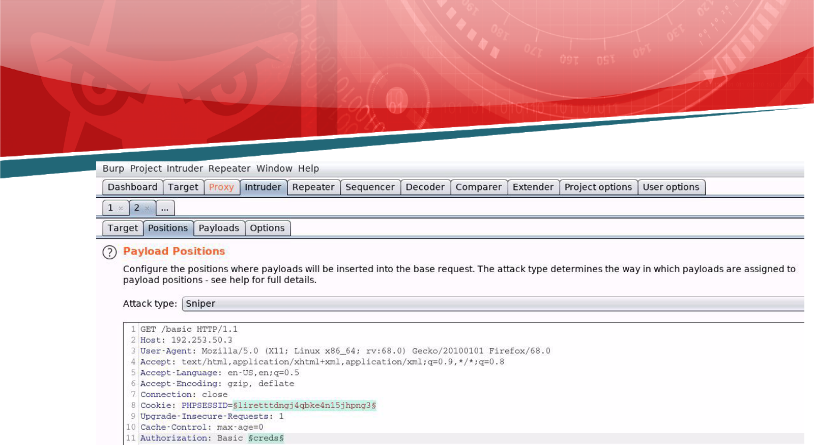

![ref1]
<table><tr><th colspan="1"><b>Name</b> </th><th colspan="1">Attacking Basic Auth with Burp Suite </th></tr>
<tr><td colspan="1" rowspan="2"><b>URL</b> </td><td colspan="1" valign="bottom"><https://attackdefense.com/challengedetails?cid=1896> </td></tr>
<tr><td colspan="1"></td></tr>
<tr><td colspan="1"><b>Type</b> </td><td colspan="1">Webapp Pentesting Basics </td></tr>
</table>

**Important Note:** This document illustrates all the important steps required to complete this lab. This  is  by  no  means  a  comprehensive  step-by-step  solution for this exercise. This is only provided as a reference to various commands needed to complete this exercise and for your further research on this topic. Also, note that the IP addresses and domain names might be different in your lab.  

**Step 1:** Determining the IP address of the target machine. **Command:** ifconfig ![ref2]

The IP address of the host machine is 192.253.50.2 Therefore, the target machine has IP address 192.253.50.3 **Step 2:** Scan the target machine using nmap. 

**Command:** nmap 192.253.50.3 

We have discovered that HTTP and MYSQL services are running on the target machine. ![ref2]**Step 3:** Checking the application available on port 80 of the target machine. 

**URL:** http://192.253.50.3 

bWAPP application is hosted on the target machine. Access the /basic directory: ![ref2]

**URL:** http://192.253.50.3/basic 

Enter some random username - password combination. ![ref2]

Since the credentials were incorrect, the same login prompt would appear again: 

Click on the “Cancel” button: ![ref2]

![ref1]

**Step 3:** Using Burp Suite to crack the Basic Auth: 

Click on the FoxyProxy plugin icon on the top-right of the browser. 

Select Burp Suite option from the list: ![ref2]

Start Burp Suite: ![ref2]

Click Next ![ref2]

![ref1]

Click on Start Burp 

Burp Suite is opened. Now, access the /basic directory again. 

Notice that Burp window comes into focus as it has intercepted the request. ![ref2]

Notice that the Proxy button in Burp Suite lit up (orange). Click on the Proxy button 

Notice the request being made by the browser. ![ref2]

![ref1]

Forward the above intercepted request and switch back to the browser window: 

Notice that the application is prompting for credentials. Enter some random credentials and press Ok. 

Intercepted request: ![ref2]

Notice the Authorization header. The “/basic” directory uses Basic Auth. Send the intercepted request to intruder. ![ref2]

![ref1]

Navigate to the Intruder tab in Burp Suite: 

Navigate to the Positions sub-tab in the Intruder tab ![ref2]

Base64 decode the Basic Auth: 

Right click and decode the base64 encoded basic auth: ![ref2]

The credentials passed to the login prompt are shown. Replace the credentials with a parameter to be substituted: 

Click on the Add Button on the right side: ![ref2]

Navigate to the Payloads tab and load the 100-common-passwords.txt list 

![ref1]

Click on the Load button to load the password list located at /root/Desktop/wordlists/100-common-passwords.txt: 

In the Payload Processing section click on the “Add” button. ![ref2]

Select “Add Prefix” 

Set the Prefix to “admin:”: 

So, now “admin:” would be appended to each password from the list. ![ref2]

Add another Payload Processing option to encode the payload to base64: 

Select the Encode Rule as Base64-encode Next, click on the “Start Attack” button: 

This would start the dictionary attack against the target webapp: 

![ref1]

Check the Status codes of the requests and check the payload for the request with a different status code: 

Notice that there is one request with the status code of 301. Double click on the request entry: ![ref2]

Select the credentials in the Authorization header field and send them to the Decoder tab. 

URL decode the credentials followed by base64-decode: ![ref2]

![ref1]

**Username:** admin **Password:** cookie1 

Now, turn off the intercept mode in Burp Suite: ![ref2]

Pass the credentials to the application: 

Click OK 

The login was successful and the Flag is displayed: **Flag:** d25db4ce54b60b49dfd7b32c52ed8d26 

**References: ![ref2]**

1\. Burp Suite (<https://portswigger.net/support/burp-suite-tools>) 

[ref1]: Aspose.Words.198a91bb-36c1-4930-8679-e7a035cf7d2d.002.png
[ref2]: Aspose.Words.198a91bb-36c1-4930-8679-e7a035cf7d2d.003.png
