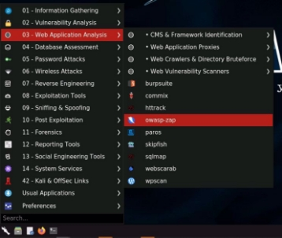
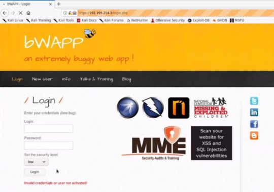
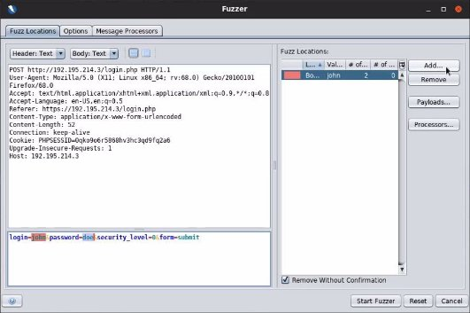

![ref1]
<table><tr><th colspan="1"><b>Name</b> </th><th colspan="1">` `Active Crawling with ZAProxy </th></tr>
<tr><td colspan="1" rowspan="2"><b>URL</b> </td><td colspan="1" valign="bottom"><https://attackdefense.com/challengedetails?cid=1897> </td></tr>
<tr><td colspan="1"></td></tr>
<tr><td colspan="1"><b>Type</b> </td><td colspan="1">Webapp Pentesting Basics </td></tr>
</table>

**Important Note:** This document illustrates all the important steps required to complete this lab. This  is  by  no  means  a  comprehensive  step-by-step  solution for this exercise. This is only provided as a reference to various commands needed to complete this exercise and for your further research on this topic. Also, note that the IP addresses and domain names might be different in your lab.  

**Objective:** Perform Dictionary Attack on the bWAPP login page. 

**Step 1:** Identifying IP address of the target machine **Command:** ip addr 

The IP address of the attacker machine is 192.195.214.2. The target machine is located at the IP address 192.195.214.3 ![ref2]

**Step 2:** Identifying open ports. **Command:** nmap 192.195.214.3 

Port 80 and 3306 are open. 

**Step 3:** Starting ZAP. Click on the Menu, Navigate to "Web Application Analysis" and click on "owasp-zap". 

ZAP: ![ref2]

**Step 4:** Click on "Manual Explore", enter the target IP address in the Input field and click on "Launch Browser". 

A browser session will be started with ZAP HUD. ![ref2]

![ref1]

**Step 5:** Click on "Continue to your target".  ![ref2]

**Step 6:** Attempt login with invalid credentials.  

The website and the login page action will be added to the sitemap. ![ref2]

**Step 7:** Click on the POST request from the sitemap and click on the "Request" tab. 

**Step 8:** Right click on the POST request, navigate to Attack and click on "Fuzz". 

The Fuzzer window will appear.  ![ref2]

**Step 9:** Select the entered username "john" and click on the Add button. ![ref2]

The payloads window will appear.  

**Step 10:** Click on the Add button, enter the payloads for username. Click on the Add button. **Payloads:** admin,bee ![ref2]

**Step 11:** Click on the "OK" button.  

The payload will appear in the Fuzz Locations. ![ref2]

**Step 12:** Similarly, select the entered password "doe" and click on the Add button. 

The payloads window will appear.  ![ref2]

**Step 13:** Click on the Add button, enter the payloads for password. Click on the Add button. **Payloads:** admin, password, adminpasswd, cookie, hello, world, bug, bee 

**Step 14:**  Click on the OK button. ![ref2]

The payload will appear in the Fuzz Locations. 

**Step 15:** Click on Start Fuzzer. Upon completion of the attack, compare the status code. ![ref2]

One of the status code will be 302.  

**Step 16:** Login to the web application. The login credentials were discovered in the previous step. 

**Username:** bee **Password:** bug ![ref2]

**After Login:**  

**References:**  

1\. OWASP Zed Attack Proxy (<https://www.zaproxy.org/>)  ![ref2]

1\. bWAPP (<http://www.itsecgames.com/>) 

[ref1]: Aspose.Words.008f3792-6f1d-42ca-bf18-7db1b1727947.002.png
[ref2]: Aspose.Words.008f3792-6f1d-42ca-bf18-7db1b1727947.004.png
