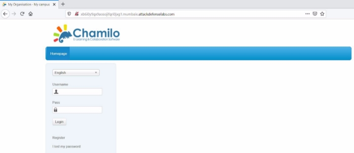
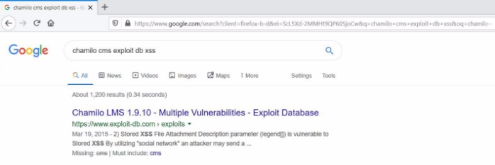
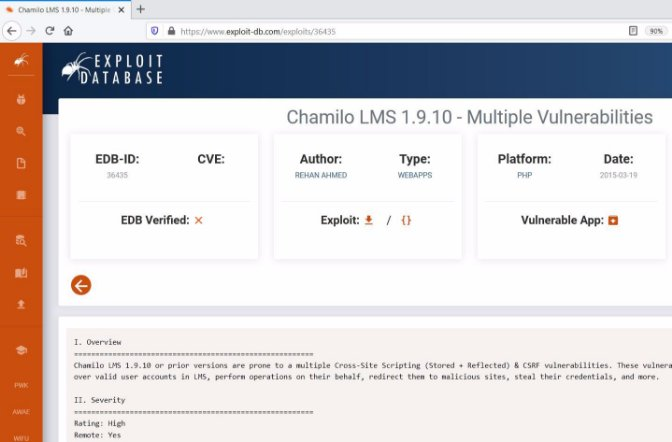
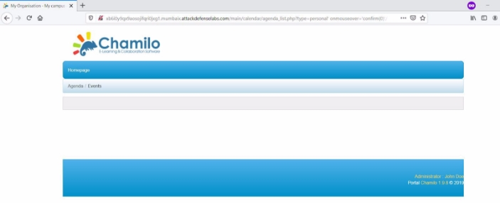
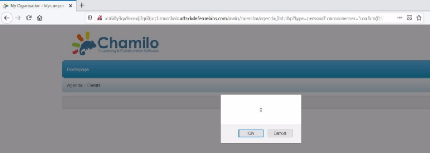



<table><tr><th colspan="1" valign="top"><b>Name</b> </th><th colspan="1" valign="top">Chamilo LMS </th></tr>
<tr><td colspan="1" rowspan="2" valign="top"><b>URL</b> </td><td colspan="1" valign="bottom"><https://www.attackdefense.com/challengedetails?cid=298> </td></tr>
<tr><td colspan="1"></td></tr>
<tr><td colspan="1"><b>Type</b> </td><td colspan="1">Real World Webapps : Reflected XSS </td></tr>
</table>

**Important Note:** This document illustrates all the important steps required to complete this lab. This  is  by  no  means  a  comprehensive  step-by-step  solution for this exercise. This is only provided as a reference to various commands needed to complete this exercise and for your further research on this topic. Also, note that the IP addresses and domain names might be different in your lab.  

**Solution:**  

**Step 1:** Inspect the web application. 

**Step 2:** Search on google “chamilo cms exploit db xss” and look for publicly available exploits. ![ref1]

The exploit db link contains the payload required to exploit the vulnerability. **Exploit DB Link: <https://www.exploit-db.com/exploits/36435>** ![ref1]

**Step 3:** Inject the payload in URL to exploit the vulnerability.  

**Payload:** http://xb6i0y9qx9aosojifqri0jxg1.mumbaix.attackdefenselabs.com/main/calendar/agenda\_list.ph p?type=personal%27%20onmouseover=%27confirm%280%29%27/%3E%3C!-- 

Upon moving the mouse over the page the payload will be triggered. 

The XSS payload triggered successfully. ![ref1]

**References:**  

1. Chamilo LMS (<https://chamilo.org/chamilo-lms/>)  ![ref1]
1. Chamilo LMS 1.9.10 - Multiple Vulnerabilities(<https://www.exploit-db.com/exploits/36435>)  

[ref1]: Aspose.Words.51130965-9a62-431e-b48f-6b1daaa6a89e.004.png
