

![ref1]
<table><tr><th colspan="1"><b>Name</b> </th><th colspan="1">Directory Enumeration with Burp Suite </th></tr>
<tr><td colspan="1" rowspan="2"><b>URL</b> </td><td colspan="1" valign="bottom"><https://attackdefense.com/challengedetails?cid=1886> </td></tr>
<tr><td colspan="1"></td></tr>
<tr><td colspan="1"><b>Type</b> </td><td colspan="1">Webapp Pentesting Basics </td></tr>
</table>

**Important Note:** This document illustrates all the important steps required to complete this lab. This  is  by  no  means  a  comprehensive  step-by-step  solution for this exercise. This is only provided as a reference to various commands needed to complete this exercise and for your further research on this topic. Also, note that the IP addresses and domain names might be different in your lab.  

**Step 1:** Start the terminal and check the IP address of the machine. **Command:** ip addr 

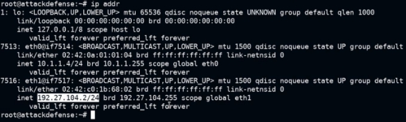

The IP address of the attacker machine is 192.27.104.2, the target machine will be located at IP address 192.27.104.3 

**Step 2:** Run a Nmap scan against the target IP. **Command:** nmap -sS -sV 192.27.104.3 

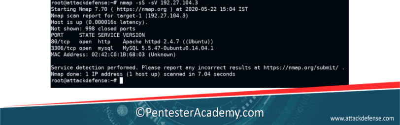

Port 80 and 3306 are open.**  

**Step 3:** Access the web application using firefox.  **Command:** firefox http://192.27.104.3 

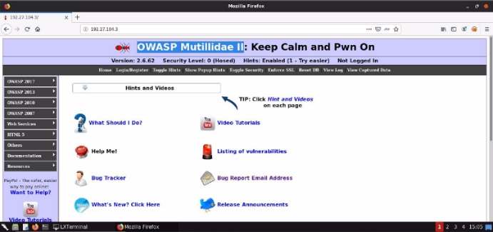

**Step 4:** The target is running OWASP Mutillidae II. Start burp suite. 

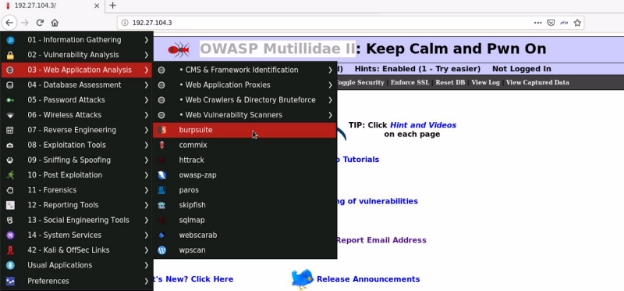

**Step 5:** Navigate to the **intruder tab** and set the target machine IP address. 

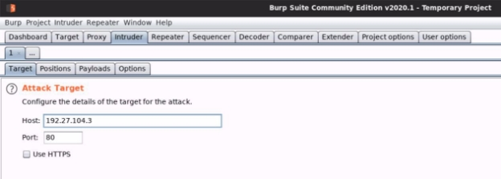

**Step 6:** Configure the Payload positions. The payload position can be set by selecting the text and click on the add button. 

GET /§name§ HTTP/1.0 Cookie: c=cval Content-Length: 17 

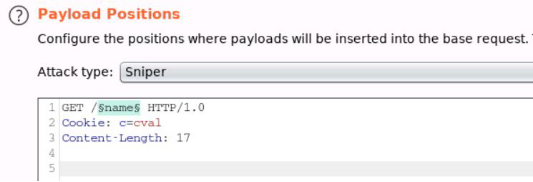

**Step 7:** Since the Burp Suite Community edition, time throttles requests, Add known words to the payload list.  

data passwords phpmyadmin images 

js 

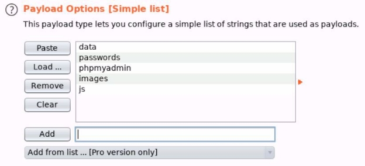

**Step 8:** Click on “**Load ..**” and navigate to common.txt file then click open. **Path:** /usr/share/wordlists/dirb/common.txt 

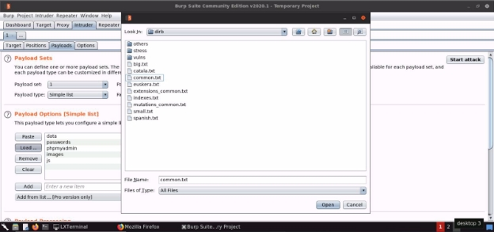

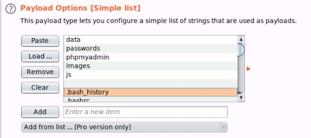

Also, remove the empty entry by selecting the empty space and click on “Remove” 

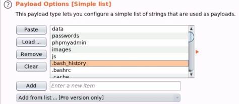

**Step 9:** Click on “**Start Attack**” and check the status code for the payloads.  

404 Status Code - Not Found 

200/301 Status Code - Directory exists (Moved Permanently) 

![ref2]

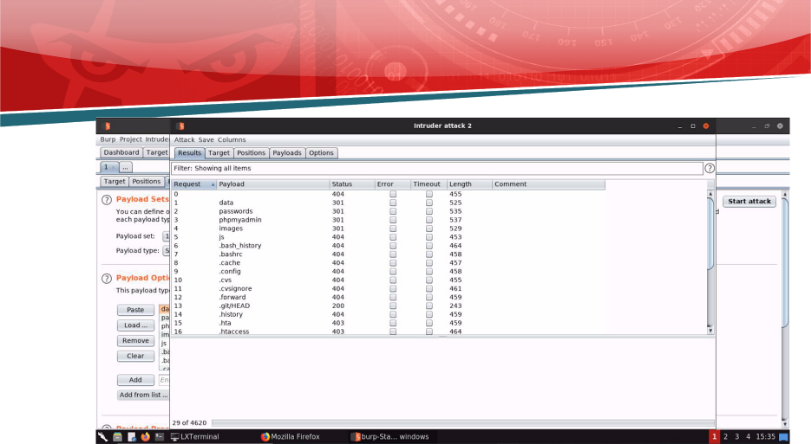

**References** 

1. Burp Suite (<https://portswigger.net/burp>) 
1. Mutillidae II (<https://sourceforge.net/projects/mutillidae/>) 
![ref2]

[ref1]: Aspose.Words.502900df-d594-4797-9a37-919426424c2b.002.png
[ref2]: Aspose.Words.502900df-d594-4797-9a37-919426424c2b.013.png
