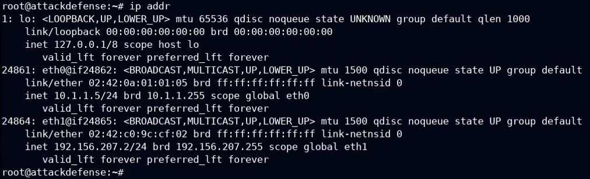
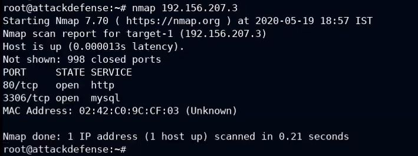
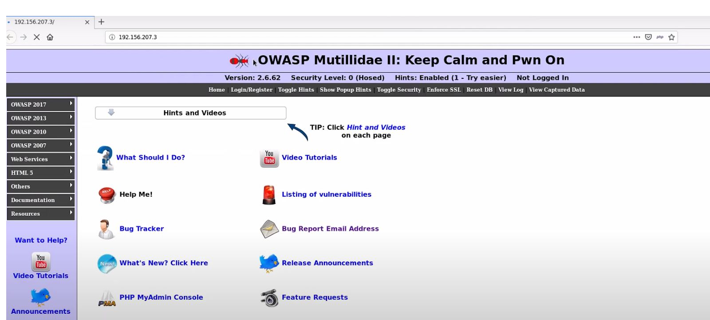
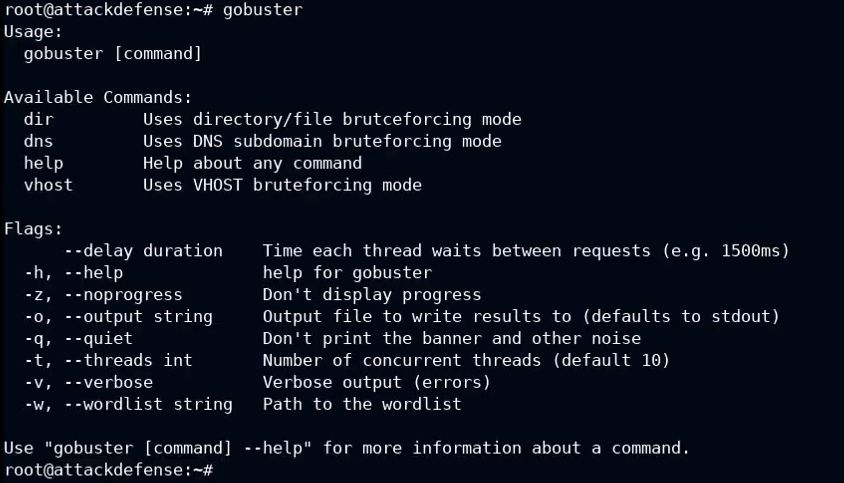
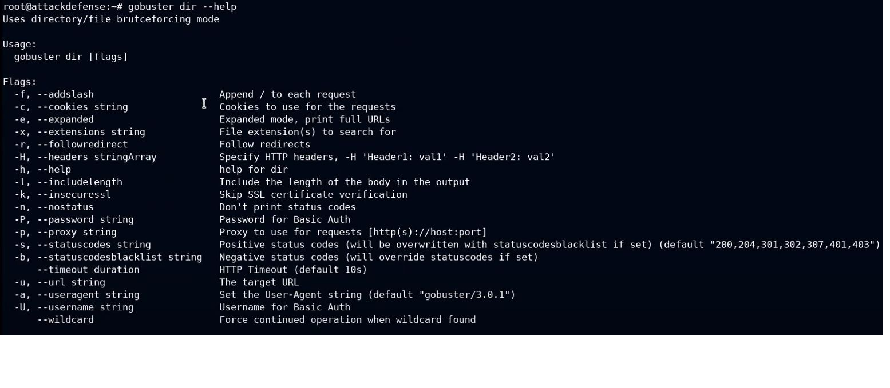
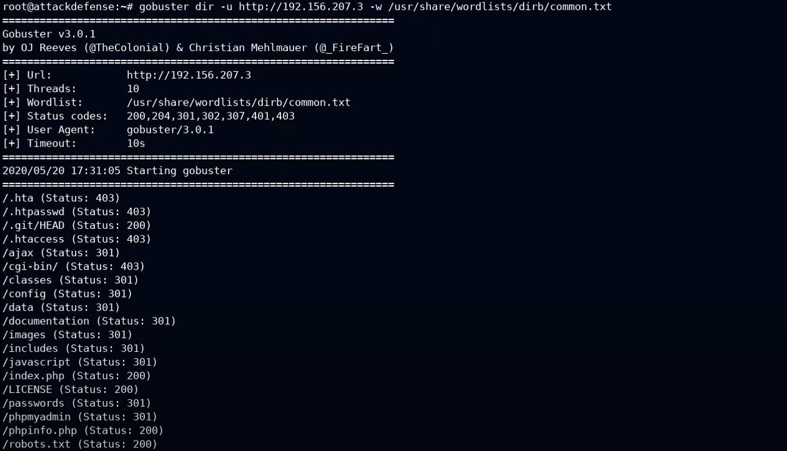
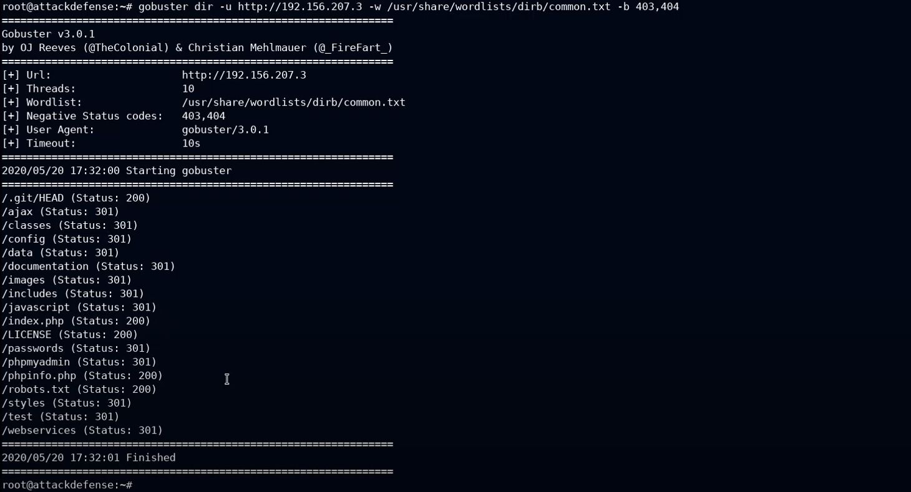
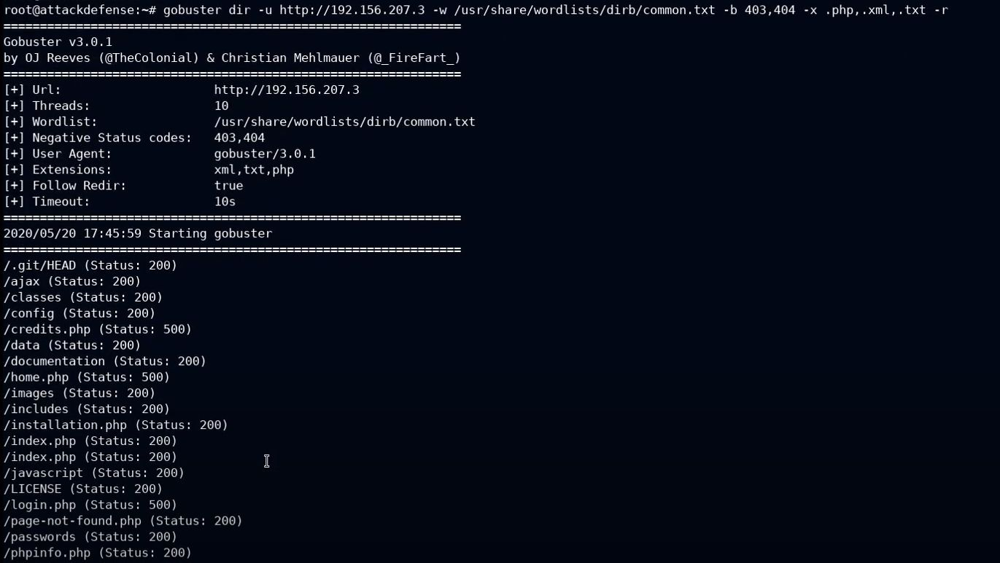
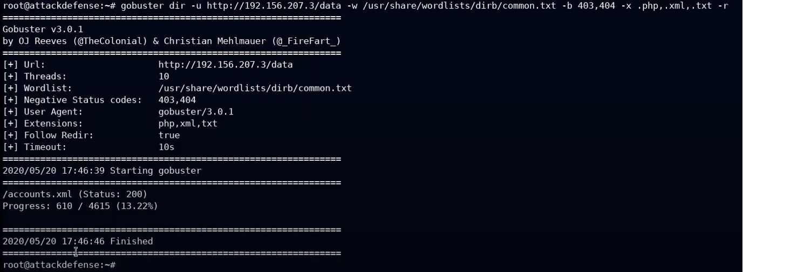
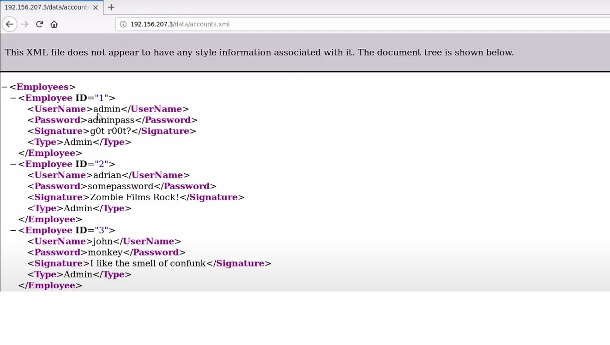

||
||
||
||
||

>  style="width:8.47917in;height:1.85481in" /> style="width:7.20833in;height:2.1875in" /> style="width:8.48958in;height:0.85417in" />**Important** **Note:**
> This document illustrates all the important steps required to complete
> this lab. This is by no means a comprehensive step-by-step solution
> for this exercise. This is only provided as a reference to various
> commands needed to complete this exercise and for your further
> research on this topic. Also, note that the IP addresses and domain
> names might be different in your lab.
>
> **Objective:** Perform directory enumeration with Gobuster
>
> **Solution:**
>
> **Step** **1:** Start a terminal and check the IP address of the host.
>
> **Command:** ip addr
>
> **Step** **2:** Run Nmap scan on the target IP to find open ports.
>
> **Note:** The target IP will be 192.156.207.3
>
> **Command:** nmap 192.156.207.3

Port 80 and Port 3306 are
open

**Step** **3:** Start firefox and navigate to the target IP.

An instance of Mutillidae is running at port 80 of the target.

**Step** **4:** Start a terminal and run gobuster command to get the
available options in the gobuster tool.

**Command:** gobuster

Check the available commands for dir mode in gobuster.

**Command:** gobuster dir --help

**Step** **5:** Run the
gobuster while passing the URL and wordlist as an argument.

**Command:** gobuster dir -u http://192.156.207.3 -w
/usr/share/wordlists/dirb/common.txt

**Note:** -u flag is used to specify the URL of the target whereas the
-w flag is used to specify the wordlist with its full path.

**Step** **6:** Run the gobuster scan while ignoring the 403 and 404
status codes.

**Command:** gobuster dir -u http://192.156.207.3 -w
/usr/share/wordlists/dirb/common.txt -b 403,404

**Note:** The -b flag is used to specify the status codes which has to
be ignored.

**Step** **7:** Run the
gobuster scan while ignoring 403,404 status code files/directories and
run the scan to find the specific file extensions (.php, .xml, .txt)

**Command:** gobuster dir -u http://192.156.207.3 -w
/usr/share/wordlists/dirb/common.txt -b 403,404 -x .php,.xml,.txt -r

**Note:** -x flag is used to find the files which have the specified
extensions. -r flag is used to specify to follow any redirects or 302
status code pages.

**Step** **8:** Run the
gobuster to scan ‘/data’ directory while ignoring the 403 and 404 status
code pages/directories. Find the files with the extensions such as .php,
.xml, .txt

**Command:** gobuster dir -u http://192.156.207.3/data -w
/usr/share/wordlists/dirb/common.txt -b 403,404 -x .php,.xml,.txt -r

**Note:** the ‘/data’ directory is appended in the target URL. The
gobuster will start scanning from the /data directory.

Found an accounts.xml file
inside the /data directory.

**Step** **9:** Navigate to the accounts.xml file and check its
contents.

**URL:** http://192.156.207.3/data/accounts.xml

The login credentials have been revealed in the accounts.xml file.

**References:**

> 1\. Gobuster
> [<u>(https://github.com/OJ/gobuster)</u>](https://github.com/OJ/gobuster)
>
> 2\. Mutillidae
> ([<u>https://sourceforge.net/projects/mutillidae/</u>](https://sourceforge.net/projects/mutillidae/))
