

<table><tr><th colspan="1"><b>Name</b> </th><th colspan="1">Directory Enumeration with ZAProxy </th></tr>
<tr><td colspan="1" rowspan="2"><b>URL</b> </td><td colspan="1" valign="bottom"><https://attackdefense.com/challengedetails?cid=1885>  </td></tr>
<tr><td colspan="1"></td></tr>
<tr><td colspan="1"><b>Type</b> </td><td colspan="1">Webapp Pentesting Basics </td></tr>
</table>

**Important Note:** This document illustrates all the important steps required to complete this lab. This  is  by  no  means  a  comprehensive  step-by-step  solution for this exercise. This is only provided as a reference to various commands needed to complete this exercise and for your further research on this topic. Also, note that the IP addresses and domain names might be different in your lab.  

**Objective:** Perform directory enumeration with ZAProxy 

**Step 1:** Identifying IP address of the target machine **Command:** ip addr 

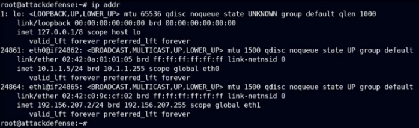

The IP address of the attacker machine is 192.156.207.2. The target machine is located at the IP address 192.156.207.3 ![ref1]

**Step 2:** Identifying open ports. **Command:** nmap 192.156.207.3  

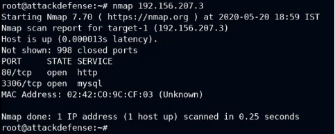

Port 80 and 3306 are open. 

**Step 3:** By default, ZAP only has one wordlist for fuzzing. The wordlists are present in the directory "/root/.ZAP/fuzzers/dirbuster/". Adding dirb common.txt wordlist to the ZAP wordlist directory.  

**Commands:**  

ls -l ~/.ZAP/fuzzers/dirbuster 

cp /usr/share/wordlists/dirb/common.txt ~/.ZAP/fuzzers/dirbuster/ 

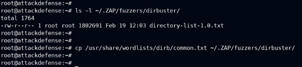

**Step 4:** Starting ZAProxy. Click on the Menu, Navigate to "Web Application Analysis" and click on "owasp-zap". ![ref1]

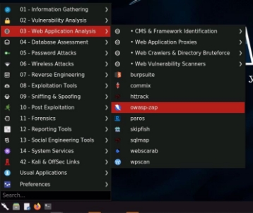

ZAP:  

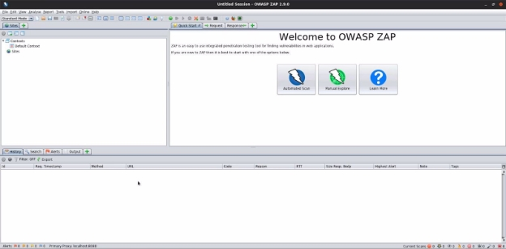

**Step 5:** Click on "Manual Explore", enter the target IP address in the Input field and click on "Launch Browser". ![ref1]

A browser session will be started with ZAP HUD. ![ref1]

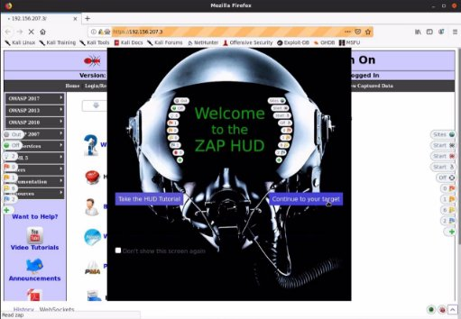

**Step 6:** Click on "Continue to your target".  

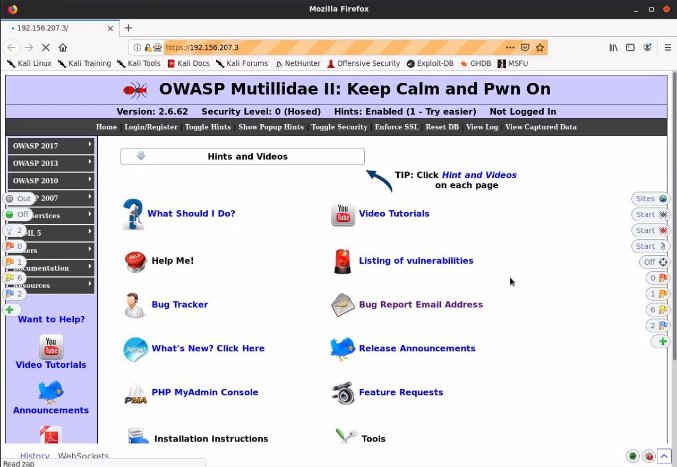

Upon visiting the website, the website will be added to the Site map. ![ref1]

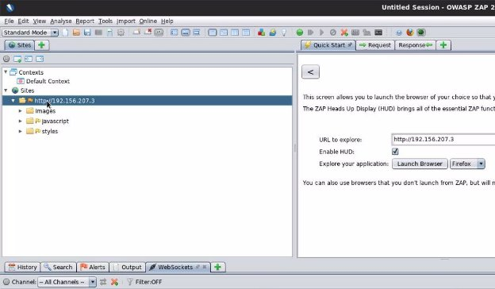

**Step 7:** Right Click on the target site under Sites, navigate to Attack and click on "Forced Browse Directory" .  

A new tab will appear on the bottom window:  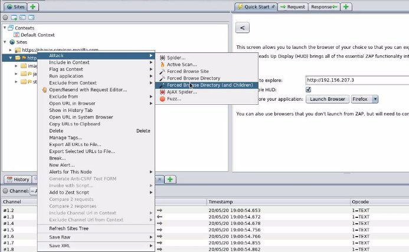![ref1]

**Step 8:** Click on the List dropdown and select the common.txt wordlist.  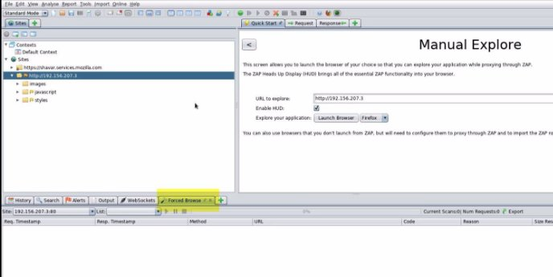

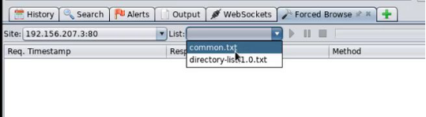

**Step 9:** Start the attack by clicking the play button. 

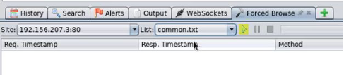

The scan will start and the found directories and files will be added to the sitemap. ![ref1]

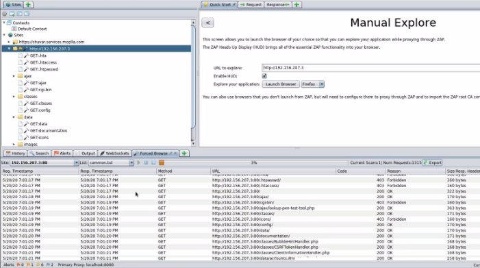

**Step 10:** After the scan completes, expand the directories. Check the files in data folder. ![ref1]

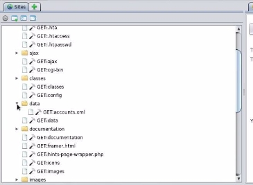

**Step 11:** Access the "data" directory in the browser.  

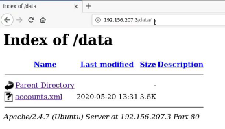

**Step 12:** Click on the "accounts.xml" file.  

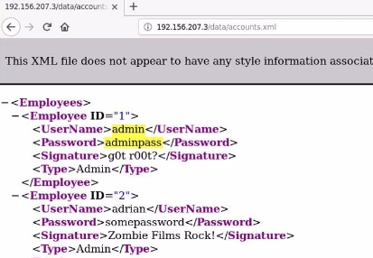

The login credentials were revealed.  **References:**  

1. OWASP Zed Attack Proxy (<https://www.zaproxy.org/>)  ![ref1]
1. Mutillidae II (<https://sourceforge.net/projects/mutillidae/>) 

[ref1]: Aspose.Words.e3d93e22-a2d1-4faf-9176-faea81028e5f.004.png
