

![ref1]
<table><tr><th colspan="1"><b>Name</b> </th><th colspan="1">Improper Session Management </th></tr>
<tr><td colspan="1" rowspan="2"><b>URL</b> </td><td colspan="1" valign="bottom"><https://attackdefense.com/challengedetails?cid=1931>  </td></tr>
<tr><td colspan="1"></td></tr>
<tr><td colspan="1"><b>Type</b> </td><td colspan="1">Webapp Pentesting Basics </td></tr>
</table>

**Important Note:** This document illustrates all the important steps required to complete this lab. This  is  by  no  means  a  comprehensive  step-by-step  solution for this exercise. This is only provided as a reference to various commands needed to complete this exercise and for your further research on this topic. Also, note that the IP addresses and domain names might be different in your lab.  

**Step 1:** Interacting with the webapp. 

When the lab starts up, the Secure Bank’s webapp opens up in the browser: 

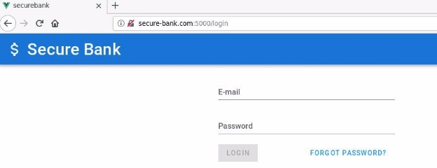

**Step 2:** Configure Burp Suite to intercept the requests. Select the Burp profile from Foxy Proxy plugin: ![ref2]

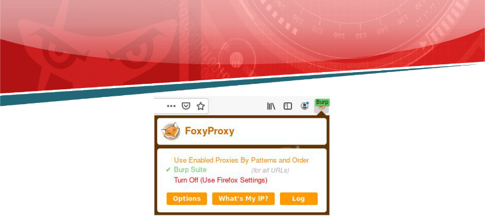

Launch Burp Suite: 

Select Web Application Analysis > burpsuite ![ref2]

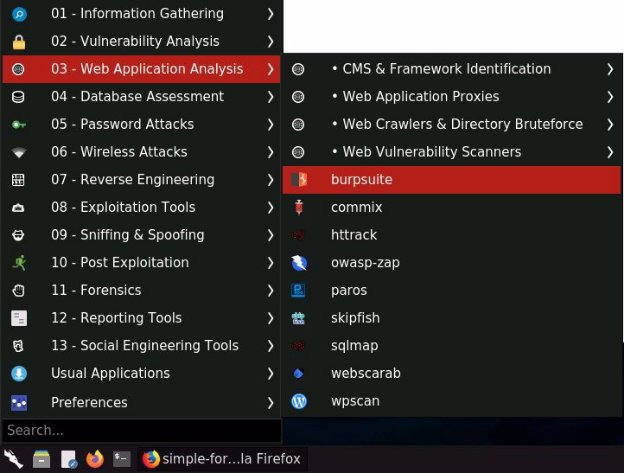

![ref1]

The following window will appear: 

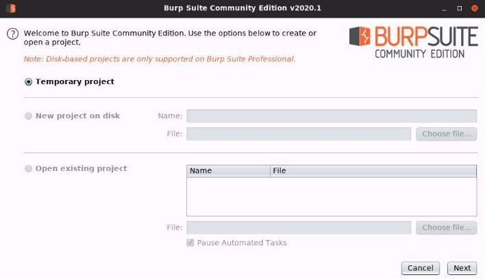

Click Next. ![ref2]

Finally, click Start Burp in the following window: 

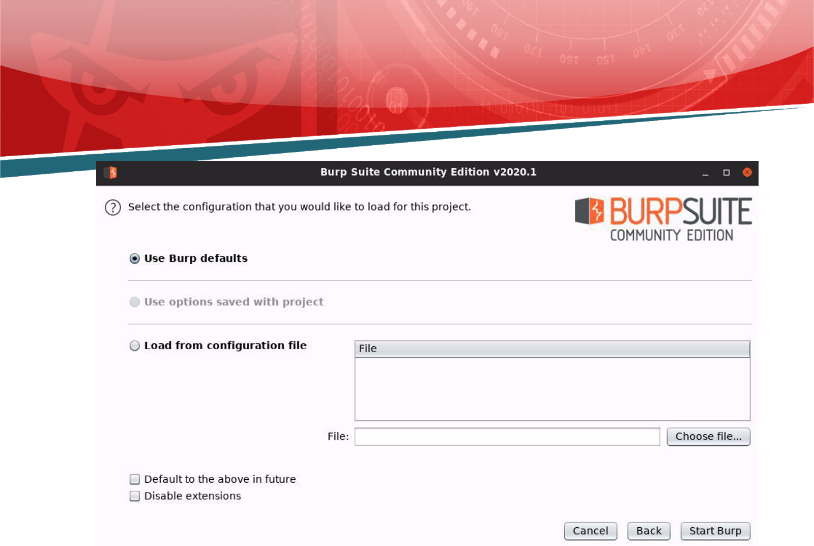

The following window will appear after BurpSuite has started: ![ref2]

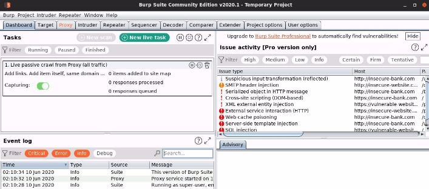

![ref1]

**Step 3:** Login into the webapp using the provided credentials: 

**Username:** james@secbank.com **Password:** password1 

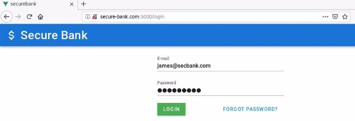

Check the intercepted request in Burp Suite. 

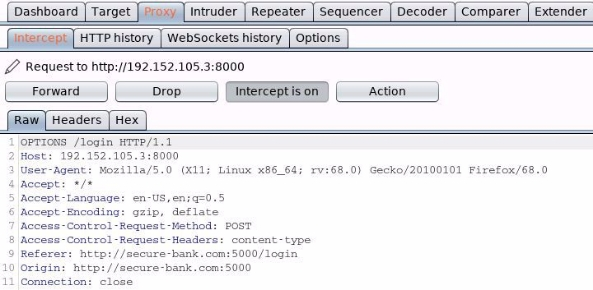

Forward the above OPTIONS request. ![ref2]

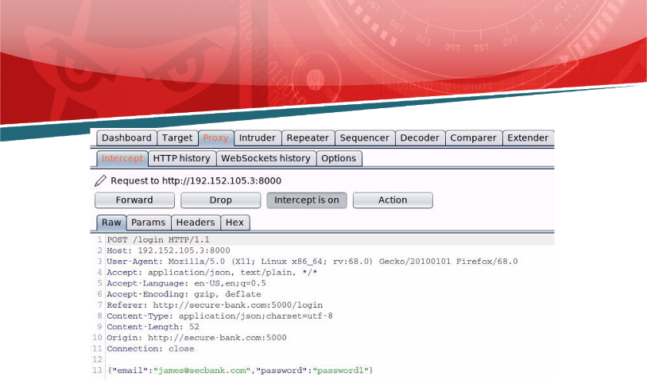

Forward the above POST request and check the web page:. 

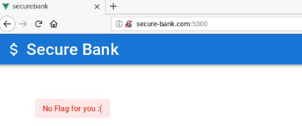

The page says “No Flag for you :(”. ![ref2]

Notice the response in the HTTP History tab. 

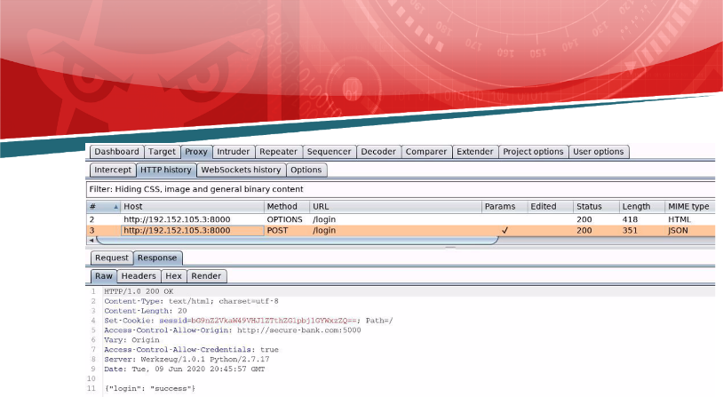

Notice that the response contains a “Set-Cookie” header. The cookie seems to be base64-encoded. 

**Cookie:** bG9nZ2VkaW49VHJ1ZTthZG1pbj1GYWxzZQ== 

**Step 4:** Decoding the above obtained cookie using base64 utility: 

**Command:** echo bG9nZ2VkaW49VHJ1ZTthZG1pbj1GYWxzZQ== | base64 -d 

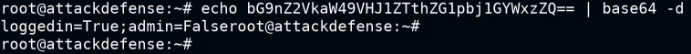

So, the cookie contains the information on whether the user is logged in as admin or not. ![ref2]**Step 5:** Modifying the cookie to authenticate as admin. 

Logout of the webapp: 

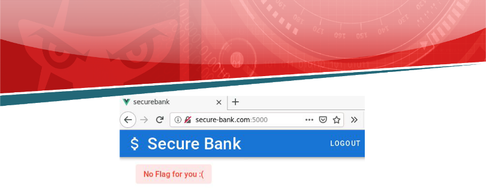

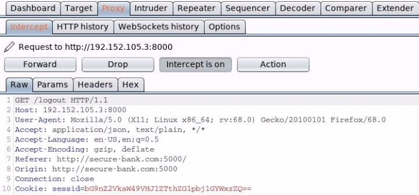

Modify the above request: 

1. Change the request endpoint to “/” 
1. Modify the cookie value so that the admin is set to “True”. 

**Command:** echo -n "loggedin=True;admin=True" | base64 ![ref2]**Cookie (for admin):** bG9nZ2VkaW49VHJ1ZTthZG1pbj1UcnVl 

![ref1]

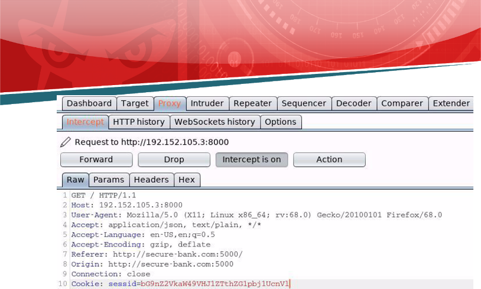

Send the above request and check the response in the HTTP History tab. 

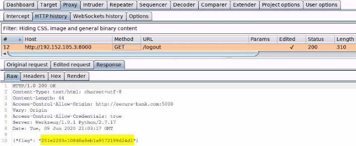

**Flag:** 251e2203c108d0a8eb1a9572199d24d1 ![ref2]

**References:** 

1. OWASP Top 10 (<https://owasp.org/www-project-top-ten/>) ![ref2]
1. A2: Broken Authentication ([https://owasp.org/www-project-top-ten/OWASP_Top_Ten_2017/Top_10-2017_A2-Brok en_Authentication](https://owasp.org/www-project-top-ten/OWASP_Top_Ten_2017/Top_10-2017_A2-Broken_Authentication)) 

[ref1]: Aspose.Words.3efb24ef-8575-4806-8765-117f7e6a75e8.002.png
[ref2]: Aspose.Words.3efb24ef-8575-4806-8765-117f7e6a75e8.004.png
