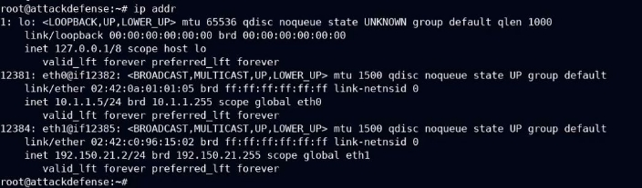

<table><tr><th colspan="1"><b>Name</b> </th><th colspan="1">Local File Inclusion </th></tr>
<tr><td colspan="1" rowspan="2"><b>URL</b> </td><td colspan="1" valign="bottom"><https://www.attackdefense.com/challengedetails?cid=2122>  </td></tr>
<tr><td colspan="1"></td></tr>
<tr><td colspan="1"><b>Type</b> </td><td colspan="1">OWASP Top 10 : Broken Access Control </td></tr>
</table>

**Important Note:** This document illustrates all the important steps required to complete this lab. This  is  by  no  means  a  comprehensive  step-by-step  solution for this exercise. This is only provided as a reference to various commands needed to complete this exercise and for your further research on this topic. Also, note that the IP addresses and domain names might be different in your lab.  

**Objective:** Local File Inclusion attack. 

**Solution:**  

**Step 1:** Start a terminal and check the IP address of the host. **Command:** ip addr 

**Step 2:** Run Nmap scan on the target IP to find open ports. ![ref1]**Note:** The target IP will be 192.150.21.3 

**Command:** nmap 192.150.21.3 

Port 80 and 3306 are open 

**Step 3:** Start firefox and navigate to the target IP. 

An instance of bWAPP is running at port 80 of the target. ![ref1]**Step 4:** Log in to the application using **bee:bug** credentials. 

**Step 5:** From the Choose your bug dropdown, Select “**Remote & Local File Inclusion (RFI/LFI)**” exercise. 

**Step 6:** Choose a language from the Dropdown menu. 

Click on the Go button. 

**Step 7:** Modify the language parameter in the URL and put “/etc/passwd” in the parameter. ![ref1]

The Local File Inclusion attack was successful. ![ref1]**References:** 

1\. bWAPP (<http://www.itsecgames.com/>) 

[ref1]: Aspose.Words.b3eb176c-36a5-4c0f-a4c2-8066ebd2a5c5.004.png
