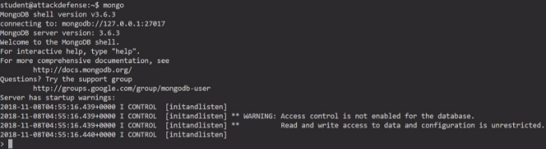
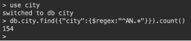

<table><tr><th colspan="1"><b>Name</b> </th><th colspan="1">MongoDB: Basics </th></tr>
<tr><td colspan="1" rowspan="2"><b>URL</b> </td><td colspan="1" valign="bottom"><https://www.attackdefense.com/challengedetails?cid=230>  </td></tr>
<tr><td colspan="1"></td></tr>
<tr><td colspan="1"><b>Type</b> </td><td colspan="1">Infrastructure Attacks: MongoDB </td></tr>
</table>

**Important Note:** This document illustrates all the important steps required to complete this lab. This  is  by  no  means  a  comprehensive  step-by-step  solution for this exercise. This is only provided as a reference to various commands needed to complete this exercise and for your further research on this topic. Also, note that the IP addresses and domain names might be different in your lab.  

**Q1. How many databases are present is mongodb cluster? Answer:** 7 

**Solution:**  

Connect to mongodb server running on localhost 

**Command: mongo** 

**Command:** show dbs ![ref1]

**Q2. How many collections are present in database users? Answer:** 3 

**Commands:**  use users 

show collections 

**Q3. What is the value of flag obtained from the mongodb cluster? Answer:** fl4g\_f0r\_m0ng0\_db

**Commands: ![ref1]**use flag 

show collections db.flag.find() 

**Q4. What is the email address of user named “Heather” from “current” user collection? Answer:** mauris.sapien@eueratsemper.ca 

**Commands:** 

use users db.current.find({"user":"Heather"}) 

**Q5. How many users are present in “past” collection in users database? Answer:** 179 

**Commands:** use users db.past.count() 

**Q6. How many cities of state “Massachusetts” are present in the collection city in database city?** 

**Answer:** 474 ![ref1]

**Commands:** 

use city db.city.find({"state":"MA"}).count() 

**Q7. How many cities have population greater than 15000 in the collection city in database city?** 

**Answer:** 5785 

**Commands:** 

use city db.city.find({"pop":{$gt:15000}}).count() 

**Q8. How many cities of state “Indiana” have population  greater than 15000 in collection “city” in database “city”?** 

**Answer:** 130 

**Commands:** 

use city db.city.find({$and:[{pop:{$gt:15000}},{"state":"IN"}]}).count() ![ref1]

**Q9. How many cities have population less than 100 or belongs to state “Indiana” in collection “city” in database “city”?** 

**Answer:** 1376 

**Commands:** 

use city db.city.find({$or:[{pop:{$lt:100}},{"state":"IN"}]}).count() 

**Q10. How many Cities have their name starting with “AN” in collection “city” in database “city”?** 

**Answer:** 154 

**Commands:** 

use city db.city.find({"city":{$regex:"^AN.\*"}}).count() 

**Q11. What is the name of 101st city in collection “city” when sorted in ascending order according to “city” in database “city”?** 

**Answer:** ADDY 

**Commands:**  ![ref1]

use city db.city.find().sort({"city":1}).skip(100).limit(1) 

**Q12. What is the average population in collection “city” in database “city” (Upto two decimal places)?** 

**Answer:** 8462.79 

**Commands:** 

use city db.city.aggregate({"$group":{"\_id":null,avg:{$avg:"$pop"}}}) 

**References:** 

1. MongoDB (<https://www.mongodb.com/>) ![ref1]
1. mongo (<https://docs.mongodb.com/manual/mongo/>)  

[ref1]: Aspose.Words.34f31a11-8a0c-4d43-b84f-d499d641c6b9.004.png
