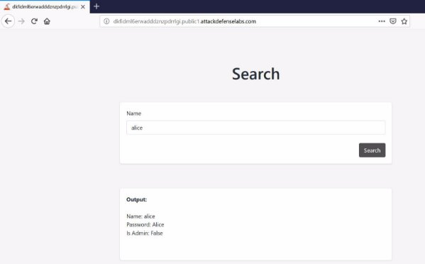
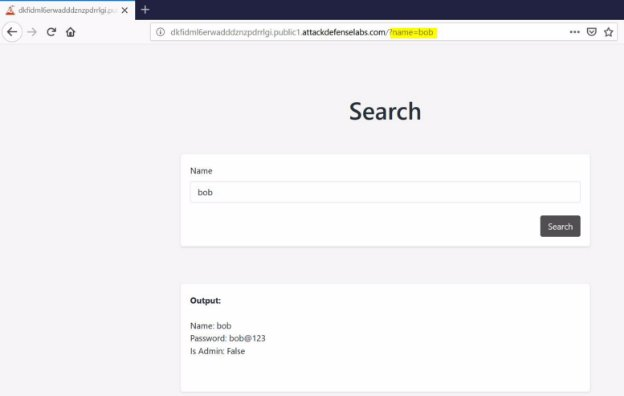
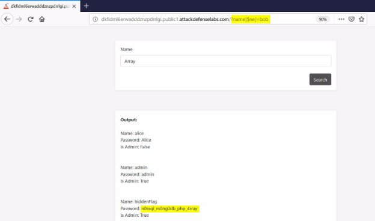



<table><tr><th colspan="1"><b>Name</b> </th><th colspan="1">MongoDB: NoSQL injection </th></tr>
<tr><td colspan="1" rowspan="2"><b>URL</b> </td><td colspan="1" valign="bottom"><https://www.attackdefense.com/challengedetails?cid=232>  </td></tr>
<tr><td colspan="1"></td></tr>
<tr><td colspan="1"><b>Type</b> </td><td colspan="1">Infrastructure Attacks: MongoDB </td></tr>
</table>

**Important Note:** This document illustrates all the important steps required to complete this lab. This  is  by  no  means  a  comprehensive  step-by-step  solution for this exercise. This is only provided as a reference to various commands needed to complete this exercise and for your further research on this topic. Also, note that the IP addresses and domain names might be different in your lab.  

The webapp is vulnerable to injection, which can be exploited to dump all documents from the collection. 

**Step 1:** Interact with the web application.  ![ref1]

Upon entering a random name say bob in the search field, if the record exist for that name, details are shown otherwise nothing is shown. 

**Step 2:** Inject payload in the URL ![ref1]**Payload:**  /?name[$ne]=bob

**Flag:** n0ssql\_m0ng0db\_php\_4rray **References:** 

1. MongoDB (<https://www.mongodb.com/>) ![ref1]
1. Mongodb is vulnerable to SQL injection in PHP at least ([https://www.idontplaydarts.com/2010/07/mongodb-is-vulnerable-to-sql-injection-in-php-a t-least/](https://www.idontplaydarts.com/2010/07/mongodb-is-vulnerable-to-sql-injection-in-php-at-least/))  

[ref1]: Aspose.Words.b9b7f787-e875-4add-9b48-5db7e1814c40.003.png
