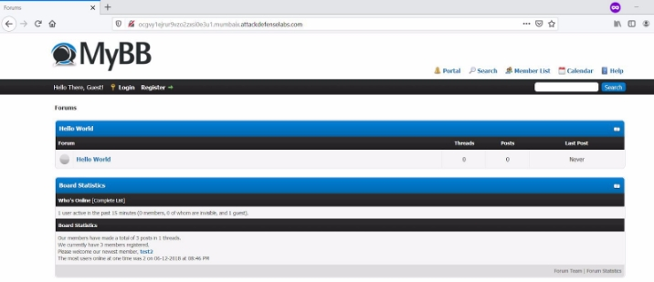
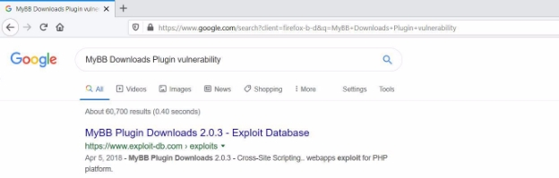
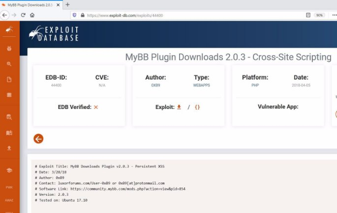
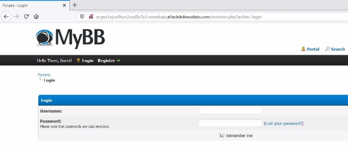
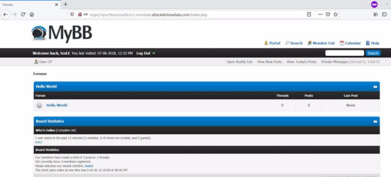
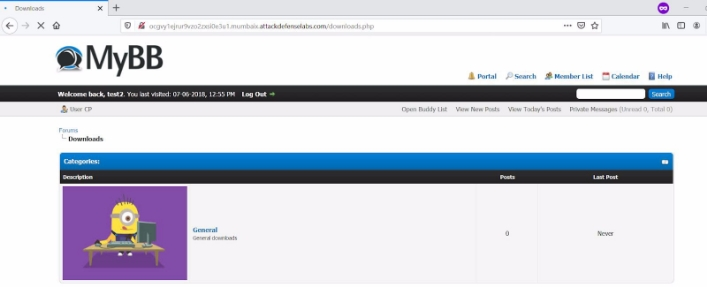
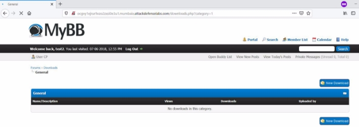
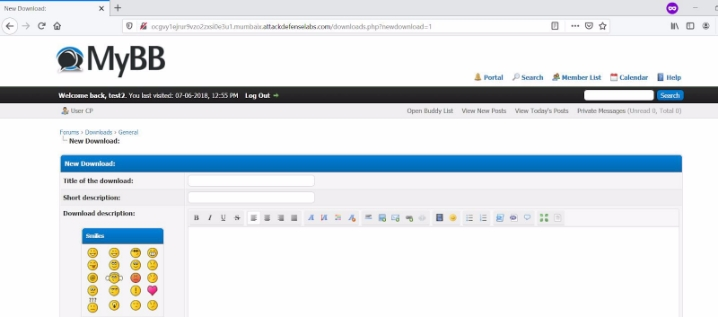
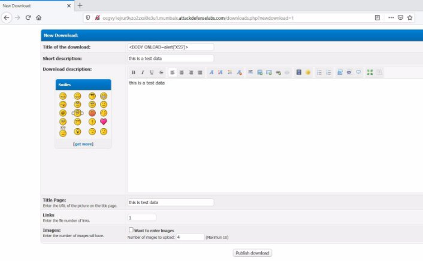
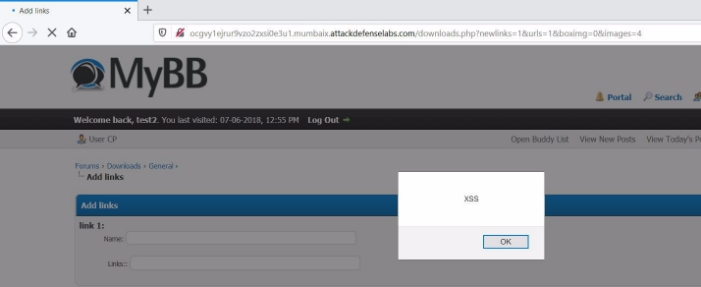



<table><tr><th colspan="1" valign="top"><b>Name</b> </th><th colspan="1" valign="top">MyBB Downloads Plugin </th></tr>
<tr><td colspan="1" rowspan="2" valign="top"><b>URL</b> </td><td colspan="1" valign="bottom"><https://www.attackdefense.com/challengedetails?cid=9> </td></tr>
<tr><td colspan="1"></td></tr>
<tr><td colspan="1"><b>Type</b> </td><td colspan="1">Real World Webapps : Stored XSS </td></tr>
</table>

**Important Note:** This document illustrates all the important steps required to complete this lab. This  is  by  no  means  a  comprehensive  step-by-step  solution for this exercise. This is only provided as a reference to various commands needed to complete this exercise and for your further research on this topic. Also, note that the IP addresses and domain names might be different in your lab.  

**Solution:**  

**Step 1:** Inspect the web application. 

**Step 2:** Search on google “MyBB Downloads Plugin vulnerability” and look for publicly available exploits. ![ref1]

The exploit db link contains the payload required to exploit the vulnerability. **Exploit DB Link: <https://www.exploit-db.com/exploits/44400>** ![ref1]

**Step 3:** The user has to authenticate in order to exploit the vulnerability. The login credentials are provided in the challenge description. 

**URL:** http://ocgvy1ejrur9vzo2zxsi0e3u1.mumbaix.attackdefenselabs.com/member.php?action=login 

**Credentials:** 

- **Username:** test2 
- **Password:** password 

**Login Page** 

**Admin Dashboard ![ref1]**

**Step 4:** Navigate to the downloads page. 

**URL:** http://ocgvy1ejrur9vzo2zxsi0e3u1.mumbaix.attackdefenselabs.com/downloads.php 

**Step 5:** Click on the General button. ![ref1]

**Step 6:** Click on New Download button. 

**Step 7:** Inject the payload in the title field and enter any data in Short description, Download description, Title page field. 

**Payload:** <BODY ONLOAD=alert('XSS')> ![ref1]

Click on Publish Download button. ![ref1]

The XSS payload triggered successfully. **References:**  

1. MyBB (<https://mybb.com/>) ![ref1]
1. MyBB Plugin Downloads (<https://community.mybb.com/mods.php?action=view&pid=854>)  
1. MyBB Plugin Downloads 2.0.3 - Cross-Site Scripting (<https://www.exploit-db.com/exploits/44400>)  

[ref1]: Aspose.Words.430ac682-afc1-48df-ab32-3a71a88f1eec.004.png
