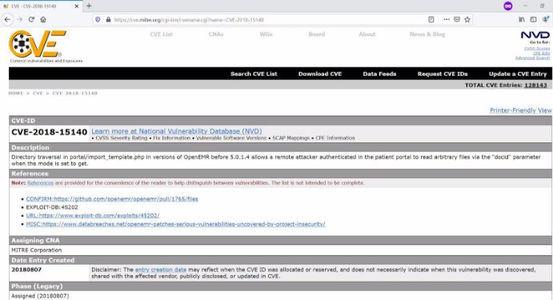
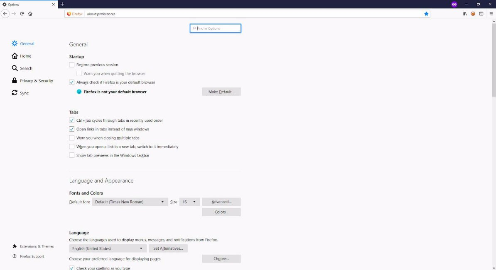

![ref1]
<table><tr><th colspan="1"><b>Name</b> </th><th colspan="1">CVE-2018-15140 </th></tr>
<tr><td colspan="1" rowspan="2"><b>URL</b> </td><td colspan="1" valign="bottom"><https://www.attackdefense.com/challengedetails?cid=1147> </td></tr>
<tr><td colspan="1"></td></tr>
<tr><td colspan="1"><b>Type</b> </td><td colspan="1">Webapp CVEs : 2018 </td></tr>
</table>

**Important Note:** This document illustrates all the important steps required to complete this lab. This  is  by  no  means  a  comprehensive  step-by-step  solution for this exercise. This is only provided as a reference to various commands needed to complete this exercise and for your further research on this topic. Also, note that the IP addresses and domain names might be different in your lab.  

**Solution:**  

The web application is vulnerable to CVE-2018-15140 

**Step 1:** Inspect the web application. ![ref2]

**Step 2:** Search on google “CVE-2018-15140”. 

The exploit db link contains the steps to be followed to exploit the vulnerability. ![ref2]**Exploit DB Link: <https://www.exploit-db.com/exploits/45202>** 

**Step 3:** The user has to authenticate in order to exploit the vulnerability. Credentials are provided in challenge description. 

**Credentials:** 

- **Username:** admin 
- **Password:** password

**URL: ![ref2]**http://ps3dgd20qqggulcsec2kwkl8s.mumbaix.attackdefenselabs.com/interface/login/login.php?si te=default 

**Admin Dashboard:** 

**Step 4:** Navigate to the vulnerable page provided at exploit-db and intercept the request with burp suite. 

To configure Burp Suite check the Appendix. 

**URL: ![ref2]**http://ps3dgd20qqggulcsec2kwkl8s.mumbaix.attackdefenselabs.com/portal/import\_template.php 

**Step 5:** Right click and select “Change request method”. 

**Step 6:** Inject the payload in the request. ![ref2]**Payload:** mode=get&docid=/etc/passwd 

Click on the Forward button. 

The Directory Traversal attack was successful. **References:**  

1. OpenEMR (<https://www.open-emr.org/>)  ![ref2]
1. CVE-2018-15140 (<https://cve.mitre.org/cgi-bin/cvename.cgi?name=CVE-2018-15140>)  
1. OpenEMR 5.0.1.3 - (Authenticated) Arbitrary File Actions (<https://www.exploit-db.com/exploits/45202>)  

**Appendix**

**Appendix A: Configuration for Windows OS** 

`     `A.1 Google Chrome with Burp Suite      A.2 Mozilla Firefox with Burp Suite 

**Appendix B: Configuration for Kali OS** 

`                `B.1 Google Chrome with Burp Suite 

`    `B.2 Mozilla Firefox with Burp Suite 

**Appendix C: Configuration for FoxyProxy Standard plugin ![ref2]**

`    `C.1 FoxyProxy on Google Chrome with Burp Suite 

`    `C.2 FoxyProxy on Mozilla Firefox with Burp Suite** 

**Appendix A** 

**A.1 Google Chrome with Burp Suite (Windows OS)** 

**Step 1:** Open Google Chrome and navigate to the URL given below. **URL:** chrome://settings 

Google Chrome Settings page will appear. ![ref2]**Step 2:** Search for “proxy” in the search box. 

**Step 3:** Upon clicking on “Open proxy settings”, Windows “Internet Properties” settings dialog box will appear. Click on “LAN settings” button. ![ref2]

**Step 4:** Select the checkbox “Use a proxy server for your LAN (These settings will not apply to dial-up or VPN connections)”. And  enter “127.0.0.1” and “8080” in “Address” textbox and “Port” textbox respectively.  

Click “OK” on the “Local Area Network (LAN) Settings” dialog box and close the “Internet Properties” dialog box. 

**Step 5:** Start Burp suite. 

**Step 6:** Navigate to “Options” tab under “Proxy” tab and verify that the “running” checkbox is selected for the interface “127.0.0.1:8080”. 

All the HTTP request made by Google Chrome will be intercepted by Burp Suite.  ![ref3]![ref2]

![ref1]

**A.2 Mozilla Firefox with burp suite (Windows OS) ![ref2]**

**Step 1:** Open Mozilla Firefox and navigate to the URL given below. **URL:** about:preferences 

**Step 2:** Scroll down to the bottom of the page and click on “Settings” button under “Network Settings” section. ![ref2]

**Step 3:**  Enter “127.0.0.1” and “8080” in “HTTP Proxy” textbox and “Port” textbox respectively. 

Click on the OK button.  ![ref2]

**Step 4:** Start Burp suite. 

**Step 5:** Navigate to “Options” tab under “Proxy” tab and verify that the “running” checkbox is selected for the interface “127.0.0.1:8080”. ![ref4]

All the HTTP request made by Mozilla Firefox will be intercepted by Burp Suite.  ![ref3]![ref2]

**Appendix B **

**B.1 Google Chrome with Burp Suite (Kali OS)** 

**Step 1:** Open Google Chrome and navigate to the URL given below. **URL:** chrome://settings 

Google Chrome Settings page will appear. ![ref2]**Step 2:** Search for “proxy” in the search box. 

**Step 3:** Upon clicking on “Open proxy settings”, The “Networks” settings window will appear. Click on Network Proxy option. ![ref2]

**Step 4:** Enter “127.0.0.1” in “HTTP Proxy” textbox and enter 8080 as port.  

Close the dialog box.  **Step 5:** Start Burp suite. 

**Step 6:** Navigate to “Options” tab under “Proxy” tab and verify that the “running” checkbox is selected for the interface “127.0.0.1:8080”. ![ref5]![ref2]

All the HTTP/HTTPS request made by Google Chrome will be intercepted by Burp Suite.  ![ref6]![ref2]

**B.2 Mozilla Firefox with burp suite (Kali OS) **

**Step 1:** Open Mozilla Firefox and navigate to the URL given below. **URL:** about:preferences** 

**Step 2:** Click on “Advanced” tab on the left panel and then click on “Settings” button under “Network” tab. ![ref2]

**Step 3:**  Enter “127.0.0.1” and “8080” in “HTTP Proxy” textbox and “Port” textbox respectively. ![ref2]

**Step 4:** Start Burp suite. 

**Step 5:** Navigate to “Options” tab under “Proxy” tab and verify that the “running” checkbox is selected for the interface “127.0.0.1:8080”. ![ref5]

All the HTTP request made by Mozilla Firefox will be intercepted by Burp Suite.  ![ref6]![ref2]

**Appendix C** 

**C.1 FoxyProxy on Google Chrome with Burp Suite** 

**Step 1:** Installing FoxyProxy. 

FoxyProxy Standard plugin for Google Chrome can be installed from the URL given below: 

**URL: [https://chrome.google.com/webstore/detail/foxyproxy-standard/gcknhkkoolaabfmlnjonogaaifnjlfn p?hl=en](https://chrome.google.com/webstore/detail/foxyproxy-standard/gcknhkkoolaabfmlnjonogaaifnjlfnp?hl=en)** 

After installing FoxyProxy, a small fox icon will appear on the right side of the address bar.  

**Step 2:** Click on the FoxyProxy icon and click on Options. ![ref2]

**Step 3:** Click on the “Add New Proxy” Button.  

**Step 4:** Enter “127.0.0.1” in “Host or IP Address” textbox and enter “8080” in Port textbox. ![ref2]

Click on the Save button. ![ref2]

The configured proxy will appear in the proxies table. 

**Step 5:** Enable the proxy. 

Click on the FoxyProxy icon and select the option “Use proxy 127.0.0.1:8080 for all URLs” 

The FoxyProxy icon will change its color (In this case it is blue). ![ref2]

**Step 6:** Start Burp suite. 

**Step 7:** Navigate to “Options” tab under “Proxy” tab and verify that the “running” checkbox is selected for the interface “127.0.0.1:8080”. ![ref4]

All the HTTP/HTTPS request made by Google Chrome will be intercepted by Burp Suite.  ![ref3]![ref2]

**C.2 FoxyProxy on Mozilla Firefox with Burp Suite ![ref1]**

**Step 1:** Installing FoxyProxy. 

FoxyProxy Standard plugin for Mozilla Firefox can be installed from the URL given below: **URL: <https://addons.mozilla.org/en-US/firefox/addon/foxyproxy-standard/>** 

After installing FoxyProxy, a small fox icon will appear on the right side of the address bar.  

**Step 2:** Click on the FoxyProxy icon and click on Options. ![ref2]

**Step 3:** Click on the add button on the left panel ![ref1]

**Step 4:** Enter “127.0.0.1” in “IP Address, DNS name, server name” textbox and enter “8080” in Port textbox. 

Click on the Save button. ![ref2]

The proxy will appear in the proxies table. **Step 5:** Enable the proxy. 

Click on the FoxyProxy icon and select the option “Use proxy 127.0.0.1:8080 for all URLs (ignore patterns)” 

The FoxyProxy icon will change its color (In this case it is green). ![ref2]

**Step 6:** Start Burp suite. ![ref1]

**Step 7:** Navigate to “Options” tab under “Proxy” tab and verify that the “running” checkbox is selected for the interface “127.0.0.1:8080” ![ref4]

All the HTTP/HTTPS request made by Mozilla Firefox will be intercepted by Burp Suite.  ![ref3]![ref2]

[ref1]: Aspose.Words.0eab2217-7a8b-4e6d-b4f0-8b50e7053675.002.png
[ref2]: Aspose.Words.0eab2217-7a8b-4e6d-b4f0-8b50e7053675.004.png
[ref3]: Aspose.Words.0eab2217-7a8b-4e6d-b4f0-8b50e7053675.017.jpeg
[ref4]: Aspose.Words.0eab2217-7a8b-4e6d-b4f0-8b50e7053675.021.jpeg
[ref5]: Aspose.Words.0eab2217-7a8b-4e6d-b4f0-8b50e7053675.026.jpeg
[ref6]: Aspose.Words.0eab2217-7a8b-4e6d-b4f0-8b50e7053675.027.jpeg
