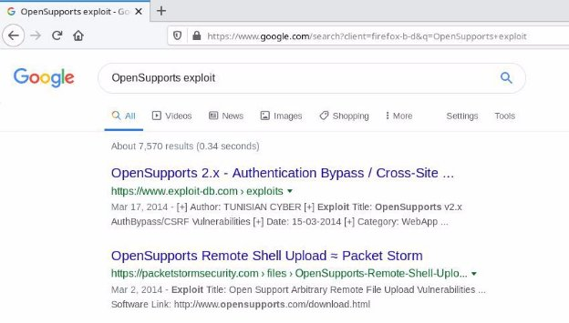

<table><tr><th colspan="1"><b>Name</b> </th><th colspan="1">OpenSupports </th></tr>
<tr><td colspan="1" rowspan="2"><b>URL</b> </td><td colspan="1" valign="bottom"><https://attackdefense.com/challengedetails?cid=437> </td></tr>
<tr><td colspan="1"></td></tr>
<tr><td colspan="1"><b>Type</b> </td><td colspan="1">Real World Webapps : Broken Authentication </td></tr>
</table>

**Important Note:** This document illustrates all the important steps required to complete this lab. This  is  by  no  means  a  comprehensive  step-by-step  solution for this exercise. This is only provided as a reference to various commands needed to complete this exercise and for your further research on this topic. Also, note that the IP addresses and domain names might be different in your lab.  

**Solution:**  

**Step 1:** Inspect the web application. 

**Step 2:** Search on google “OpenSupports exploit” and look for publicly available exploits. ![ref1]

The exploit db link contains an HTML script which can be used to exploit the vulnerability. ![ref1]**Exploit DB Link: <https://www.exploit-db.com/exploits/32319>** 

**Step 3:** Navigate to the login page located at /admin/ 

**URL:** http://ee0tjqz271dt84nf9lo3swccr.mumbaix.attackdefenselabs.com/admin/ ![ref1]

**Step 4:** In the Login Staff login portal, inject the SQLI payload in username and password field. **Payload:** 1'or'1'='1 

**Step 5:** Click on the Login button. 

Authentication was bypassed  successfully. ![ref1]

**References:**  

1. Open Support (<https://www.opensupports.com/>)  ![ref1]
1. OpenSupports 2.x - Authentication Bypass / Cross-Site Request Forgery  (<https://www.exploit-db.com/exploits/32319>)  

[ref1]: Aspose.Words.54c0f8de-663e-4aaf-8614-f5cd0a12a8da.004.png
