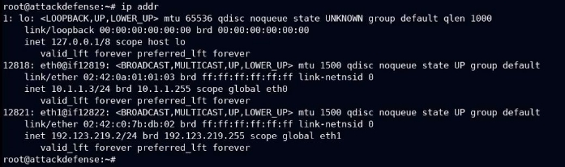
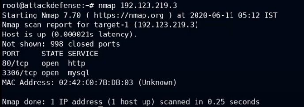
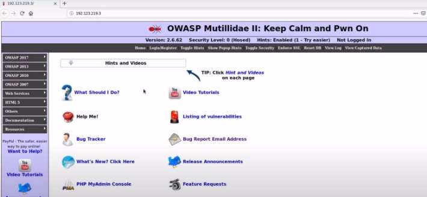
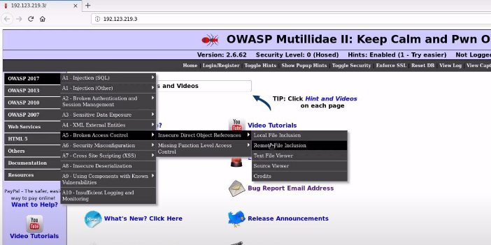
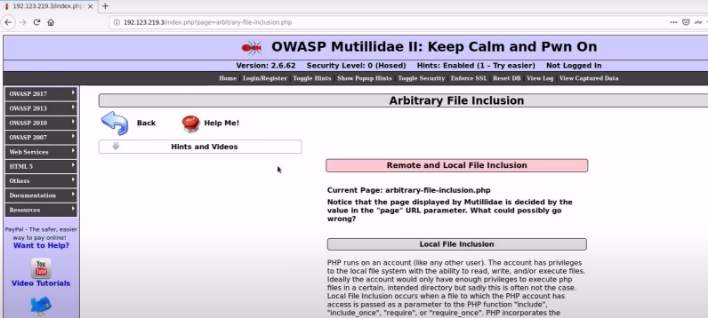
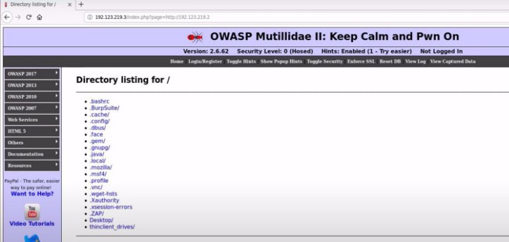
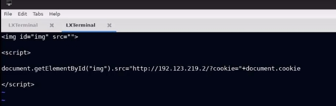
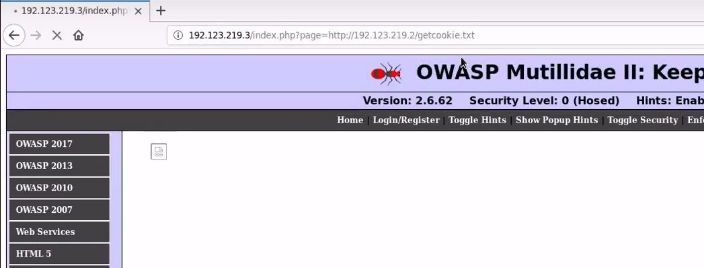
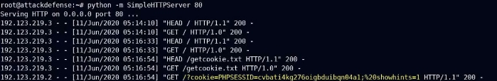



![ref1]
<table><tr><th colspan="1"><b>Name</b> </th><th colspan="1">Remote File Inclusion </th></tr>
<tr><td colspan="1" rowspan="2"><b>URL</b> </td><td colspan="1" valign="bottom"><https://attackdefense.com/challengedetails?cid=2124>  </td></tr>
<tr><td colspan="1"></td></tr>
<tr><td colspan="1"><b>Type</b> </td><td colspan="1">OWASP Top 10 : Broken Access Control </td></tr>
</table>

**Important Note:** This document illustrates all the important steps required to complete this lab. This  is  by  no  means  a  comprehensive  step-by-step  solution for this exercise. This is only provided as a reference to various commands needed to complete this exercise and for your further research on this topic. Also, note that the IP addresses and domain names might be different in your lab.  

**Objective:** Perform XML External Entity attack. 

**Solution:**  

**Step 1:** Start a terminal and check the IP address of the host. **Command:** ip addr 

**Step 2:** Run Nmap scan on the target IP to find open ports. ![ref2]**Note:** The target IP will be 192.123.219.3 

**Command:** nmap 192.123.219.3 

Port 80 and Port 3306 are open 

**Step 3:** Start firefox and navigate to the target IP. 

An instance of Mutillidae is running at port 80 of the target. 

**Step 4:** Navigate to Remote File Inclusion page located under Insecure Direct Object References in Broken Access Control of OWASP 2017 ![ref2]

**Step 5:** Start a Simple HTTP Server on port 80 ![ref2]

**Command:** python -m SimpleHTTPServer 80 

**Step 6:** Check for the Remote File Inclusion Vulnerability by modifying the page parameter with the URL of the attacker’s machine. 

These are the root (/) directories/files of the attacker machine. 

**Step 7:** Create a file to retrieve the cookies and save it as getcookie.txt **Content:** 

 ![ref2]

 

**Step 8:** Open the getcookie.txt from the target server. ![ref1]

**Step 9:** Check the python HTTP server terminal. 

The Remote File Inclusion attack is successful. ![ref2]

![ref1]

**References: ![ref2]**

1\. Mutillidae (<https://sourceforge.net/projects/mutillidae/>) 

[ref1]: Aspose.Words.e11a2d87-f09f-4460-b06d-94fb5bac4d6e.002.png
[ref2]: Aspose.Words.e11a2d87-f09f-4460-b06d-94fb5bac4d6e.004.png
