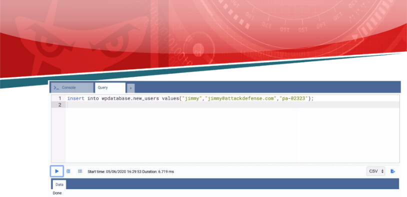
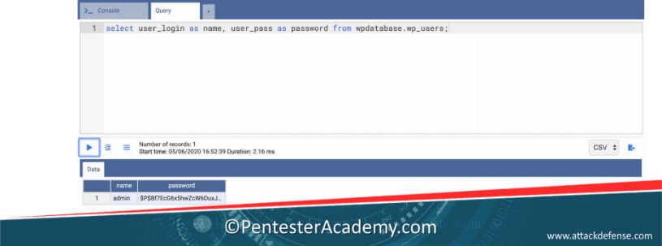
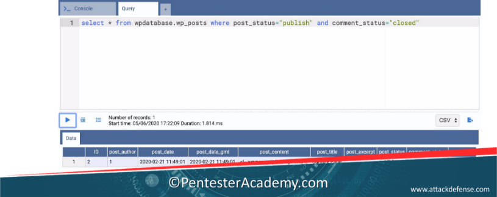
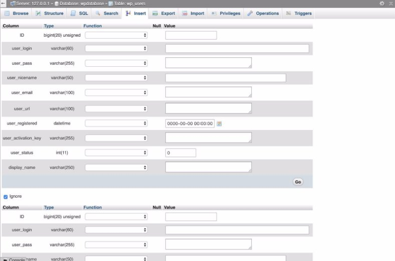

![ref1]
<table><tr><th colspan="1"><b>Name</b> </th><th colspan="1">SQL Basics </th></tr>
<tr><td colspan="1" rowspan="2"><b>URL</b> </td><td colspan="1" valign="bottom"><https://attackdefense.com/challengedetails?cid=1801> </td></tr>
<tr><td colspan="1"></td></tr>
<tr><td colspan="1"><b>Type</b> </td><td colspan="1">Webapp Pentesting Basics </td></tr>
</table>

**Important Note:** This document illustrates all the important steps required to complete this lab. This  is  by  no  means  a  comprehensive  step-by-step  solution for this exercise. This is only provided as a reference to various commands needed to complete this exercise and for your further research on this topic. Also, note that the IP addresses and domain names might be different in your lab.  

In  this exercise, we will take a look at basic SQL queries this includes usage of SELECT, CREATE, INSERT, UPDATE, UNION and JOIN statements. 

**Home Page:  ![ref2]**

**Enter the Credentials:** 

**Username:** admin **Password:** admin 

**Step 1:** Expand the Databases section on the Left Panel and click on any of the table from the wpdatabase. ![ref2]

Information regarding the table is displayed in the Properties tab. **Step 2:** Click on the DDL Tab. 

The table definition is mentioned on the DDL tab. ![ref2]

**Step 3:** Expand "wp\_commentmeta" table and the child tree.  

![ref1]

The columns, primary key, foreign key and Indexes information can be accessed from the left section. 

**Step 4:** Expand the columns.  ![ref2]

The datatype and properties of the columns are displayed.  

**Getting started with basic SQL Queries**  

**Task  1:** Identifying the databases present on the system. **Query:** show databases; 

**Task 2:** Selecting a database. ![ref2]**Query:** use wpdatabase; 

**Task 3:** Listing tables in a database. **Query:** show tables; 

**Task 4:**  Retrieving Data from the table. **Query:** select \* from wp\_users; ![ref2]

![ref1]

**Task 5:** Retrieving data from only certain columns of a table. **Query:** select user\_login,user\_pass from wp\_users; 

**Task 6:** Retrieving data from table by mentioning the database name. **Query:** select \* from wpdatabase.wp\_posts; 

**Task 7:** Sorting data on the basis of post title. 

**Query:** select \* from wpdatabase.wp\_posts order by post\_title; 

**Task 8:** Retrieving first record from the table. ![ref2]

**Query:** select \* from wpdatabase.wp\_posts order by post\_title limit 1; 

![ref1]

**Task 9:** Retrieving a particular row from the table. 

**Query:** select \* from wpdatabase.wp\_posts order by post\_title limit 2,1;** 

**Task 10:** Create a new table "new\_users" with name, email and id as columns. Use the id column as a primary key.  

**Query:** create table new\_users (     name varchar(100), ![ref2]

`    `email varchar(100), 

`    `id varchar(100),     primary key(id) ) ![ref1]

**Task 11:** Inserting rows into the table. 

**Query:** insert into wpdatabase.new\_users values ("John","john@attackdefense.com","pa-01234"); 

**Task 12:** Updating record in the table. ![ref2]

**Query:** update wpdatabase.new\_users set name="james" where id="pa-01234"; 

![ref1]

**Task 13:** Combining records from two tables using UNION Statement, UNION statement requires equal number of columns to be selected from each table. 

Checking columns in wp\_users table **Query:**  desc wpdatabase.wp\_users; ![ref2]

Checking columns in new\_users table (created in Task 10). **Query:** desc wpdatabase.new\_users; 

Union query:  

**Query:** select user\_login,user\_email from wpdatabase.wp\_users union select name,email from wpdatabase.new\_users; 

The data from the tables wp\_users and new\_users was presented in a single table. 

**Task 14:** Insert more data into the new\_users table and use the JOIN statement to retrieve the users who have common name in new\_users and wp\_users table. 

Inserting user named admin to new\_users table. 

**Query:** insert into wpdatabase.new\_users values("admin","admin@admin.xyz","pa-02333"); 

Similarly insert user "jimmy" and "david". 

**Query:** insert into wpdatabase.new\_users values("jimmy","jimmy@attackdefense.com","pa-02323"); ![ref2]

**Query:** insert into wpdatabase.new\_users values("david","<david@attackdefense.com>","pa-02663"); 

Viewing records in table new\_users: ![ref2]

**Query:** select \* from wpdatabase.new\_users; 

![ref1]

Using a JOIN statement to combine rows from new\_users and wp\_users table. 

**Query:** select \* 

from wpdatabase.wp\_users 

JOIN wpdatabase.new\_users on wpdatabase.new\_users.name=wpdatabase.wp\_users.user\_login ![ref2]

The columns from both the tables are returned in the data. 

**Task 15:** Using the join statement, display the value in user\_login and user\_pass field from the table wp\_users and display the id from new\_users table. 

**Query:** select wpdatabase.wp\_users.user\_login,wpdatabase.wp\_users.user\_pass,wpdatabase.new\_users.id from wpdatabase.wp\_users JOIN wpdatabase.new\_users on wpdatabase.new\_users.name=wpdatabase.wp\_users.user\_login 

**Task 16:** Use an alias "name" and "password" for the column user\_login,user\_pass respectively in the table wp\_users. 

**Query:** select user\_login as name, user\_pass as password from wpdatabase.wp\_users; 

**Task 17:** Identify the distinct authors who have published a post. The post\_author column in wp\_posts table consists the id of authors. 

**Query:** select distinct(post\_author) from wpdatabase.wp\_posts;** 

Only 1 author has published a post.  ![ref2]

**Task 18:** Count the posts stored in the wp\_posts table. Use the COUNT aggregate function. **Query:** select count(\*) from wpdatabase.wp\_posts; 

![ref1]

**Task 19:** Show all the data of the posts which have the status "publish". **Query:** select \* from wpdatabase.wp\_posts where post\_status='publish'; ![ref2]

**Task 20:** Show all the data of the posts which have "wp:paragraph" in it's content. Use the Like clause 

**Query:** select \* from wpdatabase.wp\_posts where post\_content like '%wp:paragraph%'; 

**Task 21:** Show all the data for the posts which have post\_status set to "publish" and comment\_status set to "closed". 

**Query:** select \* from wpdatabase.wp\_posts where post\_status="publish" and comment\_status="closed" 

The Data present in the table can also be viewed by right clicking the table name from the left panel and selecting the Query data option. ![ref2]

Similarly, OmniDB also provides option to EDIT table ,INSERT, Update records: EDIT Table: ![ref2]

Insert record:  

Update record:  ![ref2]

**Getting Started with PHPMyAdmin Login Page:  **

The login credentials are mentioned in the challenge description.  

Username: root 

Password: Blank or <No Password> 

**Main Dashboard:  ![ref2]**

The databases are listed on the Left Panel. Expand the wpdatabase. ![ref1]

![ref1]

**All the tables present inside the database are displayed. Expand the wp\_users table.** 

The information regarding the columns and the indexes are displayed on the left panel. **Clicking on the Databases Tab.**  

All the Databases are listed on the web page. **Click on the wpdatabase Table** 

The tables inside the database wpdatabase are displayed.  ![ref2]**Click on the Table wp\_users** 

The record of the tables are displayed on the web page.  

**Click on the Structure tab to see the structural information of the tables.**  

**Click on the SQL tab.**  

The SQL queries can be executed on the SQL tab. The same queries which were executed on the OmniDB SQL console can be executed here. The various buttons provided on the page "select", "insert", "update" can be used to change the statement.  ![ref2]

**Click on the Search Tab** 

The search tab provides an easy way to search the table instead of writing SELECT statements with where clause. The values can be directly set to value with various operators.  ![ref2]

**Click on the Insert Tab: **

The Insert tab functionality can be used to insert records into the table.  ![ref2]

**Click on the Export Tab:**  

Specific Table can be exported from the export table. ![ref2]

Click on the Import section  

The import section can be used to import an SQL archive file into the tables. ![ref2]**Click on the Privileges Tab** 

The privileges to the wpdatabase table are mentioned on the tab. **Click on the Operations tab.** 

Operations such as moving the table, creating a copy, renaming it, adding comments can be performed from the operations tab.  ![ref2]

**Click on Triggers** 

The triggers are mentioned here. Currently there are no triggers.  **Click on the Dashboard** (Home Icon) 

**Click on the SQL Tab. ![ref2]**

The SQL statements can be executed from here. All the statements executed above on the OmniDB SQL console can be executed here.  

**Click on the User accounts Tab.  ![ref2]**

![ref1]

Access to various User accounts are mentioned on the web page. ![ref2]**Click on the Binary Log** 

The Binary log tab displays all the SQL queries executed. ![ref2]

![ref1]

**References:**  

1. OmniDB (<https://omnidb.org/en/>) ![ref2]
1. PHPMyAdmin (<https://www.phpmyadmin.net/>) 

[ref1]: Aspose.Words.081b1fe6-c3b5-490e-b782-2e6f78e086f8.002.png
[ref2]: Aspose.Words.081b1fe6-c3b5-490e-b782-2e6f78e086f8.003.png
