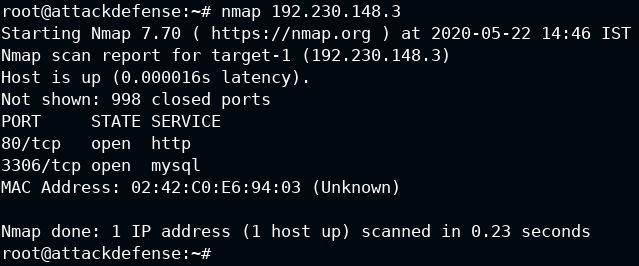

||
||
||
||
||

>  style="width:8.47917in;height:1.85479in" /> style="width:6.16667in;height:4.57292in" /> style="width:8.48958in;height:0.85417in" />**Important** **Note:**
> This document illustrates all the important steps required to complete
> this lab. This is by no means a comprehensive step-by-step solution
> for this exercise. This is only provided as a reference to various
> commands needed to complete this exercise and for your further
> research on this topic. Also, note that the IP addresses and domain
> names might be different in your lab.
>
> **Step** **1:** Determining the IP address of the target machine.
>
> **Command:** ifconfig

The IP address of the host
machine is 192.230.148.2

Therefore, the target machine has IP address 192.230.148.3

**Step** **2:** Scan the target machine using nmap.

**Command:** nmap 192.230.148.3

HTTP and MYSQL services are running on the target machine.

**Step** **3:** Checking the application available on port 80 of the
target machine.

Open the following URL in firefox:

**URL:** [<u>http://192.230.148.3</u>](http://192.88.244.3/)

**Note:** Make sure to supply the correct IP address

Notice that OWASP Mutillidae
II is running on the target machine.

**Step** **3:** Using nikto to scan the discovered webapp.

Return back to the terminal and type nikto to view the usage help for
the tool.

**Command:** nikto

Notice that there are some
interesting options like **-host**, **-Tuning**, and a more elaborate
help can be displayed using the **-Help** option.

Displaying the full help text:

**Command:** nikto -Help

>  style="width:8.47917in;height:1.85479in" /> style="width:7.15625in;height:3.35417in" /> style="width:7.34375in;height:1.33333in" /> style="width:6.94792in;height:2.9375in" /> style="width:8.48958in;height:0.85417in" />...
>
> ...
>
>  style="width:8.47917in;height:1.85479in" /> style="width:7.36458in;height:2.41667in" /> style="width:7.40625in;height:3.03125in" /> style="width:8.48958in;height:0.85417in" />...

Scan the target using nikto:

**Command:** nikto -h http://192.230.148.3

Notice that the output indicates that:

**Target** **server:** Apache version 2.4.7 **Backend:** PHP version
5.5.9 built on Ubuntu

The interesting bits of information are highlighted in yellow.

>  style="width:8.47917in;height:1.85479in" /> style="width:7.38542in;height:3.35417in" /> style="width:7.39583in;height:1.77083in" /> style="width:8.48958in;height:0.85417in" />...

Some more information in the output is highlighted.

**Step** **4:** Scanning the target application for LFI vulnerability.

Back in the webapp, copy the URL for LFI (Local File Inclusion) page.
For that, click on the left side:

“OWASP 2017” \> “A5: Broken Access Control” \> “Insecure Direct Object
References” \> “Local File Inclusion”

**URL:**
[<u>http://192.230.148.3/index.php?page=arbitrary-file-inclusion.php</u>](http://192.88.244.3/index.php?page=arbitrary-file-inclusion.php)

Check for the Remote File Retrieval in verbose mode:

**Command:** nikto -h
http://192.230.148.3/index.php?page=arbitrary-file-inclusion.php -Tuning
5 -Display V

>  style="width:8.47917in;height:1.85479in" /> style="width:7.40625in;height:1.80208in" /> style="width:8.48958in;height:0.85417in" />...

All the requests with the response code 200 are listed in the verbose
mode

The highlighted line indicates that the LFI vulnerability was detected

Saving the scan result as an HTML file:

**Command:** nikto -h
http://192.230.148.3/index.php?page=arbitrary-file-inclusion.php -Tuning
5 -o nikto.html -Format htm

> ...

The scan has been completed.

Check the files in the current directory.

**Command:** ls -l

Open it using firefox:

**URL:** file:///root/nikto.html

>  style="width:8.47917in;height:1.85479in" /> style="width:7.40625in;height:5.70833in" /> style="width:7.375in;height:3.45833in" /> style="width:8.48958in;height:0.85417in" />...

Click on the highlighted URL
in the above image to view the contents of the /etc/passwd file of the
target machine.

Returning back to the HTML report:

In the end, there is the section on “Host Summary” and “Scan Summary”:

Here, the stats and the CLI options used to info the tool and some other
information related to the time elapsed, etc are provided.

**References:**

> 1\. Nikto [<u>(https://cirt.net/Nikto2)</u>](https://cirt.net/Nikto2)
>
> 2\. Mutillidae II
> [<u>(https://sourceforge.net/projects/mutillidae/</u>](https://sourceforge.net/projects/mutillidae/))
