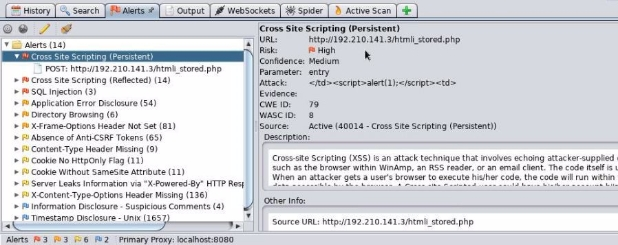
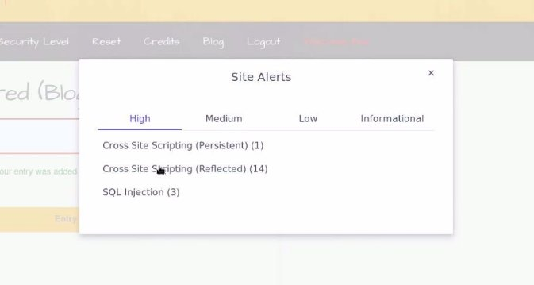

![ref1]
<table><tr><th colspan="1"><b>Name</b> </th><th colspan="1">Scanning Web Application with ZAProxy </th></tr>
<tr><td colspan="1" rowspan="2"><b>URL</b> </td><td colspan="1" valign="bottom"><https://attackdefense.com/challengedetails?cid=1888> </td></tr>
<tr><td colspan="1"></td></tr>
<tr><td colspan="1"><b>Type</b> </td><td colspan="1">Webapp Pentesting Basics </td></tr>
</table>

**Important Note:** This document illustrates all the important steps required to complete this lab. This  is  by  no  means  a  comprehensive  step-by-step  solution for this exercise. This is only provided as a reference to various commands needed to complete this exercise and for your further research on this topic. Also, note that the IP addresses and domain names might be different in your lab.  

**Objective:**  Scan the web application with ZAProxy and identify the possible vulnerabilities. 

**Step 1:** Identifying IP address of the target machine **Command:** ip addr 

The IP address of the attacker machine is 192.210.1412. The target machine is located at the IP address 192.210.1413 ![ref2]

**Step 2:** Identifying open ports. **Command:** nmap 192.210.1413  

Port 80 and 3306 are open. 

**Step 3:** Starting Burp Suite. Click on the Menu, Navigate to "Web Application Analysis" and click on "owasp-zap". 

ZAP:  ![ref2]

**Step 4:** Click on "Manual Explore", enter the target IP address in the Input field and click on "Launch Browser". 

A browser session will be started with ZAP HUD. ![ref2]

**Step 5:** Click on "Continue to your target".  

![ref1]

**Step 6:** Login to the web application, the login credentials are mentioned on the login page.  

**Username:** bee **Password:** bug 

**Step 7:** Access various web pages.**  From the Choose your bug dropdown, select "HTML Injection - Reflected (GET)" and click on the Hack button. ![ref2]

HTML Injection - Reflected (GET): 

**Step 8:** Enter any values in the input field and click Go ![ref2]

The entered input will appear below the Go button 

**Step 9:** From the Choose your bug dropdown, Select "HTML Injection - Reflected (POST)" and click on the Hack button. 

HTML Injection - Reflected (POST) 

**Step 10:** Enter any values in the input field and click Go ![ref2]

The entered input will appear below the Go button 

**Step 11:** From the Choose your bug dropdown, Select "HTML Injection - Stored (Blog)" and click on the Hack button. ![ref2]

**Step 12:** Enter any values in the input field and click Submit. 

The entered value will appear in the table.  ![ref2]

**Step 13:** From the Choose your bug dropdown, Select "SQL Injection (GET/Search)" and click on the Hack button. 

SQL Injection (GET/Search) ![ref2]

**Step 14:** Enter "Joe" and click on the Search button. 

1 result will appear. 

**Step 15:** From the Choose your bug dropdown, Select "SQL Injection (GET/Select)" and click on the Hack button. ![ref2]

SQL Injection (GET/Select) ![ref2]

**Step 16:** "G.I. Joe: Retaliation" is the default selected option. Click on the "Select" button. ![ref1]

1 result will appear. 

**Step 17:** Configuring ZAProxy to use authenticated session. In ZAProxy, navigate to the sitemap and find the login request.  

**Step 18:** Right click on the POST request, navigate to "Include in Context" and select on "Default Context". ![ref2]

![ref1]

![ref3]

The session Properties window will appear.  

**Step 19:** Click on the Authentication tab under Default Context menu and select "Form-based Authentication" for the selected method.  ![ref2]

Authentication Section:  ![ref2]

**Step 20:** Click on the Select button and select the POST login request.  

The form fields will automatically be filled.  ![ref2]

**Step 21:** Set the Username parameter to "login" and Enter "Login" in the "Regex pattern identified in Logged Out response messages". ![ref1]

**Step 22:** Click on the Users tab.  ![ref2]

![ref1]

**Step 23:** Click on the "Add" button and add a new user with username "bee" and password "bug" 

**Step 24:** Click on the "OK" button. 

**Step 25:** Click on the User lock icon.  ![ref2]

**Step 26:** Right click on the Site (http://192.210.141.3), navigate to "Include in Context" and select on "Default Context". 

![ref3]

Session Properties window will appear.  ![ref2]

**Step 27:** Click on the "OK" button. Right click on the Site (http://192.210.141.3), navigate to Attack and select "Spider". 

**Step 28:** A dialog box will appear, select the "bee" user and click on "Start Scan" button. 

Scan Result:  ![ref2]

202 URLs were found.  

**Step 29:** Right click on the Site (http://192.210.141.3), navigate to Attack and select "Active Scan". ![ref2]

**Step 30:** A dialog box will appear, select the "bee" user and click on "Start Scan" button. 

**Step 31:** After the scan completes, click on the "Alerts" tab. 

There are 3 critical alerts.  ![ref2]

**Step 32:** Click on Cross Site Scripting (Persistent)  

The information regarding the URL, payload, description about the vulnerability will be displayed.  

**Step 33:** Navigate to the URL, Inject the XSS payload and click on Submit button. **URL:** http://192.210.141.3/htmli\_stored.php 

The XSS payload will be triggered.  

**Step 34:** Navigate to the right side and access the Alert section of the ZAP HUD. ![ref2]

ZAP HUD:  

**Step 35:** Click on the "Cross Site Scripting (Reflected)" and click on the first URL. ![ref2]

**Step 36:** Click on the URL on the dialog box.  

The XSS payload will be triggered.  ![ref2]

**Step 37:** Expand the SQL Injection Section from the Alerts section of ZAP HUD 

**Step 38:** Click on the First URL. 

**Step 39:** Navigate to the URL ![ref2]

**URL:** http://192.210.141.3/sqli\_1.php?action=search&title=ZAP'+AND+'1'%3D'1'+--+ 

No Records will appear.  ![ref2]

**Step 40:** In the URL, change the AND condition into OR.  

**URL: [http://192.210.141.3/sqli_1.php?action=search&title=ZAP'+OR+'1'%3D'1'+--+](http://192.210.141.3/sqli_1.php?action=search&title=ZAP%27+OR+%271%27%3D%271%27+--+)** The Payload to use is also mentioned on the Vulnerablity information window (step 38). 

All the records present in the table will be dumped on the web page.  **References:**  

1. OWASP Zed Attack Proxy (<https://www.zaproxy.org/>)  ![ref2]
1. bWAPP (<http://www.itsecgames.com/>) 

[ref1]: Aspose.Words.cbaf6519-e428-40a8-b313-af0820ea0196.002.png
[ref2]: Aspose.Words.cbaf6519-e428-40a8-b313-af0820ea0196.004.png
[ref3]: Aspose.Words.cbaf6519-e428-40a8-b313-af0820ea0196.028.png
