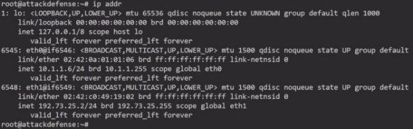
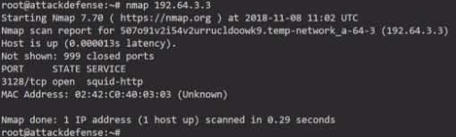
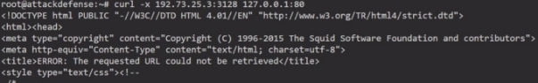
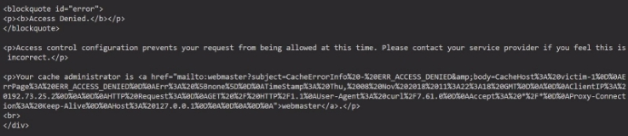
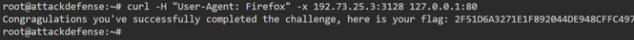



<table><tr><th colspan="1"><b>Name</b> </th><th colspan="1">Squid: Browser Based Restriction </th></tr>
<tr><td colspan="1" rowspan="2"><b>URL</b> </td><td colspan="1" valign="bottom"><https://www.attackdefense.com/challengedetails?cid=225>  </td></tr>
<tr><td colspan="1"></td></tr>
<tr><td colspan="1"><b>Type</b> </td><td colspan="1">Infrastructure Attacks : Squid Proxy </td></tr>
</table>

**Important Note:** This document illustrates all the important steps required to complete this lab. This  is  by  no  means  a  comprehensive  step-by-step  solution for this exercise. This is only provided as a reference to various commands needed to complete this exercise and for your further research on this topic. Also, note that the IP addresses and domain names might be different in your lab.  

**Objective:** You have to figure out a way to access the web portal and retrieve the flag! 

**Solution:** 

**Step 1:** Find ip address of the target machine 

The target server is at 192.73.25.3 ![ref1]

**Step 2:** Perform nmap scan to identify the running services and open ports **Command:** nmap 192.73.25.3 

**Step 3:** Accessing web server through proxy using curl  **Command:** curl -x 192.73.25.3:3128 127.0.0.1:80 

Squid proxy is not allowing the request.  

**Step 4:** Since the proxy accepts connection only from firefox browser. Send “User-Agent: Firefox” as header with the curl command 

**Command:** curl -H "User-Agent: Firefox" -x 192.73.25.3:3128 127.0.0.1:80 

**Flag:** 2F51D6A3271E1F892044DE948CFFC497 **![ref1]**

**References: ![ref1]**

1\. Squid Proxy (<http://www.squid-cache.org/>)  

[ref1]: Aspose.Words.c74d67e3-1ea1-423f-8b3c-a09ac7cbd701.004.png
