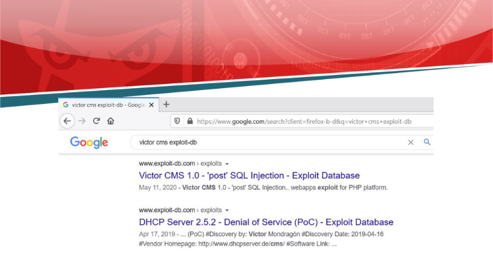

<table><tr><th colspan="1"><b>Name</b></th><th colspan="1">Victor CMS</th></tr>
<tr><td colspan="1" rowspan="2"><b>URL</b></td><td colspan="1" valign="bottom"><https://www.attackdefense.com/challengedetails?cid=2267></td></tr>
<tr><td colspan="1"></td></tr>
<tr><td colspan="1"><b>Type</b></td><td colspan="1">Real World Webapps: SQL Injection</td></tr>
</table>

**Important Note:** This document illustrates all the important steps required to complete this lab. This is by no means a comprehensive step-by-step solution for this exercise. This is only provided as a reference to various commands needed to complete this exercise and for your further research on this topic. Also, note that the IP addresses and domain names might be different in your lab.

**Solution:**

**Step 1:** Inspect the web application.

**Step 2:** Search on google “victor cms exploit-db”.![ref1]

The exploit db link contains the steps which have to be performed to exploit the vulnerability. **Exploit DB Link:** <https://www.exploit-db.com/exploits/48451>

**Step 3:** Click on the first post link.

**URL:** http://jwjozxqhcwh31mcc4618w9cxs.stager3.attackdefenselabs.com/post.php?post=1

**Step 4:** Use SQLmap to retrieve the database name. Pass the URL in the SQLmap with other required parameters.

**Command:** sqlmap -u "http://jwjozxqhcwh31mcc4618w9cxs.stager3.attackdefenselabs.com/post.php?post=1" --dbs

By exploiting the vulnerability, The attacker was successful to retrieve the database names from the target server.

**References:**

1. Victor CMS (<https://github.com/VictorAlagwu/CMSsite>)![ref1]
1. Victor CMS 1.0 - 'post' SQL Injection (<https://www.exploit-db.com/exploits/48451>)

[ref1]: Aspose.Words.b78a1eff-6c18-43d5-8d02-88feb3ede7f5.003.png
