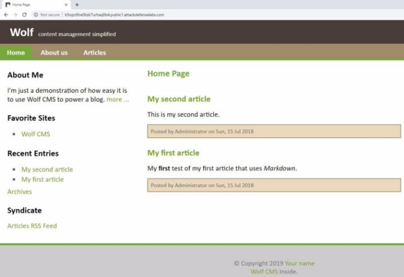

<table><tr><th colspan="1"><b>Name</b> </th><th colspan="1">Vulnerable Apache III </th></tr>
<tr><td colspan="1" rowspan="2"><b>URL</b> </td><td colspan="1" valign="bottom"><https://www.attackdefense.com/challengedetails?cid=199>  </td></tr>
<tr><td colspan="1"></td></tr>
<tr><td colspan="1"><b>Type</b> </td><td colspan="1">Infrastructure Attacks : Apache </td></tr>
</table>

**Important Note:** This document illustrates all the important steps required to complete this lab. This  is  by  no  means  a  comprehensive  step-by-step  solution for this exercise. This is only provided as a reference to various commands needed to complete this exercise and for your further research on this topic. Also, note that the IP addresses and domain names might be different in your lab.  

The target server is hosting a web app. The web app is not vulnerable but the directory listing enabled on the server. And, that can lead to sensitive information leakage. 

**Objective:** Your objective is to login into the webapp as 'admin' user and retrieve the flag! 

**Solution:  ![ref1]**

**Step 1:** Inspect the web application. 

**URL:** http://ti5opclltre0lizk7urhaq0b4.public1.attackdefenselabs.com  

**Step 2:** Enumerate directories present on the target machine using dirb. 

**Command:** dirb** http://ti5opclltre0lizk7urhaq0b4.public1.attackdefenselabs.com /usr/share/dirb/wordlists/small.txt ![ref1]

“public” and “doc” directory are present on the web server.  ![ref1]

**Step 3:** Check the files stored in the “public” directory. 

**URL:** http://ti5opclltre0lizk7urhaq0b4.public1.attackdefenselabs.com/public 

**Step 4:** View the contents of file “cred.conf” present in “/public” folder. 

**URL:** http://ti5opclltre0lizk7urhaq0b4.public1.attackdefenselabs.com/public/cred.conf 

**Step 5:** Login to the web application with the credentials found in previous step. 

User: admin ![ref1]

Password: $k@d00$#@123456 

URL: http://ti5opclltre0lizk7urhaq0b4.public1.attackdefenselabs.com/?/admin/login 

Dashboard: 

**Admin Password:** $k@d00$#@123456 **![ref1]**

**References:**  

1. Apache httpd (<https://httpd.apache.org/>)  ![ref1]
1. Wolf CMS (<https://github.com/wolfcms/wolfcms>)  
1. dirb (<https://tools.kali.org/web-applications/dirb>)  

[ref1]: Aspose.Words.0f50a3d0-1b27-427e-8dd8-94658c74f1d8.003.png
