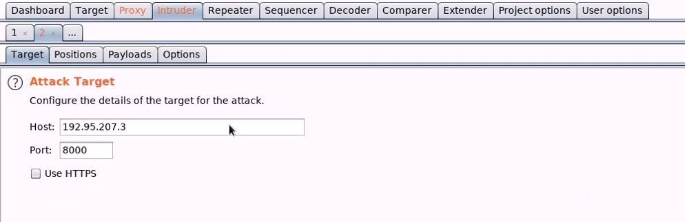

![ref1]
<table><tr><th colspan="1"><b>Name</b> </th><th colspan="1">Vulnerable Bank Portal: Dictionary Attack </th></tr>
<tr><td colspan="1" rowspan="2"><b>URL</b> </td><td colspan="1" valign="bottom"><https://attackdefense.com/challengedetails?cid=1932> </td></tr>
<tr><td colspan="1"></td></tr>
<tr><td colspan="1"><b>Type</b> </td><td colspan="1">Webapp Pentesting Basics </td></tr>
</table>

**Important Note:** This document illustrates all the important steps required to complete this lab. This  is  by  no  means  a  comprehensive  step-by-step  solution for this exercise. This is only provided as a reference to various commands needed to complete this exercise and for your further research on this topic. Also, note that the IP addresses and domain names might be different in your lab.  

**Step 1:** Interacting with the webapp. 

When the lab starts up, the Secure Bank's webapp opens up in the browser 

**Step 2:** Right-click and choose “View Page Source” option. ![ref2]

The form is not present in the source code 

**Step 3:** Navigate to the Webpage and right-click to choose “Inspect Element” ![ref2]

Form Action is not mentioned in the code ![ref2]

**Step 4:** Configure Firefox to use Burp Suite. Click on the FoxyProxy plugin icon on the top-right of the browser and select "Burp Suite" 

**Step 5:** Start Burp Suite, Navigate to Web Application Analysis Menu and select "burpsuite". ![ref2]

Click on Next 

Click on Start Burp button. ![ref2]

**Step 6:** Enter any credentials in the login panel. ![ref1]

Click on the Login button and intercept the request with Burp Suite. ![ref2]

![ref1]

**Step 7:** Right-click on the page and select “Send to Repeater”. 

Navigate to the Repeater tab. ![ref2]

**Step 8:** Click on the Send button to send the request. 

The Response tab displayed the Invalid Credentials error. ![ref2]

**Step 9:** Right-click on the request page and choose “Send to Intruder” 

Navigate to the Intruder tab. 

Click on Positions tab located under the Intruder section. ![ref2]

The parameters are automatically selected. 

**Step 10:** Click on the “Clear” button located on the right-side panel. 

Upon clicking on the clear button, it will remove both of the selected parameters. ![ref2]**Step 11:** Highlight the password parameter and click on Add button. 

**Step 12:** Navigate to the Payloads tab. 

Click on the load button which is located under Payload Options. ![ref2]

**Step 13:** Navigate to the wordlists directory located at Desktop. 

Select the Wordlist stored inside the wordlists directory. ![ref2]

Click on the Open button. 

The wordlist has been imported in Burp Suite. ![ref2]

**Step 14:** Click on the Start attack button located at the top right of the tab. 

Click on the OK button to the warning message. ![ref2]

**Step 15:** Check for the different response length in the intruder scan. 

Close the attack running in the intruder. 

**Step 16:** Close the interception and navigate to the admin login page. ![ref2]

**Step 17:** Login using the password found from the intruder attack. 

**Credentials:** 

- **Email:** admin@secbank.com 
- **Password:** christmas 

The Attacker has successfully logged into the web application. 

**References: ![ref2]**

1. OWASP Top 10 (<https://owasp.org/www-project-top-ten/>)  
1. A2: Broken Authentication ([https://owasp.org/www-project-top-ten/OWASP_Top_Ten_2017/Top_10-2017_A2-Brok en_Authentication](https://owasp.org/www-project-top-ten/OWASP_Top_Ten_2017/Top_10-2017_A2-Broken_Authentication)) 

[ref1]: Aspose.Words.624d6fad-a997-4a31-b826-5ac11c082b1e.002.png
[ref2]: Aspose.Words.624d6fad-a997-4a31-b826-5ac11c082b1e.004.png
