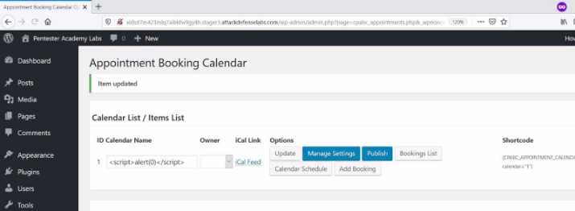

<table><tr><th colspan="1"><b>Name</b> </th><th colspan="1">CVE-2020-9371 </th></tr>
<tr><td colspan="1" rowspan="2"><b>URL</b> </td><td colspan="1" valign="bottom"><https://attackdefense.com/challengedetails?cid=1940> </td></tr>
<tr><td colspan="1"></td></tr>
<tr><td colspan="1"><b>Type</b> </td><td colspan="1">Webapp CVEs: 2020 </td></tr>
</table>

**Important Note:** This document illustrates all the important steps required to complete this lab. This  is  by  no  means  a  comprehensive  step-by-step  solution for this exercise. This is only provided as a reference to various commands needed to complete this exercise and for your further research on this topic. Also, note that the IP addresses and domain names might be different in your lab.  

**Solution:**  

The web application is vulnerable to CVE-2020-9371 

**Step 1:** Inspect the web application. ![ref1]

**Step 2:** Search on google “CVE-2020-9371 exploit-db”. 

The Exploit-DB link contains the steps to be followed to exploit the vulnerability. ![ref1]

**Exploit-DB Link: <https://www.exploit-db.com/exploits/48204>** 

**Step 3:** The user has to authenticate in order to exploit the vulnerability. The login credentials are provided in the challenge description. 

**Credentials:** 

- **Username:** admin 
- **Password:** password1 

**URL:** http://xidsd7m423mlq7aibkhv9gy4h.stager3.attackdefenselabs.com/wp-login.php ![ref1]**Login Panel:** 

**Admin Dashboard:** 

**Step 4:** Click on the “Appointment Booking Calendar” option located at the left sidebar. ![ref1]

**URL:** http://xidsd7m423mlq7aibkhv9gy4h.stager3.attackdefenselabs.com/wp-admin/admin.php?page =cpabc\_appointments.php 

**Step 5:** Inject the payload in the Calender Name text field. The payload is provided at the exploit-db link. 

**Payload:**  ![ref1]

Click on the “Update” button. 

**Step 6:** Click on the “Manage Settings” button. 

The attack was successful. ![ref1]

**References:**  

1. WordPress (<https://wordpress.org/>)  ![ref1]
1. Appointment Booking Calendar (<https://wordpress.org/plugins/appointment-booking-calendar/>) 
1. CVE-2020-9371 (<https://cve.mitre.org/cgi-bin/cvename.cgi?name=CVE-2020-9371>)  
1. WordPress Plugin Appointment Booking Calendar 1.3.34 - CSV Injection/ Cross Site Scripting  (<https://www.exploit-db.com/exploits/48204>)  

[ref1]: Aspose.Words.a4696264-b03b-438e-adf2-460061df274e.004.png
