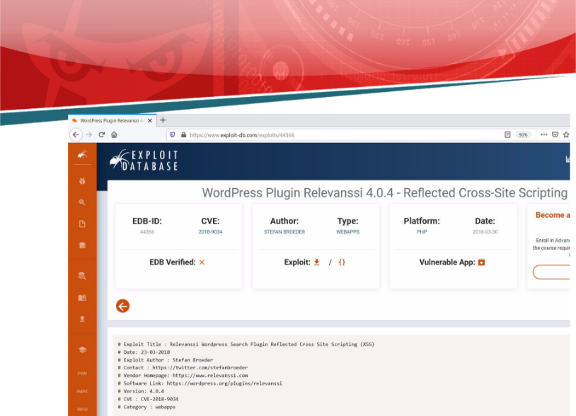

![ref1]
<table><tr><th colspan="1"><b>Name</b> </th><th colspan="1">CVE-2018-9034 </th></tr>
<tr><td colspan="1" rowspan="2"><b>URL</b> </td><td colspan="1" valign="bottom"><https://www.attackdefense.com/challengedetails?cid=1023> </td></tr>
<tr><td colspan="1"></td></tr>
<tr><td colspan="1"><b>Type</b> </td><td colspan="1">Webapp CVEs : 2018 </td></tr>
</table>

**Important Note:** This document illustrates all the important steps required to complete this lab. This  is  by  no  means  a  comprehensive  step-by-step  solution for this exercise. This is only provided as a reference to various commands needed to complete this exercise and for your further research on this topic. Also, note that the IP addresses and domain names might be different in your lab.  

**Solution:**  

The web application is vulnerable to CVE-2018-9034 

**Step 1:** Inspect the web application. ![ref2]

**Step 2:** Search on google “CVE-2018-9034”. 

The exploit db link contains the steps to be followed to exploit the vulnerability. ![ref2]**Exploit DB Link: <https://www.exploit-db.com/exploits/44366>** 

**Step 3:** The user has to authenticate in order to exploit the vulnerability. Credentials are provided in the challenge description. 

**Credentials:** 

- **Username:** admin 
- **Password:** password1

**URL:** http://3xdnwc43hlewtgd0c22bjh4tb.mumbaix.attackdefenselabs.com/wp-login.php ![ref2]**Admin Login:** 

**Admin Dashboard: ![ref2]**

**Step 4:** Navigate to Vulnerable url and inject the payload in the URL. ![ref1]

**Payload:** '><SCRIPT>var+x+%3D+String(%2FXSS%2F)%3Bx+%3D+x.substring(1%2C+x.length-1)%3B alert(x)<%2FSCRIPT><BR+ 

**URL:** http://3xdnwc43hlewtgd0c22bjh4tb.mumbaix.attackdefenselabs.com/wp-admin/options-general. php?page=relevanssi%2Frelevanssi.php&tab=%27%3E%3CSCRIPT%3Evar+x+%3D+String% 28%2FXSS%2F%29%3Bx+%3D+x.substring%281%2C+x.length-1%29%3Balert%28x%29%3C %2FSCRIPT%3E%3CBR+ 

The XSS attack was successful. **References:**  

1. Wordpress (<http://wordpress.org/>) ![ref2]
1. WordPress Plugin Relevanssi  (<https://wordpress.org/plugins/relevanssi>)  
1. CVE-2018-9034 (<https://cve.mitre.org/cgi-bin/cvename.cgi?name=CVE-2018-9034>)  
1. WordPress Plugin Relevanssi 4.0.4 - Reflected Cross-Site Scripting (<https://www.exploit-db.com/exploits/44366>)  

[ref1]: Aspose.Words.8b7a2026-7d28-4d2b-9a23-0fe0c0507c1a.002.png
[ref2]: Aspose.Words.8b7a2026-7d28-4d2b-9a23-0fe0c0507c1a.004.png
