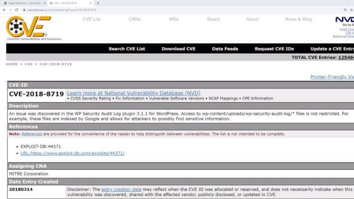
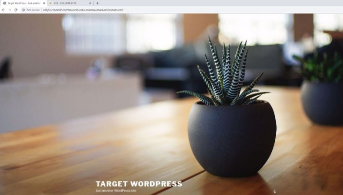
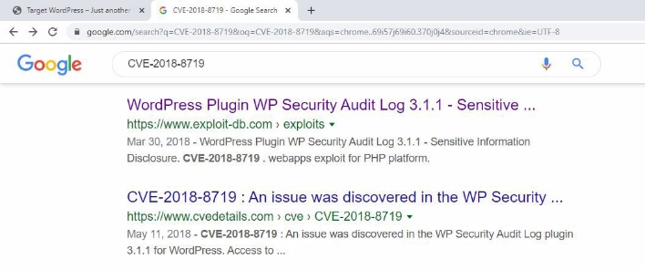
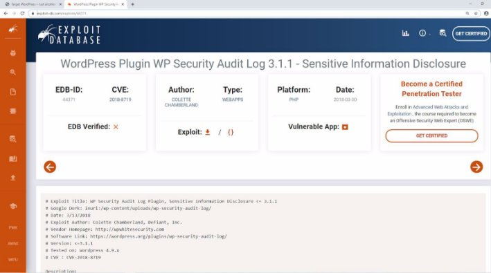
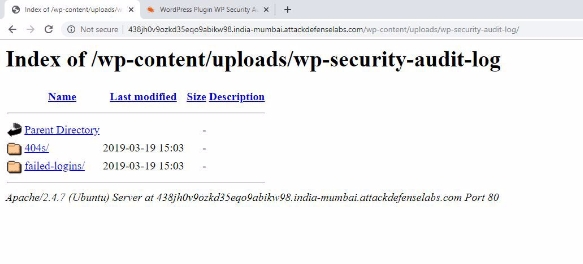
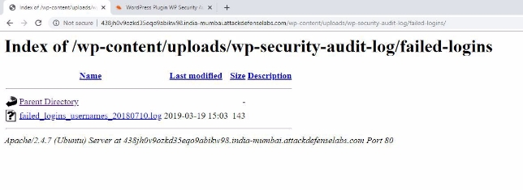
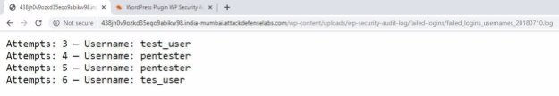



<table><tr><th colspan="1"><b>Name</b> </th><th colspan="1">CVE-2018-8719 </th></tr>
<tr><td colspan="1" rowspan="2"><b>URL</b> </td><td colspan="1" valign="bottom"><https://www.attackdefense.com/challengedetails?cid=974>  </td></tr>
<tr><td colspan="1"></td></tr>
<tr><td colspan="1"><b>Type</b> </td><td colspan="1">Webapp CVEs : 2018  </td></tr>
</table>

**Important Note:** This document illustrates all the important steps required to complete this lab. This  is  by  no  means  a  comprehensive  step-by-step  solution for this exercise. This is only provided as a reference to various commands needed to complete this exercise and for your further research on this topic. Also, note that the IP addresses and domain names might be different in your lab.  

**Solution:**  

The web application is vulnerable to CVE-2018-8719 

**Step 1:** Inspect the web application. ![ref1]

**Step 2:** Search on google “CVE-2018-8719” and look for publically available exploits.  **![ref1]**

The exploit db link contains the information regarding the location of the logs.  **Exploit DB Link: <https://www.exploit-db.com/exploits/44371>**  

**Step 3:** The logs are stored at the location “/wp-content/uploads/wp-security-audit-log/”. Navigate to the URL given below: 

**URL:** http://438jh0v9ozkd35eqo9abikw98.india-mumbai.attackdefenselabs.com/wp-content/uploads/w p-security-audit-log/ ![ref1]

**Step 4:** Click on failed-logins directory.  

**Step 5:** View the log file. 

The username which resulted in failed login attempt were listed. ![ref1]

**References:**  

1. Wordpress (<https://wordpress.com/>) ![ref1]
1. WP Security Audit Log (<https://wordpress.org/plugins/wp-security-audit-log/>) 
1. CVE-2018-8719 (<https://cve.mitre.org/cgi-bin/cvename.cgi?name=CVE-2018-8719>)  
1. WordPress Plugin WP Security Audit Log 3.1.1 - Sensitive Information Disclosure (<https://www.exploit-db.com/exploits/44371>)  

[ref1]: Aspose.Words.8f6bbdb4-5dc9-4cd1-970f-640bccfe19fd.004.png
