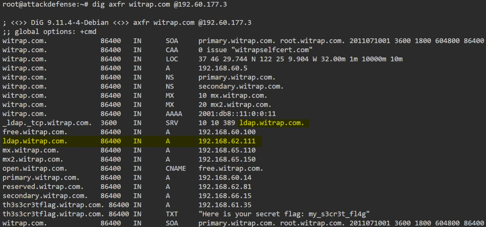

||
||
||
||
||

>  style="width:8.47917in;height:1.85481in" /> style="width:7.38542in;height:3.17708in" /> style="width:8.48958in;height:0.85417in" />**Important** **Note:**
> This document illustrates all the important steps required to complete
> this lab. This is by no means a comprehensive step-by-step solution
> for this exercise. This is only provided as a reference to various
> commands needed to complete this exercise and for your further
> research on this topic. Also, note that the IP addresses and domain
> names might be different in your lab.
>
> **Q1.** **How** **many** **A** **Records** **are** **present** **for**
> **witrap.com** **and** **its** **subdomains?**
>
> **Answer:** 9
>
> **Command:** dig axfr witrap.com @192.60.177.3

**Q2.** **What** **is**
**the** **IP** **address** **of** **machine** **which** **support**
**ldap** **over** **TCP** **on** **witrap.com?**

**Answer:** 192.168.62.111

**Command:** dig axfr witrap.com @192.60.177.3

**Q3.** **Can** **you** **find** **the** **secret** **flag** **in**
**TXT** **record** **of** **a** **subdomain** **of** **witrap.com**
**?**

**Answer:** my_s3cr3t_fl4g

**Command:** dig axfr witrap.com @192.60.177.3

**Q4.** **What** **is**
**the** **subdomain** **for** **which** **only** **reverse** **dns**
**entry** **exists** **for** **witrap.com?** **witrap** **owns** **the**
**ip** **address** **range:** **192.168.\*.\***

**Answer:** temp.witrap.com

**Command:** dig axfr -x 192.168 @192.60.177.3

**Q5.** **How** **many**
**records** **are** **present** **in** **reverse** **zone** **for**
**witrap.com** **(excluding** **SOA)?** **witrap** **owns** **the**
**ip** **address** **range:** **192.168.\*.\***

**Answer:** 12

**Command:** dig axfr -x 192.168 @192.60.177.3

**References:**

> 1\. Bind 9
> ([<u>https://www.isc.org/downloads/bind/</u>](https://www.isc.org/downloads/bind/))
> 2. nslookup
> ([<u>https://linux.die.net/man/1/nslookup</u>](https://linux.die.net/man/1/nslookup))
> 3. dig
> ([<u>https://linux.die.net/man/1/dig</u>](https://linux.die.net/man/1/dig))
